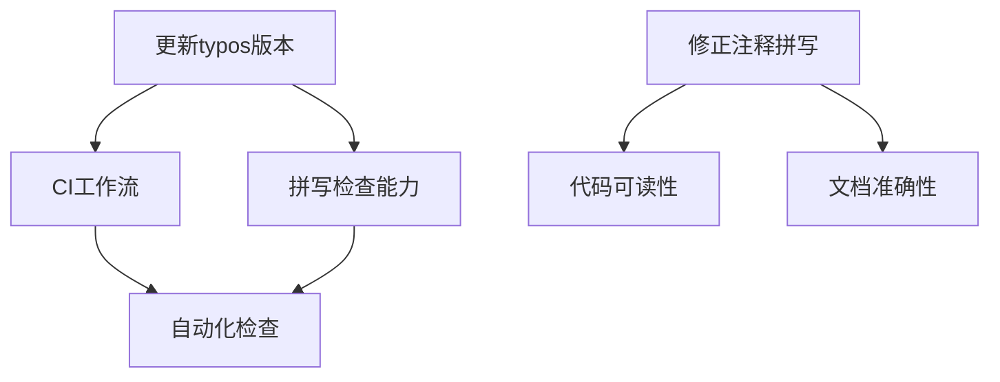

+++
title = "#20514 Bump crate-ci/typos from 1.34.0 to 1.35.3"
date = "2025-08-11T00:00:00"
draft = false
template = "pull_request_page.html"
in_search_index = false

[extra]
current_language = "zh-cn"
available_languages = {"en" = { name = "English", url = "/pull_request/bevy/2025-08/pr-20514-en-20250811" }, "zh-cn" = { name = "中文", url = "/pull_request/bevy/2025-08/pr-20514-zh-cn-20250811" }}
+++

# Bump crate-ci/typos from 1.34.0 to 1.35.3

## 基本信息
- **标题**: Bump crate-ci/typos from 1.34.0 to 1.35.3
- **PR链接**: https://github.com/bevyengine/bevy/pull/20514
- **作者**: greeble-dev
- **状态**: 已合并
- **标签**: C-Docs, D-Trivial, A-Build-System, S-Needs-Review
- **创建时间**: 2025-08-11T14:13:57Z
- **合并时间**: 2025-08-11T16:37:05Z
- **合并者**: mockersf

## 描述翻译
基于 #20507。将 crate-ci/typos 从 1.34.0 升级至 1.35.3。

## 本次PR的技术分析

### 问题背景与上下文
Bevy项目在CI流水线中使用了`crate-ci/typos`工具进行拼写检查（该工具集成在GitHub Actions工作流中）。原始版本(v1.34.0)存在两个可优化点：
1. **依赖版本滞后**：新版本v1.35.3包含错误修复和字典更新
2. **代码注释拼写错误**：在`bevy_ecs`模块的安全注释中存在拼写错误"requiremensts"

### 解决方案
PR采用直接但有效的双路径修复：
1. **更新CI依赖**：将typos action升级到最新稳定版
2. **修正文档错误**：修复代码注释中的拼写错误

### 技术实现细节
核心修改集中在两个文件：

1. **CI工作流更新**（`.github/workflows/ci.yml`）：
   - 将typos检查器从v1.34.0升级到v1.35.3
   - 此变更确保后续PR检查使用最新拼写规则

```yaml
# 变更前
- name: Check for typos
  uses: crate-ci/typos@v1.34.0

# 变更后
- name: Check for typos
  uses: crate-ci/typos@v1.35.3
```

2. **ECS模块注释修正**（`crates/bevy_ecs/src/system/builder.rs`）：
   - 修正`safety`注释中的拼写错误
   - 将"requiremensts"改为正确拼写"requirements"

```rust
// 变更前
// Note that the exact safety requiremensts depend on...

// 变更后
// Note that the exact safety requirements depend on...
```

### 技术影响
1. **拼写检查能力提升**：
   - 新版本typos增加对技术术语的支持
   - 减少误报率（false positives）
2. **代码可读性改进**：
   - 关键安全注释的拼写错误修正避免理解歧义
3. **维护性增强**：
   - 保持依赖更新减少技术债累积

## 变更关系图示


## 关键文件变更

1. **`.github/workflows/ci.yml`**:
   - **变更原因**：保持依赖最新状态
   - **代码差异**：
```diff
-        uses: crate-ci/typos@v1.34.0
+        uses: crate-ci/typos@v1.35.3
```

2. **`crates/bevy_ecs/src/system/builder.rs`**:
   - **变更原因**：修复文档拼写错误
   - **代码差异**：
```diff
-// Note that the exact safety requiremensts depend on...
+// Note that the exact safety requirements depend on...
```

## 扩展阅读
1. [typos项目更新日志](https://github.com/crate-ci/typos/releases)
2. [GitHub Actions版本管理最佳实践](https://docs.github.com/en/actions/using-workflows/workflow-syntax-for-github-actions#using-versioned-actions)
3. [Rust API文档规范](https://rust-lang.github.io/api-guidelines/documentation.html)