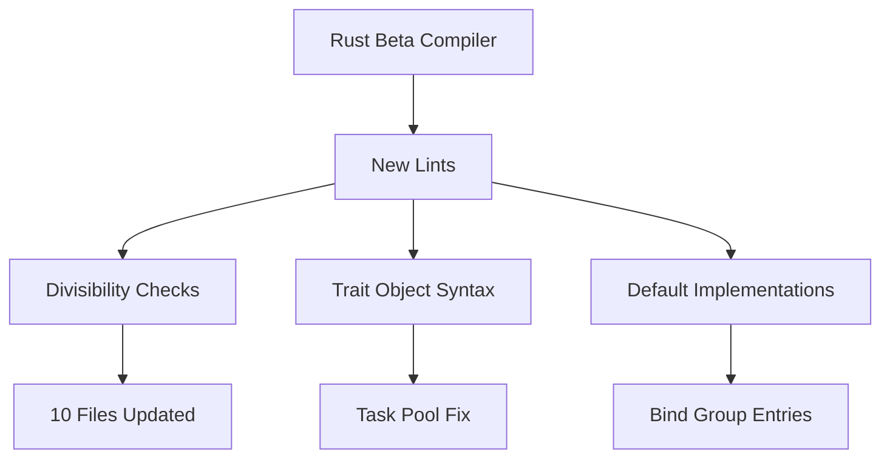

+++
title = "#20516 Fix latest lints for rust beta"
date = "2025-08-11T00:00:00"
draft = false
template = "pull_request_page.html"
in_search_index = true

[taxonomies]
list_display = ["show"]

[extra]
current_language = "en"
available_languages = {"en" = { name = "English", url = "/pull_request/bevy/2025-08/pr-20516-en-20250811" }, "zh-cn" = { name = "中文", url = "/pull_request/bevy/2025-08/pr-20516-zh-cn-20250811" }}
labels = ["C-Code-Quality"]
+++

## Fix latest lints for rust beta

### Basic Information
- **Title**: Fix latest lints for rust beta
- **PR Link**: https://github.com/bevyengine/bevy/pull/20516
- **Author**: mockersf
- **Status**: MERGED
- **Labels**: C-Code-Quality
- **Created**: 2025-08-11T17:19:34Z
- **Merged**: 2025-08-11T19:53:18Z
- **Merged By**: james7132

### Description Translation
# Objective

- Fix #19679

## Solution

- fix lints

### The Story of This Pull Request

This PR addresses lint warnings introduced by the Rust beta compiler. The core issue (#19679) required updating multiple locations across the codebase to use more idiomatic Rust patterns and satisfy new compiler requirements. 

The changes primarily fall into three categories. First, divisibility checks were modernized by replacing manual modulus operations (`%`) with the standard library's `is_multiple_of` method. This change appears in 10 different files, including critical areas like mesh processing and rendering systems. For example:

```rust
// Before in bevy_mesh/src/mesh.rs
if indices.len() % 3 != 0

// After
if !indices.len().is_multiple_of(3)
```

Second, a type signature in the task pooling system was corrected to use proper trait object syntax. The previous version contained unnecessary parentheses around a trait object:

```rust
// Before in bevy_tasks/src/task_pool.rs
Box<(dyn core::any::Any + Send)>

// After
Box<dyn core::any::Any + Send>
```

Third, the `DynamicBindGroupEntries` struct in the renderer received a `Default` implementation to satisfy new trait requirements:

```rust
impl<'b> Default for DynamicBindGroupEntries<'b> {
    fn default() -> Self {
        Self::new()
    }
}
```

These changes maintain existing functionality while aligning with Rust's evolving best practices. The modifications are mechanical but important for keeping the codebase compatible with upcoming Rust versions and maintaining a clean build process. All changes are localized and don't introduce new functionality or architectural changes.

### Visual Representation



### Key Files Changed

1. **crates/bevy_tasks/src/task_pool.rs** (+3/-3)  
   Fixed trait object syntax in concurrent task handling:
   ```rust
   // Before:
   let spawned: ConcurrentQueue<FallibleTask<Result<T, Box<(dyn core::any::Any + Send)>>>> 
   
   // After:
   let spawned: ConcurrentQueue<FallibleTask<Result<T, Box<dyn core::any::Any + Send>>>> 
   ```

2. **crates/bevy_render/src/render_resource/bind_group_entries.rs** (+6/-0)  
   Added Default implementation:
   ```rust
   impl<'b> Default for DynamicBindGroupEntries<'b> {
       fn default() -> Self {
           Self::new()
       }
   }
   ```

3. **crates/bevy_mesh/src/mesh.rs** (+2/-2)  
   Updated mesh validation checks:
   ```rust
   // Before:
   if indices.len() % 3 != 0
   if indices.len() % 2 != 0
   
   // After:
   if !indices.len().is_multiple_of(3)
   if !indices.len().is_multiple_of(2)
   ```

4. **crates/bevy_animation/src/gltf_curves.rs** (+1/-1)  
   ```rust
   // Before:
   if values.len() % divisor != 0
   
   // After:
   if !values.len().is_multiple_of(divisor)
   ```

5. **examples/app/headless.rs** (+1/-1)  
   ```rust
   // Before:
   if state.count % 60 == 0
   
   // After:
   if state.count.is_multiple_of(60)
   ```

### Further Reading
- Rust `is_multiple_of` documentation: https://doc.rust-lang.org/std/primitive.u32.html#method.is_multiple_of
- Trait object syntax: https://doc.rust-lang.org/book/ch17-02-trait-objects.html
- Default trait: https://doc.rust-lang.org/std/default/trait.Default.html

### Full Code Diff
See original PR for complete diff: https://github.com/bevyengine/bevy/pull/20516/files