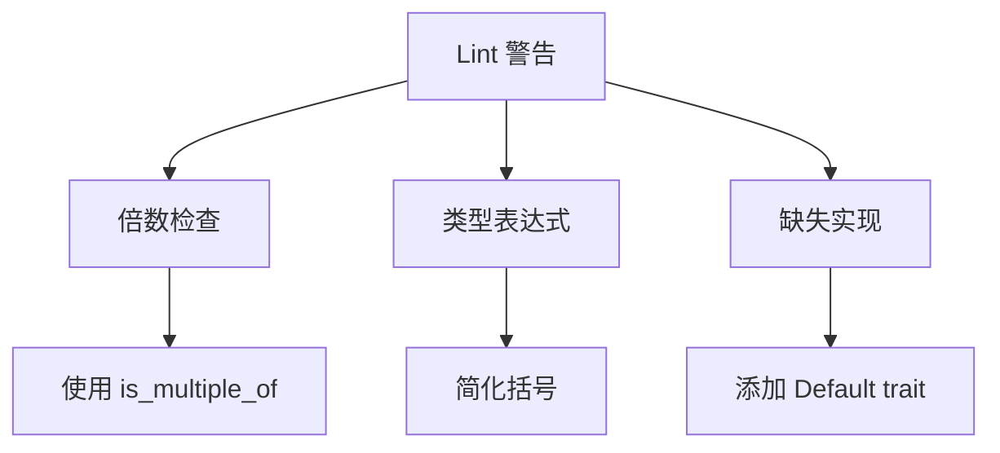

+++
title = "#20516 Fix latest lints for rust beta"
date = "2025-08-11T00:00:00"
draft = false
template = "pull_request_page.html"
in_search_index = false

[extra]
current_language = "zh-cn"
available_languages = {"en" = { name = "English", url = "/pull_request/bevy/2025-08/pr-20516-en-20250811" }, "zh-cn" = { name = "中文", url = "/pull_request/bevy/2025-08/pr-20516-zh-cn-20250811" }}
labels = ["C-Code-Quality"]
+++

# 修复 Rust Beta 的最新 Lint 警告

## Basic Information
- **Title**: Fix latest lints for rust beta
- **PR Link**: https://github.com/bevyengine/bevy/pull/20516
- **Author**: mockersf
- **Status**: MERGED
- **Labels**: C-Code-Quality
- **Created**: 2025-08-11T17:19:34Z
- **Merged**: 2025-08-11T19:53:18Z
- **Merged By**: james7132

## Description Translation
### 目标

- 修复 #19679

### 解决方案

- 修复 lint 警告

## 本次 Pull Request 的技术分析

### 问题背景
Rust 编译器的 beta 版本引入了新的 lint 规则，导致 Bevy 代码库在编译时出现多个警告。具体问题包括：
1. 使用取模运算(`%`)检查倍数关系，而新 lint 建议使用更语义化的 `is_multiple_of()` 方法
2. 类型表达式中的冗余括号，如 `Box<(dyn core::any::Any + Send)>`
3. 缺少 `Default` trait 实现

这些警告虽不影响编译，但会影响代码整洁度和未来兼容性。问题 #19679 专门追踪了这些新出现的 lint 警告。

### 解决方案
PR 采用了直接且一致的修复策略：
1. 将 `x % y == 0` 模式替换为 `x.is_multiple_of(y)`
2. 简化冗余的类型表达式括号
3. 为 `DynamicBindGroupEntries` 添加 `Default` 实现

这些修改保持了原有逻辑不变，仅改变代码表达方式以符合最新的 Rust 代码规范。

### 具体实现分析
修改涉及多个 crate 和示例，主要分为三类：

**1. 倍数检查优化**
将传统的取模运算替换为标准库提供的 `is_multiple_of()` 方法，使意图更明确：

```rust
// Before:
if indices.len() % 3 != 0

// After:
if !indices.len().is_multiple_of(3)
```

这种修改出现在多个地方：
- 网格索引验证
- 帧计数检查
- 资源对齐验证
- 顶点计数计算
- 立方体贴图验证

**2. 类型表达式简化**
删除 trait 对象类型中冗余的括号：

```rust
// Before:
Box<(dyn core::any::Any + Send)>

// After:
Box<dyn core::any::Any + Send>
```

**3. 添加 Default 实现**
为 `DynamicBindGroupEntries` 结构体添加默认实现：

```rust
impl<'b> Default for DynamicBindGroupEntries<'b> {
    fn default() -> Self {
        Self::new()
    }
}
```

### 技术影响
1. **代码质量提升**：使用标准库方法替代自定义取模运算，使代码更符合 Rust 习惯用法
2. **可维护性增强**：`is_multiple_of()` 比取模运算更清晰地表达了"倍数"的意图
3. **未来兼容性**：避免新 lint 规则可能导致未来版本编译失败
4. **API 完整性**：为 `DynamicBindGroupEntries` 添加 Default 实现，使其更完整

## Visual Representation



## Key Files Changed

### crates/bevy_mesh/src/mesh.rs
**修改原因**：将索引数量验证从取模运算改为 is_multiple_of
```diff
 match topology {
     PrimitiveTopology::TriangleList => {
-        if indices.len() % 3 != 0 {
+        if !indices.len().is_multiple_of(3) {
             return Err(MeshWindingInvertError::AbruptIndicesEnd);
         }
         // ...
     }
     PrimitiveTopology::LineList => {
-        if indices.len() % 2 != 0 {
+        if !indices.len().is_multiple_of(2) {
             return Err(MeshWindingInvertError::AbruptIndicesEnd);
         }
         // ...
```

### crates/bevy_render/src/render_resource/bind_group_entries.rs
**修改原因**：添加 Default trait 实现
```diff
+impl<'b> Default for DynamicBindGroupEntries<'b> {
+    fn default() -> Self {
+        Self::new()
+    }
+}
```

### crates/bevy_tasks/src/task_pool.rs
**修改原因**：简化类型表达式和倍数检查
```diff
- let spawned: ConcurrentQueue<FallibleTask<Result<T, Box<(dyn core::any::Any + Send)>>>> =
+ let spawned: ConcurrentQueue<FallibleTask<Result<T, Box<dyn core::any::Any + Send>>>> =
     ConcurrentQueue::unbounded();

- if state.count % 60 == 0 {
+ if state.count.is_multiple_of(60) {
```

### crates/bevy_pbr/src/render/morph.rs
**修改原因**：优化对齐检查表达式
```diff
- const fn can_align(step: usize, target: usize) -> bool {
-     step % target == 0 || target % step == 0
- }
+ const fn can_align(step: usize, target: usize) -> bool {
+     step.is_multiple_of(target) || target.is_multiple_of(step)
+ }
```

### examples/async_tasks/async_compute.rs
**修改原因**：更新示例中的倍数检查
```diff
- let offset = if NUM_CUBES % 2 == 0 {
+ let offset = if NUM_CUBES.is_multiple_of(2) {
```

## Further Reading
1. [Rust is_multiple_of 文档](https://doc.rust-lang.org/std/primitive.u64.html#method.is_multiple_of)
2. [Rust Default trait 指南](https://doc.rust-lang.org/std/default/trait.Default.html)
3. [Clippy lint 规则说明](https://github.com/rust-lang/rust-clippy)