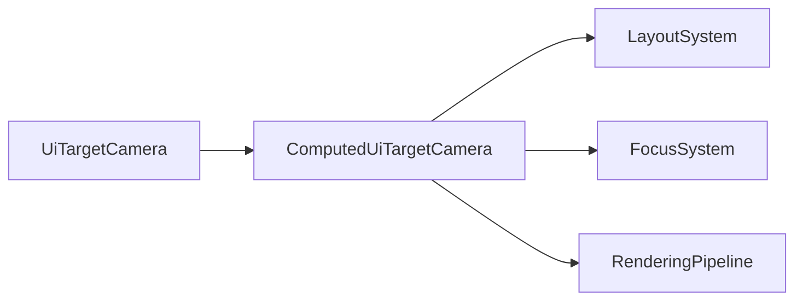

+++
title = "#20519 Rename `ComputedNodeTarget` to `ComputedUiTargetCamera`"
date = "2025-08-11T00:00:00"
draft = false
template = "pull_request_page.html"
in_search_index = true

[taxonomies]
list_display = ["show"]

[extra]
current_language = "en"
available_languages = {"en" = { name = "English", url = "/pull_request/bevy/2025-08/pr-20519-en-20250811" }, "zh-cn" = { name = "中文", url = "/pull_request/bevy/2025-08/pr-20519-zh-cn-20250811" }}
labels = ["D-Trivial", "A-UI", "C-Usability"]
+++

# Rename `ComputedNodeTarget` to `ComputedUiTargetCamera`

## Basic Information
- **Title**: Rename `ComputedNodeTarget` to `ComputedUiTargetCamera`
- **PR Link**: https://github.com/bevyengine/bevy/pull/20519
- **Author**: ickshonpe
- **Status**: MERGED
- **Labels**: D-Trivial, A-UI, C-Usability, S-Ready-For-Final-Review, M-Needs-Migration-Guide
- **Created**: 2025-08-11T19:02:19Z
- **Merged**: 2025-08-11T22:30:01Z
- **Merged By**: mockersf

## Description Translation
# Objective

Seems like not enough users and devs are aware of this component or what it's for, maybe a more descriptive name will help.

## Solution

Rename `ComputedNodeTarget` to `ComputedUiTargetCamera`. New name chosen because the component's value is derived from `UiTargetCamera`.

## The Story of This Pull Request

The PR addresses a naming clarity issue in Bevy's UI system. The `ComputedNodeTarget` component wasn't adequately conveying its purpose to developers. Its role is to store derived information about the camera target associated with a UI node, specifically containing the camera entity, scale factor, and physical size of the render target. The original name didn't indicate its relationship to cameras or UI rendering, which could lead to confusion during development.

The solution implemented is straightforward: rename the component to `ComputedUiTargetCamera` to explicitly indicate its purpose and derivation from `UiTargetCamera`. This change improves code readability and maintainability by making the component's purpose immediately clear from its name. The new name follows Bevy's naming conventions where "Computed" indicates derived data, "Ui" specifies the UI domain, and "TargetCamera" clearly denotes the camera association.

The implementation required updating all references to `ComputedNodeTarget` across the codebase. This involved:
1. Changing the component definition and its implementations
2. Updating all type annotations and queries using the component
3. Modifying systems that propagate or use this component
4. Adjusting test cases and examples that reference the component

The component's structure remains unchanged - only its name was updated. The fields (camera entity, scale factor, and physical size) maintain their existing functionality:

```rust
// Before:
pub struct ComputedNodeTarget {
    pub(crate) camera: Entity,
    pub(crate) scale_factor: f32,
    pub(crate) physical_size: UVec2,
}

// After:
pub struct ComputedUiTargetCamera {
    pub(crate) camera: Entity,
    pub(crate) scale_factor: f32,
    pub(crate) physical_size: UVec2,
}
```

The change affects multiple systems including layout calculation, text rendering, interaction handling, and rendering pipelines. For example, in the UI layout system, queries were updated to reference the new component name:

```rust
// Before:
Query<(
    Entity,
    Ref<Node>,
    Option<&mut ContentSize>,
    Ref<ComputedNodeTarget>,
)>

// After:
Query<(
    Entity,
    Ref<Node>,
    Option<&mut ContentSize>,
    Ref<ComputedUiTargetCamera>,
)>
```

Similarly, in the focus system, the node query struct was updated:

```rust
// Before:
pub struct NodeQuery {
    target_camera: &'static ComputedNodeTarget,
}

// After:
pub struct NodeQuery {
    target_camera: &'static ComputedUiTargetCamera,
}
```

The PR includes comprehensive updates to ensure all systems correctly reference the renamed component. Tests were updated to verify the changes, confirming that the UI systems continue functioning as expected with the new naming.

The impact of this change is primarily on code clarity. Developers working with UI rendering and interaction will now find it easier to understand the purpose of this component. The rename also aligns with Bevy's ongoing efforts to improve API discoverability and reduce cognitive load when working with complex systems.

## Visual Representation



## Key Files Changed

### `crates/bevy_ui/src/update.rs`
This file handles UI context updates. The component name was changed throughout the file, including in system queries and test cases. The key change was in how the component is inserted for UI root nodes.

```rust
// Before:
commands.entity(root_entity).insert(Propagate(ComputedNodeTarget { ... }));

// After:
commands.entity(root_entity).insert(Propagate(ComputedUiTargetCamera { ... }));
```

### `crates/bevy_ui_render/src/lib.rs`
Updated the rendering pipeline to use the new component name. The UI camera mapper system now references `ComputedUiTargetCamera`.

```rust
// Before:
pub fn map(&mut self, computed_target: &ComputedNodeTarget) -> Option<Entity> { ... }

// After:
pub fn map(&mut self, computed_target: &ComputedUiTargetCamera) -> Option<Entity> { ... }
```

### `crates/bevy_ui/src/layout/mod.rs`
The layout system was updated to reference the renamed component in queries and test configurations.

```rust
// Before:
app.add_plugins(HierarchyPropagatePlugin::<ComputedNodeTarget>::new(PostUpdate));

// After:
app.add_plugins(HierarchyPropagatePlugin::<ComputedUiTargetCamera>::new(PostUpdate));
```

### `crates/bevy_ui/src/ui_node.rs`
The component definition and associated implementations were renamed here.

```rust
// Before:
#[require(ComputedNode, ComputedNodeTarget, ...)]
pub struct ComputedNodeTarget { ... }

// After:
#[require(ComputedNode, ComputedUiTargetCamera, ...)]
pub struct ComputedUiTargetCamera { ... }
```

### `crates/bevy_core_widgets/src/core_slider.rs`
Widget systems were updated to use the new component name in their queries.

```rust
// Before:
Query<(
    ...,
    &ComputedNodeTarget,
    ...
)>

// After:
Query<(
    ...,
    &ComputedUiTargetCamera,
    ...
)>
```

### `release-content/migration-guides/renamed_computednodetarget.md`
Added a migration guide explaining the rename.

```markdown
---
title: Renamed `ComputedNodeTarget` to `ComputedUiTargetCamera`
pull_requests: [20519]
---

Rename `ComputedNodeTarget` to `ComputedUiTargetCamera`. New name chosen because the component's value is derived from `UiTargetCamera`.
```

## Further Reading
- [Bevy UI System Overview](https://bevyengine.org/learn/book/getting-started/ui/)
- [Component Naming Conventions Discussion](https://github.com/bevyengine/bevy/discussions/12039)
- [UI Rendering Pipeline Documentation](https://github.com/bevyengine/bevy/blob/main/crates/bevy_ui_render/README.md)

## Full Code Diff
<details>
<summary>View full diff</summary>

```diff
diff --git a/crates/bevy_core_widgets/src/core_scrollbar.rs b/crates/bevy_core_widgets/src/core_scrollbar.rs
index 5f5a7087483d1..cf52d7eb8c80c 100644
--- a/crates/bevy_core_widgets/src/core_scrollbar.rs
+++ b/crates/bevy_core_widgets/src/core_scrollbar.rs
@@ -12,7 +12,7 @@ use bevy_math::Vec2;
 use bevy_picking::events::{Cancel, Drag, DragEnd, DragStart, Pointer, Press};
 use bevy_reflect::{prelude::ReflectDefault, Reflect};
 use bevy_ui::{
-    ComputedNode, ComputedNodeTarget, Node, ScrollPosition, UiGlobalTransform, UiScale, Val,
+    ComputedNode, ComputedUiTargetCamera, Node, ScrollPosition, UiGlobalTransform, UiScale, Val,
 };
 
 /// Used to select the orientation of a scrollbar, slider, or other oriented control.
@@ -104,7 +104,7 @@ fn scrollbar_on_pointer_down(
     mut q_scrollbar: Query<(
         &CoreScrollbar,
         &ComputedNode,
-        &ComputedNodeTarget,
+        &ComputedUiTargetCamera,
         &UiGlobalTransform,
     )>,
     mut q_scroll_pos: Query<(&mut ScrollPosition, &ComputedNode), Without<CoreScrollbar>>,
diff --git a/crates/bevy_core_widgets/src/core_slider.rs b/crates/bevy_core_widgets/src/core_slider.rs
index 64570c2ed1963..6d38cf7732327 100644
--- a/crates/bevy_core_widgets/src/core_slider.rs
+++ b/crates/bevy_core_widgets/src/core_slider.rs
@@ -23,7 +23,9 @@ use bevy_log::warn_once;
 use bevy_math::ops;
 use bevy_picking::events::{Drag, DragEnd, DragStart, Pointer, Press};
 use bevy_reflect::{prelude::ReflectDefault, Reflect};
-use bevy_ui::{ComputedNode, ComputedNodeTarget, InteractionDisabled, UiGlobalTransform, UiScale};
+use bevy_ui::{
+    ComputedNode, ComputedUiTargetCamera, InteractionDisabled, UiGlobalTransform, UiScale,
+};
 
 use crate::{Callback, Notify, ValueChange};
 
@@ -234,7 +236,7 @@ pub(crate) fn slider_on_pointer_down(
         &SliderStep,
         Option<&SliderPrecision>,
         &ComputedNode,
-        &ComputedNodeTarget,
+        &ComputedUiTargetCamera,
         &UiGlobalTransform,
         Has<InteractionDisabled>,
     )>,
diff --git a/crates/bevy_ui/src/experimental/ghost_hierarchy.rs b/crates/bevy_ui/src/experimental/ghost_hierarchy.rs
index 3ae45377ebeaa..79d081c6bfd4d 100644
--- a/crates/bevy_ui/src/experimental/ghost_hierarchy.rs
+++ b/crates/bevy_ui/src/experimental/ghost_hierarchy.rs
@@ -1,7 +1,7 @@
 //! This module contains [`GhostNode`] and utilities to flatten the UI hierarchy, traversing past ghost nodes.
 
 #[cfg(feature = "ghost_nodes")]
-use crate::ui_node::ComputedNodeTarget;
+use crate::ui_node::ComputedUiTargetCamera;
 use crate::Node;
 #[cfg(feature = "ghost_nodes")]
 use bevy_camera::visibility::Visibility;
@@ -21,7 +21,7 @@ use smallvec::SmallVec;
 #[derive(Component, Debug, Copy, Clone, Reflect)]
 #[cfg_attr(feature = "ghost_nodes", derive(Default))]
 #[reflect(Component, Debug, Clone)]
-#[require(Visibility, Transform, ComputedNodeTarget)]
+#[require(Visibility, Transform, ComputedUiTargetCamera)]
 pub struct GhostNode;
 
 #[cfg(feature = "ghost_nodes")]
diff --git a/crates/bevy_ui/src/focus.rs b/crates/bevy_ui/src/focus.rs
index 03f022c7627af..eddb6f54add14 100644
--- a/crates/bevy_ui/src/focus.rs
+++ b/crates/bevy_ui/src/focus.rs
@@ -1,5 +1,6 @@
 use crate::{
-    ui_transform::UiGlobalTransform, ComputedNode, ComputedNodeTarget, Node, OverrideClip, UiStack,
+    ui_transform::UiGlobalTransform, ComputedNode, ComputedUiTargetCamera, Node, OverrideClip,
+    UiStack,
 };
 use bevy_camera::{visibility::InheritedVisibility, Camera, NormalizedRenderTarget};
 use bevy_ecs::{
@@ -139,7 +140,7 @@ pub struct NodeQuery {
     relative_cursor_position: Option<&'static mut RelativeCursorPosition>,
     focus_policy: Option<&'static FocusPolicy>,
     inherited_visibility: Option<&'static InheritedVisibility>,
-    target_camera: &'static ComputedNodeTarget,
+    target_camera: &'static ComputedUiTargetCamera,
 }
 
 /// The system that sets Interaction for all UI elements based on the mouse cursor activity
diff --git a/crates/bevy_ui/src/layout/mod.rs b/crates/bevy_ui/src/layout/mod.rs
index 9a077acb17ea2..39d5e26e0d963 100644
--- a/crates/bevy_ui/src/layout/mod.rs
+++ b/crates/bevy_ui/src/layout/mod.rs
@@ -1,7 +1,7 @@
 use crate::{
     experimental::{UiChildren, UiRootNodes},
     ui_transform::{UiGlobalTransform, UiTransform},
-    BorderRadius, ComputedNode, ComputedNodeTarget, ContentSize, Display, LayoutConfig, Node,
+    BorderRadius, ComputedNode, ComputedUiTargetCamera, ContentSize, Display, LayoutConfig, Node,
     Outline, OverflowAxis, ScrollPosition,
 };
 use bevy_ecs::{
@@ -77,7 +77,7 @@ pub fn ui_layout_system(
         Entity,
         Ref<Node>,
         Option<&mut ContentSize>,
-        Ref<ComputedNodeTarget>,
+        Ref<ComputedUiTargetCamera>,
     )>,
     added_node_query: Query<(), Added<Node>>,
     mut node_update_query: Query<(
@@ -383,7 +383,7 @@ mod tests {
     fn setup_ui_test_app() -> App {
         let mut app = App::new();
 
-        app.add_plugins(HierarchyPropagatePlugin::<ComputedNodeTarget>::new(
+        app.add_plugins(HierarchyPropagatePlugin::<ComputedUiTargetCamera>::new(
             PostUpdate,
         ));
         app.init_resource::<UiScale>();
@@ -416,7 +416,7 @@ mod tests {
 
         app.configure_sets(
             PostUpdate,
-            PropagateSet::<ComputedNodeTarget>::default()
+            PropagateSet::<ComputedUiTargetCamera>::default()
                 .after(update_ui_context_system)
                 .before(ui_layout_system),
         );
@@ -1074,13 +1074,13 @@ mod tests {
                 .chain(),
         );
 
-        app.add_plugins(HierarchyPropagatePlugin::<ComputedNodeTarget>::new(
+        app.add_plugins(HierarchyPropagatePlugin::<ComputedUiTargetCamera>::new(
             PostUpdate,
         ));
 
         app.configure_sets(
             PostUpdate,
-            PropagateSet::<ComputedNodeTarget>::default()
+            PropagateSet::<ComputedUiTargetCamera>::default()
                 .after(update_ui_context_system)
                 .before(ui_layout_system),
         );
diff --git a/crates/bevy_ui/src/lib.rs b/crates/bevy_ui/src/lib.rs
index e75f1ed96cd8d..c6eefa8bb8a38 100644
--- a/crates/bevy_ui/src/lib.rs
+++ b/crates/bevy_ui/src/lib.rs
@@ -154,9 +154,9 @@ impl Plugin for UiPlugin {
             )
             .configure_sets(
                 PostUpdate,
-                PropagateSet::<ComputedNodeTarget>::default().in_set(UiSystems::Propagate),
+                PropagateSet::<ComputedUiTargetCamera>::default().in_set(UiSystems::Propagate),
             )
-            .add_plugins(HierarchyPropagatePlugin::<ComputedNodeTarget>::new(
+            .add_plugins(HierarchyPropagatePlugin::<ComputedUiTargetCamera>::new(
                 PostUpdate,
             ))
             .add_systems(
diff --git a/crates/bevy_ui/src/picking_backend.rs b/crates/bevy_ui/src/picking_backend.rs
index ffd961acd3777..e944dd3dd3229 100644
--- a/crates/bevy_ui/src/picking_backend.rs
+++ b/crates/bevy_ui/src/picking_backend.rs
@@ -92,7 +92,7 @@ pub struct NodeQuery {
     transform: &'static UiGlobalTransform,
     pickable: Option<&'static Pickable>,
     inherited_visibility: Option<&'static InheritedVisibility>,
-    target_camera: &'static ComputedNodeTarget,
+    target_camera: &'static ComputedUiTargetCamera,
 }
 
 /// Computes the UI node entities under each pointer.
diff --git a/crates/bevy_ui/src/ui_node.rs b/crates/bevy_ui/src/ui_node.rs
index 7c55265691233..9306edbeeda64 100644
--- a/crates/bevy_ui/src/ui_node.rs
+++ b/crates/bevy_ui/src/ui_node.rs
@@ -380,7 +380,7 @@ impl From<Vec2> for ScrollPosition {
 #[derive(Component, Clone, PartialEq, Debug, Reflect)]
 #[require(
     ComputedNode,
-    ComputedNodeTarget,
+    ComputedUiTargetCamera,
     UiTransform,
     BackgroundColor,
     BorderColor,
@@ -2802,13 +2802,13 @@ impl<'w, 's> DefaultUiCamera<'w, 's> {
 /// Derived information about the camera target for this UI node.
 #[derive(Component, Clone, Copy, Debug, Reflect, PartialEq)]
 #[reflect(Component, Default, PartialEq, Clone)]
-pub struct ComputedNodeTarget {
+pub struct ComputedUiTargetCamera {
     pub(crate) camera: Entity,
     pub(crate) scale_factor: f32,
     pub(crate) physical_size: UVec2,
 }
 
-impl Default for ComputedNodeTarget {
+impl Default for ComputedUiTargetCamera {
     fn default() -> Self {
         Self {
             camera: Entity::PLACEHOLDER,
@@ -2818,7 +2818,7 @@ impl Default for ComputedNodeTarget {
     }
 }
 
-impl ComputedNodeTarget {
+impl ComputedUiTargetCamera {
     pub fn camera(&self) -> Option<Entity> {
         Some(self.camera).filter(|&entity| entity != Entity::PLACEHOLDER)
     }
diff --git a/crates/bevy_ui/src/update.rs b/crates/bevy_ui/src/update.rs
index 1978f6b3a4a18..0dd7c3871463b 100644
--- a/crates/bevy_ui/src/update.rs
+++ b/crates/bevy_ui/src/update.rs
@@ -3,8 +3,8 @@
 use crate::{
     experimental::{UiChildren, UiRootNodes},
     ui_transform::UiGlobalTransform,
-    CalculatedClip, ComputedNodeTarget, DefaultUiCamera, Display, Node, OverflowAxis, OverrideClip,
-    UiScale, UiTargetCamera,
+    CalculatedClip, ComputedUiTargetCamera, DefaultUiCamera, Display, Node, OverflowAxis,
+    OverrideClip, UiScale, UiTargetCamera,
 };
 
 use super::ComputedNode;
@@ -164,7 +164,7 @@ pub fn update_ui_context_system(
 
         commands
             .entity(root_entity)
-            .insert(Propagate(ComputedNodeTarget {
+            .insert(Propagate(ComputedUiTargetCamera {
                 camera,
                 scale_factor,
                 physical_size,
@@ -199,7 +199,7 @@ mod tests {
     use bevy_window::WindowScaleFactorChanged;
 
     use crate::update::update_ui_context_system;
-    use crate::ComputedNodeTarget;
+    use crate::ComputedUiTargetCamera;
     use crate::IsDefaultUiCamera;
     use crate::Node;
     use crate::UiScale;
@@ -217,11 +217,14 @@ mod tests {
         app.init_resource::<Events<AssetEvent<Image>>>();
         app.init_resource::<Assets<Image>>();
         app.init_resource::<ManualTextureViews>();
-        app.add_plugins(HierarchyPropagatePlugin::<ComputedNodeTarget>::new(
+        app.add_plugins(HierarchyPropagatePlugin::<ComputedUiTargetCamera>::new(
             PostUpdate,
         ));
 
-        app.configure_sets(PostUpdate, PropagateSet::<ComputedNodeTarget>::default());
+        app.configure_sets(
+            PostUpdate,
+            PropagateSet::<ComputedUiTargetCamera>::default(),
+        );
 
         app.add_systems(
             bevy_app::Update,
@@ -256,8 +259,8 @@ mod tests {
         let world = app.world_mut();
 
         assert_eq!(
-            *world.get::<ComputedNodeTarget>(uinode).unwrap(),
-            ComputedNodeTarget {
+            *world.get::<ComputedUiTargetCamera>(uinode).unwrap(),
+            ComputedUiTargetCamera {
                 camera,
                 physical_size,
                 scale_factor,
@@ -320,8 +323,8 @@ mod tests {
             (uinode2c, camera2, scale2, size2),
         ] {
             assert_eq!(
-                *world.get::<ComputedNodeTarget>(uinode).unwrap(),
-                ComputedNodeTarget {
+                *world.get::<ComputedUiTargetCamera>(uinode).unwrap(),
+                ComputedUiTargetCamera {
                     camera,
                     scale_factor,
                     physical_size,
@@ -375,7 +378,7 @@ mod tests {
 
         assert_eq!(
             world
-                .get::<ComputedNodeTarget>(uinode)
+                .get::<ComputedUiTargetCamera>(uinode)
                 .unwrap()
                 .scale_factor,
             scale1
@@ -383,7 +386,7 @@ mod tests {
 
         assert_eq!(
             world
-                .get::<ComputedNodeTarget>(uinode)
+                .get::<ComputedUiTargetCamera>(uinode)
                 .unwrap()
                 .physical_size,
             size1
@@ -391,7 +394,7 @@ mod tests {
 
         assert_eq!(
             world
-                .get::<ComputedNodeTarget>(uinode)
+                .get::<ComputedUiTargetCamera>(uinode)
                 .unwrap()
                 .camera()
                 .unwrap(),
@@ -405,7 +408,7 @@ mod tests {
 
         assert_eq!(
             world
-                .get::<ComputedNodeTarget>(uinode)
+                .get::<ComputedUiTargetCamera>(uinode)
                 .unwrap()
                 .scale_factor,
             scale2
@@ -413,7 +416,7 @@ mod tests {
 
         assert_eq!(
             world
-                .get::<ComputedNodeTarget>(uinode)
+                .get::<ComputedUiTargetCamera>(uinode)
                 .unwrap()
                 .physical_size,
             size2
@@ -421,7 +424,7 @@ mod tests {
 
         assert_eq!(
             world
-                .get::<ComputedNodeTarget>(uinode)
+                .get::<ComputedUiTargetCamera>(uinode)
                 .unwrap()
                 .camera()
                 .unwrap(),
@@ -476,7 +479,7 @@ mod tests {
 
         assert_eq!(
             world
-                .get::<ComputedNodeTarget>(uinode1)
+                .get::<ComputedUiTargetCamera>(uinode1)
                 .unwrap()
                 .scale_factor(),
             scale1
@@ -484,7 +487,7 @@ mod tests {
 
         assert_eq!(
             world
-                .get::<ComputedNodeTarget>(uinode1)
+                .get::<ComputedUiTargetCamera>(uinode1)
                 .unwrap()
                 .physical_size(),
             size1
@@ -492,7 +495,7 @@ mod tests {
 
         assert_eq!(
             world
-                .get::<ComputedNodeTarget>(uinode1)
+                .get::<ComputedUiTargetCamera>(uinode1)
                 .unwrap()
                 .camera()
                 .unwrap(),
@@ -501,7 +504,7 @@ mod tests {
 
         assert_eq!(
             world
-                .get::<ComputedNodeTarget>(uinode2)
+                .get::<ComputedUiTargetCamera>(uinode2)
                 .unwrap()
                 .camera()
                 .unwrap(),
@@ -516,7 +519,7 @@ mod tests {
 
         assert_eq!(
             world
-                .get::<ComputedNodeTarget>(uinode1)
+                .get::<ComputedUiTargetCamera>(uinode1)
                 .unwrap()
                 .scale_factor(),
             scale2
@@ -524,7 +527,7 @@ mod tests {
 
         assert_eq!(
             world
-                .get::<ComputedNodeTarget>(uinode1)
+                .get::<ComputedUiTargetCamera>(uinode1)
                 .unwrap()
                 .physical_size(),
             size2
@@ -532,7 +535,7 @@ mod tests {
 
         assert_eq!(
             world
-                .get::<ComputedNodeTarget>(uinode1)
+                .get::<ComputedUiTargetCamera>(uinode1)
                 .unwrap()
                 .camera()
                 .unwrap(),
@@ -541,7 +544,7 @@ mod tests {
 
         assert_eq!(
             world
-                .get::<ComputedNodeTarget>(uinode2)
+                .get::<ComputedUiTargetCamera>(uinode2)
                 .unwrap()
                 .camera()
                 .unwrap(),
@@ -580,7 +583,7 @@ mod tests {
 
         assert_eq!(
             world
-                .get::<ComputedNodeTarget>(uinode)
+                .get::<ComputedUiTargetCamera>(uinode)
                 .unwrap()
                 .scale_factor,
             scale
@@ -588,7 +591,7 @@ mod tests {
 
         assert_eq!(
             world
-                .get::<ComputedNodeTarget>(uinode)
+                .get::<ComputedUiTargetCamera>(uinode)
                 .unwrap()
                 .physical_size,
             size
@@ -596,7 +599,7 @@ mod tests {
 
         assert_eq!(
             world
-                .get::<ComputedNodeTarget>(uinode)
+                .get::<ComputedUiTargetCamera>(uinode)
                 .unwrap()
                 .camera()
                 .unwrap(),
@@ -610,7 +613,7 @@ mod tests {
 
         assert_eq!(
             world
-                .get::<ComputedNodeTarget>(uinode)
+                .get::<ComputedUiTargetCamera>(uinode)
                 .unwrap()
                 .scale_factor(),
             2.
diff --git a/crates/bevy_ui/src/widget/image.rs b/crates/bevy_ui/src/widget/image.rs
index 9a743595b86b1..6f0ed85ab7cc0 100644
--- a/crates/bevy_ui/src/widget/image.rs
+++ b/crates/bevy_ui/src/widget/image.rs
@@ -1,4 +1,4 @@
-use crate::{ComputedNodeTarget, ContentSize, Measure, MeasureArgs, Node, NodeMeasure};
+use crate::{ComputedUiTargetCamera, ContentSize, Measure, MeasureArgs, Node, NodeMeasure};
 use bevy_asset::{Assets, Handle};
 use bevy_color::Color;
 use bevy_ecs::prelude::*;
@@ -261,7 +261,7 @@ pub fn update_image_content_size_system(
             &mut ContentSize,
             Ref<ImageNode>,
             &mut ImageNodeSize,
-            Ref<ComputedNodeTarget>,
+            Ref<ComputedUiTargetCamera>,
         ),
         UpdateImageFilter,
     >,
diff --git a/crates/bevy_ui/src/widget/text.rs b/crates/bevy_ui/src/widget/text.rs
index 1544a5ff7a976..8063578b11311 100644
--- a/crates/bevy_ui/src/widget/text.rs
+++ b/crates/bevy_ui/src/widget/text.rs
@@ -1,5 +1,5 @@
 use crate::{
-    ComputedNode, ComputedNodeTarget, ContentSize, FixedMeasure, Measure, MeasureArgs, Node,
+    ComputedNode, ComputedUiTargetCamera, ContentSize, FixedMeasure, Measure, MeasureArgs, Node,
     NodeMeasure,
 };
 use bevy_asset::Assets;
@@ -262,7 +262,7 @@ fn create_text_measure<'a>(
 /// A `Measure` is used by the UI's layout algorithm to determine the appropriate amount of space
 /// to provide for the text given the fonts, the text itself and the constraints of the layout.
 ///
-/// * Measures are regenerated on changes to either [`ComputedTextBlock`] or [`ComputedNodeTarget`].
+/// * Measures are regenerated on changes to either [`ComputedTextBlock`] or [`ComputedUiTargetCamera`].
 /// * Changes that only modify the colors of a `Text` do not require a new `Measure`. This system
 ///   is only able to detect that a `Text` component has changed and will regenerate the `Measure` on
 ///   color changes. This can be expensive, particularly for large blocks of text, and the [`bypass_change_detection`](bevy_ecs::change_detection::DetectChangesMut::bypass_change_detection)
@@ -276,7 +276,7 @@ pub fn measure_text_system(
             &mut ContentSize,
             &mut TextNodeFlags,
             &mut ComputedTextBlock,
-            Ref<ComputedNodeTarget>,
+            Ref<ComputedUiTargetCamera>,
         ),
         With<Node>,
     >,
diff --git a/crates/bevy_ui_render/src/box_shadow.rs b/crates/bevy_ui_render/src/box_shadow.rs
index 42bd8c93583b4..2b7b9e679e135 100644
--- a/crates/bevy_ui_render/src/box_shadow.rs
+++ b/crates/bevy_ui_render/src/box_shadow.rs
@@ -28,7 +28,7 @@ use bevy_render::{
 use bevy_render::{RenderApp, RenderStartup};
 use bevy_shader::{Shader, ShaderDefVal};
 use bevy_ui::{
-    BoxShadow, CalculatedClip, ComputedNode, ComputedNodeTarget, ResolvedBorderRadius,
+    BoxShadow, CalculatedClip, ComputedNode, ComputedUiTargetCamera, ResolvedBorderRadius,
     UiGlobalTransform, Val,
 };
 use bevy_utils::default;
@@ -223,7 +223,7 @@ pub fn extract_shadows(
             &InheritedVisibility,
             &BoxShadow,
             Option<&CalculatedClip>,
-            &ComputedNodeTarget,
+            &ComputedUiTargetCamera,
         )>,
     >,
     camera_map: Extract<UiCameraMap>,
diff --git a/crates/bevy_ui_render/src/debug_overlay.rs b/crates/bevy_ui_render/src/debug_overlay.rs
index 6c277b55cd124..e5d1d7db80b0e 100644
--- a/crates/bevy_ui_render/src/debug_overlay.rs
+++ b/crates/bevy_ui_render/src/debug_overlay.rs
@@ -21,7 +21,7 @@ use bevy_sprite::BorderRect;
 use bevy_ui::ui_transform::UiGlobalTransform;
 use bevy_ui::CalculatedClip;
 use bevy_ui::ComputedNode;
-use bevy_ui::ComputedNodeTarget;
+use bevy_ui::ComputedUiTargetCamera;
 use bevy_ui::UiStack;
 
 /// Configuration for the UI debug overlay
@@ -65,7 +65,7 @@ pub fn extract_debug_overlay(
             &UiGlobalTransform,
             &InheritedVisibility,
             Option<&CalculatedClip>,
-            &ComputedNodeTarget,
+            &ComputedUiTargetCamera,
         )>,
     >,
     ui_stack: Extract<Res<UiStack>>,
diff --git a/crates/bevy_ui_render/src/gradient.rs b/crates/bevy_ui_render/src/gradient.rs
index cc8442f8c9517..93fb500779114 100644
--- a/crates/bevy_ui_render/src/gradient.rs
+++ b/crates/bevy_ui_render/src/gradient.rs
@@ -352,7 +352,7 @@ pub fn extract_gradients(
         Query<(
             Entity,
             &ComputedNode,
-            &ComputedNodeTarget,
+            &ComputedUiTargetCamera,
             &UiGlobalTransform,
             &InheritedVisibility,
             Option<&CalculatedClip>,
diff --git a/crates/bevy_ui_render/src/lib.rs b/crates/bevy_ui_render/src/lib.rs
index 068335645d082..70d2f42089248 100644
--- a/crates/bevy_ui_render/src/lib.rs
+++ b/crates/bevy_ui_render/src/lib.rs
@@ -25,8 +25,8 @@ use bevy_reflect::Reflect;
 use bevy_shader::load_shader_library;
 use bevy_ui::widget::{ImageNode, TextShadow, ViewportNode};
 use bevy_ui::{
-    BackgroundColor, BorderColor, CalculatedClip, ComputedNode, ComputedNodeTarget, Display, Node,
-    Outline, ResolvedBorderRadius, UiGlobalTransform,
+    BackgroundColor, BorderColor, CalculatedClip, ComputedNode, ComputedUiTargetCamera, Display,
+    Node, Outline, ResolvedBorderRadius, UiGlobalTransform,
 };
 
 use bevy_app::prelude::*;
@@ -327,7 +327,7 @@ pub struct UiCameraMapper<'w, 's> {
 
 impl<'w, 's> UiCameraMapper<'w, 's> {
     /// Returns the render entity corresponding to the given `UiTargetCamera` or the default camera if `None`.
-    pub fn map(&mut self, computed_target: &ComputedNodeTarget) -> Option<Entity> {
+    pub fn map(&mut self, computed_target: &ComputedUiTargetCamera) -> Option<Entity> {
         let camera_entity = computed_target.camera()?;
         if self.camera_entity != camera