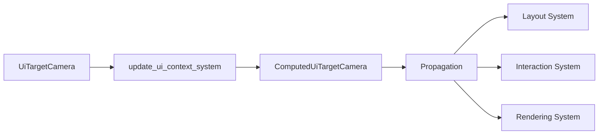

+++
title = "#20519 Rename `ComputedNodeTarget` to `ComputedUiTargetCamera`"
date = "2025-08-11T00:00:00"
draft = false
template = "pull_request_page.html"
in_search_index = false

[extra]
current_language = "zh-cn"
available_languages = {"en" = { name = "English", url = "/pull_request/bevy/2025-08/pr-20519-en-20250811" }, "zh-cn" = { name = "中文", url = "/pull_request/bevy/2025-08/pr-20519-zh-cn-20250811" }}
labels = ["D-Trivial", "A-UI", "C-Usability"]
+++

# 重命名 `ComputedNodeTarget` 为 `ComputedUiTargetCamera`

## Basic Information
- **Title**: Rename `ComputedNodeTarget` to `ComputedUiTargetCamera`
- **PR Link**: https://github.com/bevyengine/bevy/pull/20519
- **Author**: ickshonpe
- **Status**: MERGED
- **Labels**: D-Trivial, A-UI, C-Usability, S-Ready-For-Final-Review, M-Needs-Migration-Guide
- **Created**: 2025-08-11T19:02:19Z
- **Merged**: 2025-08-11T22:30:01Z
- **Merged By**: mockersf

## Description Translation
# 目的

似乎没有足够的用户和开发者了解这个组件或其用途，也许一个更具描述性的名字会有所帮助。

## 解决方案

将 `ComputedNodeTarget` 重命名为 `ComputedUiTargetCamera`。选择新名称是因为该组件的值派生自 `UiTargetCamera`。

## The Story of This Pull Request

在 Bevy 的 UI 系统中，`ComputedNodeTarget` 组件存储了 UI 节点相关的相机信息，包括相机实体、缩放因子和物理尺寸。该组件在多个 UI 系统中被使用，包括布局计算、交互处理和渲染流程。然而，其名称 `ComputedNodeTarget` 未能清晰表达其与相机的关系，导致开发者难以直观理解其用途。

为解决这个问题，本 PR 将组件重命名为 `ComputedUiTargetCamera`。新名称明确表达了三个关键信息：
1. `Computed` - 表明这是计算得到的值
2. `Ui` - 表明属于 UI 系统
3. `TargetCamera` - 明确与目标相机相关

这种重命名是语义化的改进，不改变任何功能逻辑。主要变更涉及：
- 组件类型定义的重命名
- 所有查询(Query)中对该组件的引用更新
- 派生属性(如 `#[require]`)中的引用更新
- 传播系统(HierarchyPropagatePlugin)的类型参数更新

在实现层面，变更通过简单的查找替换完成，但需要确保所有使用场景都被覆盖。由于这是公开组件的重命名，属于破坏性变更(breaking change)，因此添加了迁移指南 `renamed_computednodetarget.md`。

该变更影响了多个核心模块：
1. UI 布局系统(layout/mod.rs) - 更新了组件传播逻辑
2. UI 更新系统(update.rs) - 修改了相机上下文计算
3. UI 节点定义(ui_node.rs) - 重命名了组件结构体
4. 渲染系统(bevy_ui_render) - 更新了所有渲染相关的查询
5. 核心小部件(core_widgets) - 更新了交互处理逻辑

```rust
// 变更前
pub struct ComputedNodeTarget {
    pub(crate) camera: Entity,
    pub(crate) scale_factor: f32,
    pub(crate) physical_size: UVec2,
}

// 变更后
pub struct ComputedUiTargetCamera {
    pub(crate) camera: Entity,
    pub(crate) scale_factor: f32,
    pub(crate) physical_size: UVec2,
}
```

重命名的核心价值在于提升代码可读性和可维护性。当开发者在查询中看到 `ComputedUiTargetCamera` 时，能立即理解这是与 UI 相机相关的计算属性，而不需要额外查阅文档。这对于涉及相机选择、视口计算和 DPI 处理的 UI 系统尤为重要。

## Visual Representation



该图展示了：
1. `UiTargetCamera` 作为输入源
2. `update_ui_context_system` 计算生成 `ComputedUiTargetCamera`
3. 通过 Bevy 的传播机制将值分发到子节点
4. 最终被布局、交互和渲染系统使用

## Key Files Changed

### `crates/bevy_ui/src/update.rs` (+31/-28)
负责计算 UI 上下文的核心系统，将生成的组件从 `ComputedNodeTarget` 改为 `ComputedUiTargetCamera`

```rust
// Before:
commands.entity(root_entity).insert(Propagate(ComputedNodeTarget {
    camera,
    scale_factor,
    physical_size,
}));

// After:
commands.entity(root_entity).insert(Propagate(ComputedUiTargetCamera {
    camera,
    scale_factor,
    physical_size,
}));
```

### `crates/bevy_ui/src/ui_node.rs` (+4/-4)
定义 UI 节点组件，重命名核心结构体

```rust
// Before:
#[derive(Component, Clone, PartialEq, Debug, Reflect)]
#[require(ComputedNode, ComputedNodeTarget /* ... */)]
pub struct UiNode;

// After:
#[derive(Component, Clone, PartialEq, Debug, Reflect)]
#[require(ComputedNode, ComputedUiTargetCamera /* ... */)]
pub struct UiNode;
```

### `crates/bevy_ui_render/src/lib.rs` (+10/-10)
UI 渲染系统入口点，更新传播插件类型

```rust
// Before:
app.add_plugins(HierarchyPropagatePlugin::<ComputedNodeTarget>::new(
    PostUpdate,
));

// After:
app.add_plugins(HierarchyPropagatePlugin::<ComputedUiTargetCamera>::new(
    PostUpdate,
));
```

### `crates/bevy_ui/src/layout/mod.rs` (+6/-6)
布局系统，更新传播机制的类型引用

```rust
// Before:
app.configure_sets(
    PostUpdate,
    PropagateSet::<ComputedNodeTarget>::default()
);

// After:
app.configure_sets(
    PostUpdate,
    PropagateSet::<ComputedUiTargetCamera>::default()
);
```

### `crates/bevy_core_widgets/src/core_slider.rs` (+4/-2)
滑块小部件，更新交互处理查询

```rust
// Before:
fn slider_on_pointer_down(
    query: Query<(
        /* ... */
        &ComputedNodeTarget,
    )>,
)

// After:
fn slider_on_pointer_down(
    query: Query<(
        /* ... */
        &ComputedUiTargetCamera,
    )>,
)
```

## Further Reading
- [Bevy UI System Overview](https://bevyengine.org/learn/book/features/ui/)
- [Component Naming Best Practices](https://rust-lang.github.io/api-guidelines/naming.html)
- [Bevy ECS Query Documentation](https://docs.rs/bevy_ecs/latest/bevy_ecs/system/struct.Query.html)