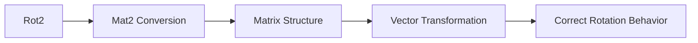

+++
title = "#20522 Fix rotation matrix construction from `Rot2`"
date = "2025-08-11T00:00:00"
draft = false
template = "pull_request_page.html"
in_search_index = true

[taxonomies]
list_display = ["show"]

[extra]
current_language = "en"
available_languages = {"en" = { name = "English", url = "/pull_request/bevy/2025-08/pr-20522-en-20250811" }, "zh-cn" = { name = "中文", url = "/pull_request/bevy/2025-08/pr-20522-zh-cn-20250811" }}
labels = ["C-Bug", "D-Trivial", "A-Math"]
+++

# Fix rotation matrix construction from `Rot2`

## Basic Information
- **Title**: Fix rotation matrix construction from `Rot2`
- **PR Link**: https://github.com/bevyengine/bevy/pull/20522
- **Author**: Jondolf
- **Status**: MERGED
- **Labels**: C-Bug, D-Trivial, S-Ready-For-Final-Review, A-Math, X-Uncontroversial
- **Created**: 2025-08-11T21:25:54Z
- **Merged**: 2025-08-11T22:06:07Z
- **Merged By**: james7132

## Description Translation
# Objective

Our `From<Rot2>` implementation for `Mat2` looks like this:

```rust
impl From<Rot2> for Mat2 {
    /// Creates a [`Mat2`] rotation matrix from a [`Rot2`].
    fn from(rot: Rot2) -> Self {
        Mat2::from_cols_array(&[rot.cos, -rot.sin, rot.sin, rot.cos])
    }
}
```

The resulting matrix looks like this:

```text
[  cos, sin ]
[ -sin, cos ]
```

Cool! Oh wait -- *checks [notes](https://en.wikipedia.org/wiki/Rotation_matrix)* -- the correct matrix is this?

```text
[ cos, -sin ]
[ sin,  cos ]
```

Oops!

## Solution

Fix the matrix signs. Now my joint's axes are oriented correctly :)

## Testing

Added a simple regression test. Fails before the change, passes after.

## The Story of This Pull Request

### The Problem and Context
We identified a bug in the conversion from `Rot2` to `Mat2` where the rotation matrix was constructed with incorrect signs. The original implementation produced this matrix:
```text
[  cos, sin ]
[ -sin, cos ]
```
However, the standard rotation matrix should be:
```text
[ cos, -sin ]
[ sin,  cos ]
```
This discrepancy would cause any transformations using this matrix to rotate in the opposite direction of what was intended. For example, a 90-degree rotation would rotate clockwise instead of counterclockwise. This bug directly affected any functionality relying on rotation matrices, such as sprite transformations or physics calculations.

### The Solution Approach
The fix required correcting the signs in the matrix construction. The solution was straightforward: swap the sign positions in the matrix columns. Instead of having negative sine in the first column and positive sine in the second, we needed positive sine in the first column and negative sine in the second. This aligns with the standard rotation matrix definition found in mathematics literature and graphics programming.

### The Implementation
We modified the `From<Rot2>` implementation for `Mat2` to correct the matrix signs. The key change was in the matrix column array:
```rust
// Before
Mat2::from_cols_array(&[rot.cos, -rot.sin, rot.sin, rot.cos])

// After
Mat2::from_cols_array(&[rot.cos, rot.sin, -rot.sin, rot.cos])
```
This change ensures the matrix is constructed as:
```text
[ cos, -sin ]
[ sin,  cos ]
```

To prevent regression, we added a comprehensive test case:
```rust
#[test]
fn rotation_matrix() {
    let rotation = Rot2::degrees(90.0);
    let matrix: Mat2 = rotation.into();

    // Check matrix axes
    assert_relative_eq!(matrix.x_axis, Vec2::Y);
    assert_relative_eq!(matrix.y_axis, Vec2::NEG_X);

    // Verify rotation behavior
    assert_relative_eq!(matrix * Vec2::X, Vec2::Y);
    assert_relative_eq!(matrix * Vec2::Y, Vec2::NEG_X);
    assert_relative_eq!(matrix * Vec2::NEG_X, Vec2::NEG_Y);
    assert_relative_eq!(matrix * Vec2::NEG_Y, Vec2::X);
}
```
This test validates both the structure of the matrix and its rotational behavior by checking:
1. The matrix's x and y axes are correctly oriented
2. The matrix correctly rotates all four cardinal directions

### The Impact
This fix ensures rotation matrices behave as expected throughout the engine. Any system using `Rot2` to create rotation matrices will now produce correct transformations. The added test prevents future regressions by verifying both the matrix structure and its rotational behavior. The change is minimal but critical for correct rotation operations.

## Visual Representation



## Key Files Changed

### crates/bevy_math/src/rotation2d.rs
**Change Description**: Fixed the rotation matrix construction from `Rot2` and added a regression test.

**Key Code Changes**:
```rust
// Before:
impl From<Rot2> for Mat2 {
    /// Creates a [`Mat2`] rotation matrix from a [`Rot2`].
    fn from(rot: Rot2) -> Self {
        Mat2::from_cols_array(&[rot.cos, -rot.sin, rot.sin, rot.cos])
    }
}

// After:
impl From<Rot2> for Mat2 {
    /// Creates a [`Mat2`] rotation matrix from a [`Rot2`].
    fn from(rot: Rot2) -> Self {
        Mat2::from_cols_array(&[rot.cos, rot.sin, -rot.sin, rot.cos])
    }
}
```

```rust
// Added test:
#[test]
fn rotation_matrix() {
    let rotation = Rot2::degrees(90.0);
    let matrix: Mat2 = rotation.into();

    assert_relative_eq!(matrix.x_axis, Vec2::Y);
    assert_relative_eq!(matrix.y_axis, Vec2::NEG_X);

    assert_relative_eq!(matrix * Vec2::X, Vec2::Y);
    assert_relative_eq!(matrix * Vec2::Y, Vec2::NEG_X);
    assert_relative_eq!(matrix * Vec2::NEG_X, Vec2::NEG_Y);
    assert_relative_eq!(matrix * Vec2::NEG_Y, Vec2::X);
}
```

## Further Reading
- [Rotation Matrix (Wikipedia)](https://en.wikipedia.org/wiki/Rotation_matrix)
- [Bevy Math Documentation](https://docs.rs/bevy_math/latest/bevy_math/)
- [Rotation Conventions in Game Development](https://www.euclideanspace.com/maths/geometry/rotations/index.htm)