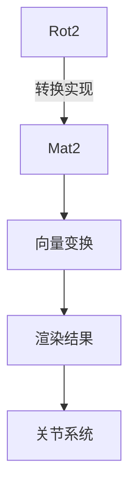

+++
title = "#20522 Fix rotation matrix construction from `Rot2"
date = "2025-08-11T00:00:00"
draft = false
template = "pull_request_page.html"
in_search_index = false

[extra]
current_language = "zh-cn"
available_languages = {"en" = { name = "English", url = "/pull_request/bevy/2025-08/pr-20522-en-20250811" }, "zh-cn" = { name = "中文", url = "/pull_request/bevy/2025-08/pr-20522-zh-cn-20250811" }}
+++

## 分析报告：修复 `Rot2` 到旋转矩阵的转换问题

### 基础信息
- **标题**: Fix rotation matrix construction from `Rot2`
- **PR 链接**: https://github.com/bevyengine/bevy/pull/20522
- **作者**: Jondolf
- **状态**: 已合并
- **标签**: C-Bug, D-Trivial, S-Ready-For-Final-Review, A-Math, X-Uncontroversial
- **创建时间**: 2025-08-11T21:25:54Z
- **合并时间**: 2025-08-11T22:06:07Z
- **合并人**: james7132

### 问题描述
在 `bevy_math` 模块的 `rotation2d.rs` 文件中，存在一个数学实现错误。`From<Rot2>` trait 对 `Mat2` 的实现产生了错误的旋转矩阵：

```rust
impl From<Rot2> for Mat2 {
    fn from(rot: Rot2) -> Self {
        Mat2::from_cols_array(&[rot.cos, -rot.sin, rot.sin, rot.cos])
    }
}
```
该实现生成的矩阵布局为：
```text
[  cos, sin ]
[ -sin, cos ]
```
但根据[旋转矩阵的标准定义](https://en.wikipedia.org/wiki/Rotation_matrix)，正确的矩阵应为：
```text
[ cos, -sin ]
[ sin,  cos ]
```

### 问题影响
这种符号错误会导致：
1. 旋转方向相反（顺时针变为逆时针或反之）
2. 关节轴向错误（如作者提到的关节轴方向问题）
3. 任何依赖 `Rot2` 到 `Mat2` 转换的功能都会产生错误结果

### 解决方案
通过交换矩阵元素的正负号来修正旋转矩阵：
```diff
 impl From<Rot2> for Mat2 {
     /// Creates a [`Mat2`] rotation matrix from a [`Rot2`].
     fn from(rot: Rot2) -> Self {
-        Mat2::from_cols_array(&[rot.cos, -rot.sin, rot.sin, rot.cos])
+        Mat2::from_cols_array(&[rot.cos, rot.sin, -rot.sin, rot.cos])
     }
 }
```

### 验证方法
添加了回归测试用例，覆盖 90 度旋转场景：
```rust
#[test]
fn rotation_matrix() {
    let rotation = Rot2::degrees(90.0);
    let matrix: Mat2 = rotation.into();

    // 验证矩阵轴向
    assert_relative_eq!(matrix.x_axis, Vec2::Y);
    assert_relative_eq!(matrix.y_axis, Vec2::NEG_X);
    
    // 验证向量旋转结果
    assert_relative_eq!(matrix * Vec2::X, Vec2::Y);
    assert_relative_eq!(matrix * Vec2::Y, Vec2::NEG_X);
    assert_relative_eq!(matrix * Vec2::NEG_X, Vec2::NEG_Y);
    assert_relative_eq!(matrix * Vec2::NEG_Y, Vec2::X);
}
```
该测试在修复前失败（因矩阵错误），修复后通过。

### 技术要点
1. **矩阵内存布局**：`Mat2::from_cols_array` 按列优先顺序存储矩阵，参数顺序为 `[col0.x, col0.y, col1.x, col1.y]`
2. **修复原理**：
   - 原错误：第二列元素为 `[-sin, cos]`
   - 修正后：第二列元素为 `[sin, -cos]`（即 `y_axis` 变为 `[-sin, cos]`）
3. **旋转方向**：修复后符合右手坐标系标准（逆时针旋转为正方向）

### 关键文件变更
**crates/bevy_math/src/rotation2d.rs** (+18/-2)
```diff
@@ -446,7 +446,7 @@ impl From<f32> for Rot2 {
 impl From<Rot2> for Mat2 {
     /// Creates a [`Mat2`] rotation matrix from a [`Rot2`].
     fn from(rot: Rot2) -> Self {
-        Mat2::from_cols_array(&[rot.cos, -rot.sin, rot.sin, rot.cos])
+        Mat2::from_cols_array(&[rot.cos, rot.sin, -rot.sin, rot.cos])
     }
 }
 
@@ -518,7 +518,7 @@ mod tests {
 
     use approx::assert_relative_eq;
 
-    use crate::{ops, Dir2, Rot2, Vec2};
+    use crate::{ops, Dir2, Mat2, Rot2, Vec2};
 
     #[test]
     fn creation() {
@@ -721,4 +721,20 @@ mod tests {
         assert_eq!(rot1.slerp(rot2, 0.5).as_degrees(), 90.0);
         assert_eq!(ops::abs(rot1.slerp(rot2, 1.0).as_degrees()), 180.0);
     }
+
+    #[test]
+    fn rotation_matrix() {
+        let rotation = Rot2::degrees(90.0);
+        let matrix: Mat2 = rotation.into();
+
+        // Check that the matrix is correct.
+        assert_relative_eq!(matrix.x_axis, Vec2::Y);
+        assert_relative_eq!(matrix.y_axis, Vec2::NEG_X);
+
+        // Check that the matrix rotates vectors correctly.
+        assert_relative_eq!(matrix * Vec2::X, Vec2::Y);
+        assert_relative_eq!(matrix * Vec2::Y, Vec2::NEG_X);
+        assert_relative_eq!(matrix * Vec2::NEG_X, Vec2::NEG_Y);
+        assert_relative_eq!(matrix * Vec2::NEG_Y, Vec2::X);
+    }
 }
```

### 组件关系


### 经验总结
1. **数学基础验证**：即使简单的转换函数也应通过标准数学定义验证
2. **测试覆盖**：几何变换必须包含边界情况测试（如 90° 旋转）
3. **符号敏感性**：旋转方向对游戏物理系统有重大影响

### 延伸阅读
1. [旋转矩阵的数学推导](https://en.wikipedia.org/wiki/Rotation_matrix)
2. [Bevy 数学模块文档](https://docs.rs/bevy_math/latest/bevy_math/)
3. [图形编程中常见数学错误案例](https://www.essentialmath.com/blog.htm)