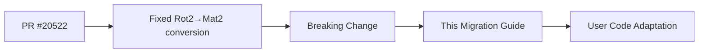

+++
title = "#20525 Add migration guide for #20522"
date = "2025-08-11T00:00:00"
draft = false
template = "pull_request_page.html"
in_search_index = true

[taxonomies]
list_display = ["show"]

[extra]
current_language = "en"
available_languages = {"en" = { name = "English", url = "/pull_request/bevy/2025-08/pr-20525-en-20250811" }, "zh-cn" = { name = "中文", url = "/pull_request/bevy/2025-08/pr-20525-zh-cn-20250811" }}
labels = ["D-Trivial", "A-Math"]
+++

# Technical Analysis: Add migration guide for #20522

## Basic Information
- **Title**: Add migration guide for #20522
- **PR Link**: https://github.com/bevyengine/bevy/pull/20525
- **Author**: Jondolf
- **Status**: MERGED
- **Labels**: D-Trivial, S-Ready-For-Final-Review, A-Math, X-Uncontroversial
- **Created**: 2025-08-11T22:35:59Z
- **Merged**: 2025-08-11T23:13:20Z
- **Merged By**: james7132

## Description Translation
# Objective

#20522 counts as a breaking change, but didn't have a migration guide.

## Solution

Add the migration guide :D

## The Story of This Pull Request

This PR addresses a documentation gap following a mathematical correction in Bevy's linear algebra implementation. The core issue originated from PR #20522, which fixed an incorrect implementation of the `From<Rot2>` conversion for `Mat2`. While that PR corrected important mathematical behavior, it introduced a breaking change without accompanying migration documentation.

The problem was significant because it affected fundamental rotation operations. Previously, the implementation constructed rotation matrices that produced clockwise rotations when mathematically expected to produce counterclockwise rotations. This discrepancy occurred because the matrix was built as the inverse of the correct rotation matrix:

```text
// Incorrect implementation
[  cos, sin ]
[ -sin, cos ]
```

The correct implementation should produce:

```text
// Correct implementation
[ cos, -sin ]
[ sin,  cos ]
```

Without a migration guide, users upgrading to the fixed version would experience unexpected behavior changes in their rotation logic. Some applications might have unintentionally relied on the clockwise rotation behavior, while others might have implemented workarounds for what they perceived as incorrect counterclockwise behavior.

The solution approach was straightforward: create clear documentation explaining both the mathematical error and the migration path. The author added a new markdown file to Bevy's migration guides directory, structuring it to:
1. Clearly identify the breaking change
2. Show both incorrect and correct matrix forms
3. Explain the behavioral difference (clockwise vs counterclockwise rotation)
4. Provide migration options

The implementation focused on practical guidance. The key insight was that users needing to preserve previous behavior could either invert their input `Rot2` or invert the resulting `Mat2`. This gives users flexibility based on their specific use case and existing code structure.

The impact of this documentation is significant despite its simplicity. It helps users:
1. Understand why their rotation behavior changed
2. Diagnose rotation-related issues after upgrading
3. Choose appropriate migration strategies
4. Avoid confusion about intended rotation direction

This change demonstrates the importance of pairing breaking API changes with clear migration paths, especially for foundational mathematical operations where behavioral changes might not be immediately obvious.

## Visual Representation



## Key Files Changed

### `release-content/migration-guides/rot2_matrix_construction.md` (+25/-0)
This new file documents the breaking change from PR #20522 and provides migration guidance.

```markdown
---
title: "Fix `From<Rot2>` implementation for `Mat2`"
pull_requests: [20522]
---

Past releases had an incorrect `From<Rot2>` implementation for `Mat2`, constructing a rotation matrix in the following form:

```text
[  cos, sin ]
[ -sin, cos ]
```

This was actually the *inverse* of the rotation matrix, resulting in clockwise rotation when transforming vectors.
The correct version is the following:

```text
[ cos, -sin ]
[ sin,  cos ]
```

resulting in counterclockwise rotation.

This error has now been fixed. You may see that rotation matrices created using the `From<Rot2>` implementation
produce different results than before, as the rotation happens counterclockwise (as intended) rather than clockwise.
Invert either the input `Rot2` or the resulting `Mat2` to get the same results as before.
```

## Further Reading
1. Original PR that fixed the matrix conversion: https://github.com/bevyengine/bevy/pull/20522
2. Bevy's migration guide system: https://github.com/bevyengine/bevy/tree/main/release-content/migration-guides
3. Rotation matrix mathematics: https://en.wikipedia.org/wiki/Rotation_matrix