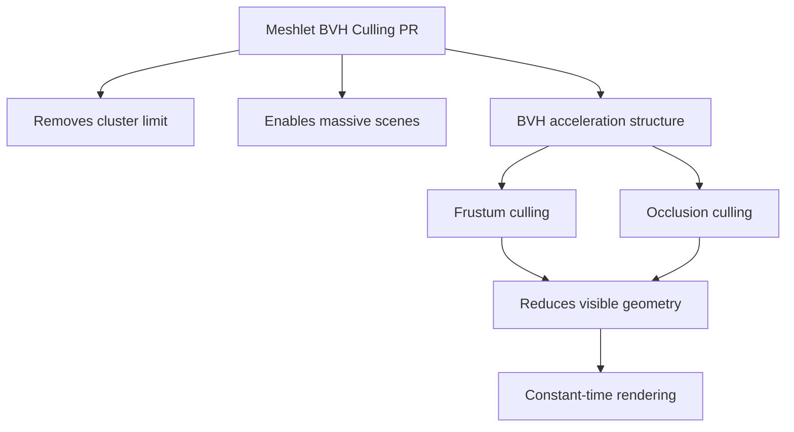

+++
title = "#20526 Add release notes for meshlet BVH culling"
date = "2025-08-14T00:00:00"
draft = false
template = "pull_request_page.html"
in_search_index = true

[taxonomies]
list_display = ["show"]

[extra]
current_language = "en"
available_languages = {"en" = { name = "English", url = "/pull_request/bevy/2025-08/pr-20526-en-20250814" }, "zh-cn" = { name = "中文", url = "/pull_request/bevy/2025-08/pr-20526-zh-cn-20250814" }}
labels = ["C-Docs", "A-Rendering"]
+++

# Analysis of PR #20526: Add release notes for meshlet BVH culling

## Basic Information
- **Title**: Add release notes for meshlet BVH culling
- **PR Link**: https://github.com/bevyengine/bevy/pull/20526
- **Author**: SparkyPotato
- **Status**: MERGED
- **Labels**: C-Docs, A-Rendering, S-Ready-For-Final-Review
- **Created**: 2025-08-11T23:56:05Z
- **Merged**: 2025-08-14T21:02:26Z
- **Merged By**: alice-i-cecile

## The Story of This Pull Request

### The Problem and Context
Bevy's virtual geometry system previously had significant scalability limitations in large scenes. The engine imposed a hardcoded cluster limit of 2^24 clusters (approximately 4 billion triangles), which constrained scene complexity. More critically, rendering performance was heavily dependent on total scene geometry rather than visible geometry. This meant that adding more objects to a scene caused near-linear increases in GPU workload, making complex scenes prohibitively expensive to render.

### The Solution Approach
The solution implemented in the referenced PR (#19318) introduced BVH (Bounding Volume Hierarchy) culling to Bevy's meshlet rendering pipeline. This spatial acceleration structure organizes scene geometry hierarchically, enabling efficient visibility testing. Instead of processing all geometry, the system can now quickly discard entire sections of the scene that aren't visible, significantly reducing GPU workload. This approach transformed rendering performance from geometry-dependent to visibility-dependent.

### The Implementation
This PR (#20526) documents the technical achievements through release notes. The notes highlight two key improvements:

1. **Removed cluster limit**: The previous 4 billion triangle limit was eliminated, allowing arbitrarily large scenes constrained only by available VRAM
2. **BVH-based culling**: The new spatial acceleration structure enables near-constant rendering time regardless of scene complexity

The release notes quantify performance improvements using concrete metrics:
- 130k dragon instances (115B triangles) render in 3.5ms on RTX 4070
- 1M+ instances (900B+ triangles) render in 4.5ms - only 30% slower despite 8x more geometry
- Comparison to v0.16 shows 1.3ms vs 2.2ms for 1,300 instances

### Technical Insights
The BVH implementation fundamentally changes how Bevy processes geometry:
1. Spatial partitioning organizes geometry into hierarchical bounding volumes
2. Early visibility testing discards entire subtrees of geometry
3. GPU workload becomes proportional to visible geometry rather than total geometry
4. Triangle processing shifts from CPU-bound to GPU-bound with optimized culling

Current limitations noted:
- All instance data re-uploaded each frame (CPU bottleneck at high instance counts)
- No asset streaming yet (VRAM limits scene complexity)
- Material evaluation remains constant cost (~0.4ms in test cases)

### The Impact
This optimization enables orders-of-magnitude more complex scenes with minimal performance penalty. Scenes with hundreds of billions of triangles become practically renderable where they were previously impossible. The performance characteristics shift from O(n) to nearly O(1) relative to total geometry, fundamentally changing how developers can design large-scale environments in Bevy.

## Visual Representation



## Key Files Changed

### `release-content/release-notes/meshlet-bvh-culling.md`
This new file documents the BVH culling feature for release notes. It provides both technical explanations and quantitative performance data.

```markdown
---
title: Virtual Geometry BVH culling
authors: ["@SparkyPotato", "@atlv24"]
pull_requests: [19318]
---

(TODO: Embed example screenshot here)

Bevy's virtual geometry has been greatly optimized with BVH-based culling, making the cost of rendering nearly independent of scene geometry.
Comparing the sample scene shown above with 130k dragon instances to one with over 1 million instances, total GPU rendering time only increases by 30%.

This also gets rid of the previous cluster limit that limited the world to 2^24 clusters (about 4 billion triangles).
There are now *no* hardcoded limits to scene size. In practice you will only be limited by asset VRAM usage (since streaming is not yet implemented),
and total instance count due the current code requiring all instances to be re-uploaded to the GPU every frame.

The screenshot above has 130,000 dragons in the scene, each with about 870,000 triangles, leading to over *115 billion* total triangles in the scene.

Speaking of concrete GPU cost, the scene above renders in about 3.5 ms on the 4070, with \~3.1 ms being spent on the geometry render and \~0.4 ms on the material evaluation.
After increasing the instance count to over 1 million (almost *900 billion triangles*!), the total increases to about 4.5 ms, with \~4.1 ms on geometry render and material evaluation remaining constant at ~0.4 ms.
This is a 30% increase in GPU time for an almost 8x increase in scene complexity.

Comparing GPU times to 0.16 on a much smaller scene with 1,300 instances, previously the full render took 2.2 ms, whereas now it is 1.3 ms.
```

## Further Reading
1. [Bounding Volume Hierarchy fundamentals](https://en.wikipedia.org/wiki/Bounding_volume_hierarchy)
2. [Meshlet rendering techniques](https://www.gdcvault.com/play/1026182/Mesh-Shading-State-of)
3. [Original implementation PR #19318](https://github.com/bevyengine/bevy/pull/19318)
4. [Virtual geometry systems design](https://advances.realtimerendering.com/s2020/index.htm)