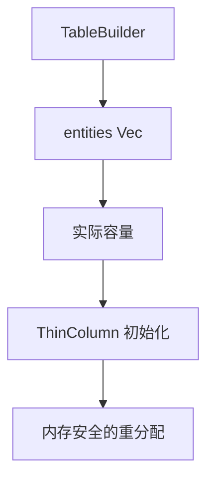

+++
title = "#20528 Use the capacity from the entities Vec to initialize Table columns"
date = "2025-08-16T00:00:00"
draft = false
template = "pull_request_page.html"
in_search_index = false

[extra]
current_language = "zh-cn"
available_languages = {"en" = { name = "English", url = "/pull_request/bevy/2025-08/pr-20528-en-20250816" }, "zh-cn" = { name = "中文", url = "/pull_request/bevy/2025-08/pr-20528-zh-cn-20250816" }}
+++

## 技术分析报告：PR #20528 - Use the capacity from the entities Vec to initialize Table columns

### 基本信息
- **标题**: Use the capacity from the entities Vec to initialize Table columns
- **PR链接**: https://github.com/bevyengine/bevy/pull/20528
- **作者**: james7132
- **状态**: 已合并
- **标签**: D-Trivial, A-ECS, P-Unsound, D-Unsafe
- **创建时间**: 2025-08-12T09:35:22Z
- **合并时间**: 2025-08-16T00:46:59Z
- **合并人**: james7132

### 描述翻译
#### 目标
使用 `realloc` 时，必须传入现有分配的内存布局作为安全前提。但在新建 `Table` 时可能违反此前提。`Vec::with_capacity` 的文档说明它返回的空间**至少**能容纳 `capacity` 个元素，不一定完全等于 `capacity`。这意味着 `entities.capacity()` 可能大于提供的容量。由于 `ThinColumn` 使用此值作为容量，传递给 `realloc` 的新布局与原始 `alloc` 分配的布局不匹配，这是不安全的(unsound)。

调查过程中还发现，在重新分配时未通过 `array_layout_unchecked` 验证 `BlobArray` 布局的总容量是否小于 `isize::MAX`。

#### 解决方案
初始化 `Table` 时先分配 `entities` Vec，然后使用其实际容量（而非直接使用提供的容量）来分配各列。将 `array_layout_unchecked` 调用替换为安全的 `array_layout` 调用，并在失败时 panic。

#### 测试
已在本地通过现有单元测试和 miri 验证。

---

### PR分析叙述

#### 问题与背景
在 Bevy 的 ECS 实现中，`Table` 用于存储实体组件数据。原始实现通过 `TableBuilder::with_capacity` 创建表时存在两个关键安全问题：

1. **内存重新分配不安全**：  
   当使用 `Vec::with_capacity` 初始化实体列表时，实际分配的容量可能大于请求值（标准库行为）。但列(`ThinColumn`)直接使用请求容量初始化：
   ```rust
   // 原始实现:
   TableBuilder::with_capacity(capacity) {
       capacity,  // 直接使用传入容量
   }
   add_column() {
       ThinColumn::with_capacity(component_info, self.capacity)
   }
   ```
   这导致后续 `realloc` 操作时传入的布局与实际分配布局不一致，违反内存安全规则（unsound behavior）。

2. **布局验证缺失**：  
   在 `BlobArray::realloc` 中，使用不安全的 `array_layout_unchecked` 计算新布局：
   ```rust
   let new_layout = unsafe { array_layout_unchecked(...) };
   ```
   此函数未验证总容量是否超过 `isize::MAX`，可能在 32 位系统引发未定义行为。

#### 解决方案与实现
核心解决思路：**统一使用实体数组的实际分配容量作为列分配依据**。

1. **重构 TableBuilder**：  
   将 `capacity` 字段替换为实体向量，确保列容量与实体实际容量严格一致：
   ```rust
   pub(crate) struct TableBuilder {
       columns: SparseSet<ComponentId, ThinColumn>,
       entities: Vec<Entity>,  // 改为直接持有Vec
   }
   ```
   初始化时通过 `Vec::with_capacity` 分配实体：
   ```rust
   pub fn with_capacity(capacity: usize, column_capacity: usize) -> Self {
       Self {
           entities: Vec::with_capacity(capacity), // 实际分配在此发生
           ...
       }
   }
   ```

2. **基于实际容量初始化列**：  
   添加列时使用实体向量的真实容量（`self.entities.capacity()`）：
   ```rust
   pub fn add_column(mut self, component_info: &ComponentInfo) -> Self {
       self.columns.insert(
           component_info.id(),
           // 使用实体向量的实际容量
           ThinColumn::with_capacity(component_info, self.entities.capacity()),
       );
       self
   }
   ```

3. **增强布局安全检查**：  
   在 `BlobArray` 中将不安全的布局计算替换为安全版本：
   ```rust
   // 修改前（不安全）:
   let new_layout = unsafe { array_layout_unchecked(...) };
   
   // 修改后（安全）:
   let new_layout = array_layout(&self.item_layout, new_capacity.get())
       .expect("array layout should be valid"); // 失败时panic
   ```

#### 技术洞察与安全考虑
1. **容量一致性原则**：  
   内存重新分配操作（`realloc`）要求新旧布局严格匹配。PR 通过确保所有列使用**相同源容量**（实体向量实际容量）初始化，解决了核心安全问题。

2. **安全边界强化**：  
   新增多处安全注释，强调容量一致性是必须维护的不变量：
   ```rust
   // 新增安全注释:
   // # Safety
   // The capacity of all columns is determined by that of the `entities` Vec...
   ```

3. **防御性错误处理**：  
   使用 `array_layout` + `expect` 替代 `array_layout_unchecked` 提供了：
   - 自动的布局有效性检查（如容量溢出）
   - 明确的错误处理路径（panic 而非 UB）

#### 影响与验证
1. **消除未定义行为**：  
   解决了内存重新分配时布局不匹配导致的 unsound 问题。

2. **维护成本**：  
   修改集中在 2 个文件（+25/-7 行），保持简单性的同时解决关键安全问题。

3. **验证方式**：  
   - 通过现有单元测试确保功能兼容性
   - 使用 miri 检测内存模型违规
   - 安全注释明确标记了不变量的维护责任

---

### 关键文件变更

#### 1. crates/bevy_ecs/src/storage/table/mod.rs
**变更原因**：确保列容量与实体向量实际容量严格一致

```rust
// 修改前:
pub(crate) struct TableBuilder {
    columns: SparseSet<ComponentId, ThinColumn>,
    capacity: usize,  // 理论容量
}

pub fn with_capacity(capacity: usize, column_capacity: usize) -> Self {
    Self {
        columns: SparseSet::with_capacity(column_capacity),
        capacity,  // 存储理论值
    }
}

pub fn add_column(mut self, component_info: &ComponentInfo) -> Self {
    self.columns.insert(
        component_info.id(),
        ThinColumn::with_capacity(component_info, self.capacity), // 使用理论值
    );
    self
}
```

```rust
// 修改后:
pub(crate) struct TableBuilder {
    columns: SparseSet<ComponentId, ThinColumn>,
    entities: Vec<Entity>,  // 实际分配的实体向量
}

pub fn with_capacity(capacity: usize, column_capacity: usize) -> Self {
    Self {
        columns: SparseSet::with_capacity(column_capacity),
        entities: Vec::with_capacity(capacity),  // 实际分配
    }
}

pub fn add_column(mut self, component_info: &ComponentInfo) -> Self {
    self.columns.insert(
        component_info.id(),
        ThinColumn::with_capacity(component_info, self.entities.capacity()), // 使用实际容量
    );
    self
}
```

#### 2. crates/bevy_ecs/src/storage/blob_array.rs
**变更原因**：替换不安全的布局计算为安全版本

```rust
// 修改前:
let new_layout = unsafe { array_layout_unchecked(&self.item_layout, new_capacity.get()) };
```

```rust
// 修改后:
let new_layout = array_layout(&self.item_layout, new_capacity.get())
    .expect("array layout should be valid");  // 显式错误处理
```

---

### 组件关系图


### 延伸阅读
1. Rust 内存安全模型:  
   [The Rustonomicon - Uninitialized Memory](https://doc.rust-lang.org/nomicon/uninitialized.html)  
2. Vec::with_capacity 行为:  
   [Rust std::vec::Vec.with_capacity](https://doc.rust-lang.org/std/vec/struct.Vec.html#method.with_capacity)  
3. Miri 内存检查工具:  
   [GitHub - rust-lang/miri](https://github.com/rust-lang/miri)