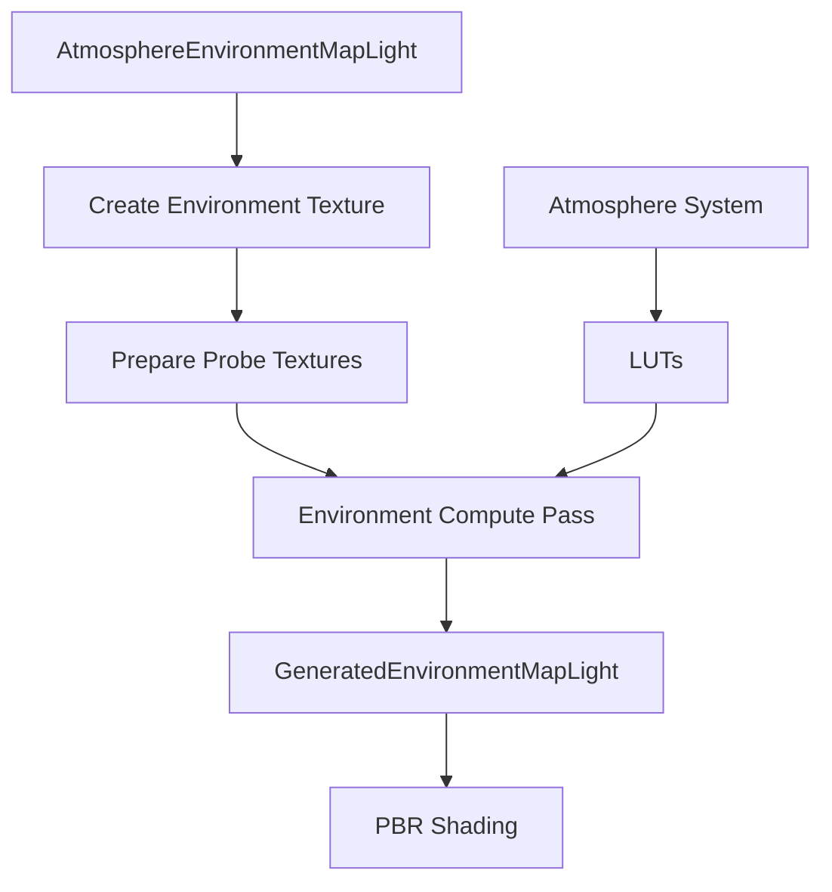

+++
title = "#20529 Atmosphere generated environment map lighting"
date = "2025-08-14T00:00:00"
draft = false
template = "pull_request_page.html"
in_search_index = true

[taxonomies]
list_display = ["show"]

[extra]
current_language = "en"
available_languages = {"en" = { name = "English", url = "/pull_request/bevy/2025-08/pr-20529-en-20250814" }, "zh-cn" = { name = "中文", url = "/pull_request/bevy/2025-08/pr-20529-zh-cn-20250814" }}
labels = ["C-Feature", "A-Rendering"]
+++

# Atmosphere Generated Environment Map Lighting Analysis

## Basic Information
- **Title**: Atmosphere generated environment map lighting
- **PR Link**: https://github.com/bevyengine/bevy/pull/20529
- **Author**: mate-h
- **Status**: MERGED
- **Labels**: C-Feature, A-Rendering, S-Ready-For-Final-Review, M-Needs-Release-Note
- **Created**: 2025-08-12T10:25:46Z
- **Merged**: 2025-08-14T18:17:02Z
- **Merged By**: alice-i-cecile

## The Story of This Pull Request

### The Problem and Context
The Bevy engine's atmosphere system provided realistic sky rendering but didn't contribute to environment lighting for reflections and diffuse illumination. Objects in scenes couldn't reflect the atmospheric conditions, reducing visual fidelity. This limitation was tracked in issue #20374. The challenge was to generate dynamic environment maps from the atmosphere with minimal performance impact while maintaining compatibility with Bevy's existing PBR pipeline.

### The Solution Approach
The implementation introduces a new `AtmosphereEnvironmentMapLight` component that generates an environment map from the current atmosphere conditions. The approach leverages existing atmospheric lookup textures (LUTs) and computes a cubemap through a new compute shader. Key engineering decisions included:

1. Using compute shaders instead of rasterization for better performance in cubemap generation
2. Reusing existing atmosphere LUTs to avoid redundant calculations
3. Implementing power-of-two size validation to prevent cubemap artifacts
4. Maintaining compatibility with existing `EnvironmentMapLight` infrastructure

### The Implementation
The solution adds a new `AtmosphereEnvironmentMapLight` component that users can attach to cameras:

```rust
commands.spawn((
    Camera3d::default(),
    AtmosphereEnvironmentMapLight::default(),
));
```

This component triggers the creation of a cubemap texture that gets populated by a new compute pipeline. The implementation consists of:
1. **Component handling**: Creation and validation of environment map textures
2. **Compute pipeline**: A new WGSL shader (`environment.wgsl`) that samples the atmosphere
3. **Resource management**: Binding groups and textures for GPU operations
4. **Integration**: Connection to Bevy's rendering graph and existing atmosphere systems

The environment map generation occurs in a new compute pass:

```rust
pass.dispatch_workgroups(
    env_map_light.size.x / 8,
    env_map_light.size.y / 8,
    6, // 6 cubemap faces
);
```

### Technical Insights
The implementation efficiently reuses existing atmosphere data through several key techniques:

1. **LUT sampling**: The shader samples precomputed transmittance, multiscattering, and sky-view LUTs
2. **Coordinate transformation**: Proper handling of cubemap face directions and coordinate systems
3. **Exposure compensation**: Decoupling exposure calculation from inscattering for consistency

```wgsl
// environment.wgsl
let ray_dir_ws = sample_cube_dir(uv, slice_index);
ray_dir_ws.z = -ray_dir_ws.z; // Account for cubemap handedness
let ray_dir_as = direction_world_to_atmosphere(ray_dir_ws.xyz);
let inscattering = sample_sky_view_lut(r, ray_dir_as);
```

A notable fix was required in the rendering pipeline to separate exposure compensation from inscattering calculations, ensuring consistent results across different rendering paths.

### The Impact
This PR significantly enhances Bevy's rendering capabilities by:
1. Adding atmospheric contributions to reflections and diffuse lighting
2. Maintaining performance through efficient compute shader implementation
3. Providing artists with a physically-based atmosphere lighting solution
4. Creating foundation for future light probe integration

The solution has minimal performance impact due to reuse of existing atmospheric calculations and efficient compute shader design. The implementation also includes safeguards like automatic size correction to ensure robustness:

```rust
// Correct non-power-of-two sizes
let new_size = UVec2::new(
    size.x.max(1).next_power_of_two(),
    size.y.max(1).next_power_of_two(),
);
```

## Visual Representation



## Key Files Changed

1. `crates/bevy_pbr/src/atmosphere/environment.rs` (+332/-0)
   - Adds core logic for environment map generation
   - Implements compute pass setup and texture preparation
   - Creates new ECS components and resources

```rust
// Component for atmosphere environment lighting
pub struct AtmosphereEnvironmentMap {
    pub environment_map: Handle<Image>,
    pub size: UVec2,
}

// Creates environment map texture
let mut environment_image = Image::new_fill(
    Extent3d {
        width: new_size.x,
        height: new_size.y,
        depth_or_array_layers: 6,
    },
    TextureDimension::D2,
    &[0; 8],
    TextureFormat::Rgba16Float,
    RenderAssetUsages::all(),
);
```

2. `crates/bevy_pbr/src/atmosphere/environment.wgsl` (+37/-0)
   - New compute shader for environment map generation
   - Samples atmosphere LUTs and writes to cubemap

```wgsl
@compute @workgroup_size(8, 8, 1)
fn main(@builtin(global_invocation_id) global_id: vec3<u32>) {
    // ... sampling logic ...
    textureStore(output, vec2<i32>(global_id.xy), i32(slice_index), color);
}
```

3. `crates/bevy_light/src/probe.rs` (+34/-1)
   - Adds new `AtmosphereEnvironmentMapLight` component
   - Documents usage and parameters

```rust
pub struct AtmosphereEnvironmentMapLight {
    pub intensity: f32,
    pub affects_lightmapped_mesh_diffuse: bool,
    pub size: UVec2,
}
```

4. `crates/bevy_pbr/src/atmosphere/mod.rs` (+21/-2)
   - Integrates new environment system into atmosphere plugin
   - Adds startup systems and rendering nodes

```rust
app.add_systems(Update, prepare_atmosphere_probe_components)
   .add_systems(RenderStartup, init_atmosphere_probe_layout)
   .add_render_graph_node::<EnvironmentNode>(Core3d, AtmosphereNode::Environment);
```

5. `crates/bevy_pbr/src/atmosphere/render_sky.wgsl` (+5/-1)
   - Fixes exposure handling for consistency

```wgsl
// Before:
// inscattering += sun_radiance * transmittance * view.exposure;

// After:
inscattering += sun_radiance * transmittance;
inscattering *= view.exposure; // Exposure compensation
```

## Further Reading
1. [Physically Based Rendering: From Theory to Implementation](https://www.pbr-book.org/)
2. [Real-Time Rendering of Atmospheric Scattering Effects](https://developer.nvidia.com/gpugems/gpugems2/part-ii-shading-lighting-and-shadows/chapter-16-accurate-atmospheric-scattering)
3. [Bevy PBR Documentation](https://bevyengine.org/learn/book/features/pbr/)
4. [WGSL Shader Language Specification](https://gpuweb.github.io/gpuweb/wgsl/)