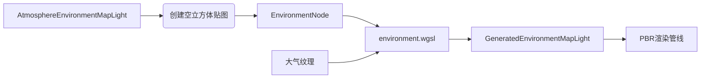

+++
title = "#20529 Atmosphere generated environment map lighting"
date = "2025-08-14T00:00:00"
draft = false
template = "pull_request_page.html"
in_search_index = false

[extra]
current_language = "zh-cn"
available_languages = {"en" = { name = "English", url = "/pull_request/bevy/2025-08/pr-20529-en-20250814" }, "zh-cn" = { name = "中文", url = "/pull_request/bevy/2025-08/pr-20529-zh-cn-20250814" }}
labels = ["C-Feature", "A-Rendering"]
+++

# Atmosphere generated environment map lighting

## Basic Information
- **Title**: Atmosphere generated environment map lighting
- **PR Link**: https://github.com/bevyengine/bevy/pull/20529
- **Author**: mate-h
- **Status**: MERGED
- **Labels**: C-Feature, A-Rendering, S-Ready-For-Final-Review, M-Needs-Release-Note
- **Created**: 2025-08-12T10:25:46Z
- **Merged**: 2025-08-14T18:17:02Z
- **Merged By**: alice-i-cecile

## Description Translation
目标

- 为大气效果添加生成的环境光照（用于反射和漫反射）
- 跟踪问题：#20374

解决方案

- 创建了新的大气节点类型 environment（环境）
- 对现有的天空视角查找纹理（sky-view lookup texture）进行上采样，仅绑定到当前视图。这个大气立方体贴图通道对性能影响很小，但过滤管线会对示例产生轻微性能影响
- 使用新的过滤管线，为不同粗糙度级别和漫反射创建 mip 链

测试

- 运行了大气示例

---

效果展示


```rs
commands.spawn((
    Camera3d::default(),
    // ...
    // 从相机视角将大气渲染到环境贴图
    AtmosphereEnvironmentMapLight::default(),
));
```

局限性与超出范围

- 该生成功能暂不支持光照探针（light probe）。这允许从场景内任意"位置"和整个大气层中将大气渲染为光照探针
- 因此我们假设场景与大气层的相对比例存在数量级差异，在当前实现中这是安全假设（尚未正式支持太空视图）
- PBR 定向光仍不受大气影响（不被其着色），这超出本 PR 范围
- 与本 PR 无关的问题：全反射球体周围出现小黑点。已定位问题，这是基于渲染天空着色器中深度值的散射计算问题。但添加环境贴图光照使该问题更"明显"，将单独处理
- 后续工作：https://github.com/mate-h/bevy/pull/10

## The Story of This Pull Request

### 问题与背景
在 Bevy 的渲染系统中，大气效果（Atmosphere）已经能渲染天空视觉表现，但缺少对基于图像照明（IBL）的支持。具体来说：
1. 现有实现无法为反射和全局漫射照明提供环境贴图
2. 场景中的物体无法反射动态变化的大气效果（如不同时间段的天空颜色变化）
3. 缺少将大气作为光源集成到 PBR 渲染管线的机制

技术约束包括：
- 环境贴图需要立方体贴图（cubemap）格式
- 生成过程需高效，避免影响实时渲染性能
- 需要与现有大气计算管线集成

### 解决方案
开发者引入新组件 `AtmosphereEnvironmentMapLight`，通过计算着色器动态生成环境贴图：

1. **新组件设计**  
   创建 `AtmosphereEnvironmentMapLight` 组件，可附加到相机或光照探针：
   ```rust
   pub struct AtmosphereEnvironmentMapLight {
       pub intensity: f32,
       pub affects_lightmapped_mesh_diffuse: bool,
       pub size: UVec2,
   }
   ```
   关键参数：
   - `intensity`：控制环境光照亮度
   - `size`：指定立方体贴图分辨率（必须为2的幂）

2. **纹理准备**  
   在 `prepare_atmosphere_probe_components` 系统中创建空的 Rgba16Float 格式立方体贴图：
   ```rust
   let mut environment_image = Image::new_fill(
       Extent3d { width: new_size.x, height: new_size.y, depth_or_array_layers: 6 },
       TextureDimension::D2,
       &[0; 8],
       TextureFormat::Rgba16Float,
       RenderAssetUsages::all(),
   );
   ```

3. **计算管线**  
   新增 `environment.wgsl` 计算着色器，核心逻辑：
   ```wgsl
   @compute @workgroup_size(8, 8, 1)
   fn main(@builtin(global_invocation_id) global_id: vec3<u32>) {
       let ray_dir_ws = sample_cube_dir(uv, slice_index);
       let ray_dir_as = direction_world_to_atmosphere(ray_dir_ws.xyz);
       let inscattering = sample_sky_view_lut(r, ray_dir_as);
       textureStore(output, vec2<i32>(global_id.xy), i32(slice_index), vec4(inscattering, 1.0));
   }
   ```
   - 每个工作线程处理立方体一个面的像素
   - 重用现有大气函数计算散射光

4. **渲染图集成**  
   在 AtmospherePlugin 中注册新节点：
   ```rust
   .add_render_graph_node::<EnvironmentNode>(Core3d, AtmosphereNode::Environment)
   ```
   `EnvironmentNode` 负责调度计算着色器：
   ```rust
   pass.dispatch_workgroups(
       env_map_light.size.x / 8,
       env_map_light.size.y / 8,
       6 // 6个立方体贴图面
   );
   ```

5. **光照集成**  
   生成的环境贴图转换为 `GeneratedEnvironmentMapLight`：
   ```rust
   GeneratedEnvironmentMapLight {
       environment_map: environment_handle,
       intensity: env_map_light.intensity,
       rotation: Quat::IDENTITY,
       affects_lightmapped_mesh_diffuse: ...,
   }
   ```
   供 PBR 系统使用

### 关键技术点
1. **高效重用**：复用已有大气纹理（transmittance_lut, sky_view_lut 等）避免重复计算
2. **并行计算**：每个立方体贴图面独立处理，工作组大小 8x8 优化 GPU 占用
3. **自动分辨率处理**：`validate_environment_map_size` 确保尺寸为2的幂
   ```rust
   UVec2::new(size.x.max(1).next_power_of_two(), ...)
   ```
4. **曝光解耦**：修改 `render_sky.wgsl` 将曝光计算移出散射计算：
   ```wgsl
   // 之前
   inscattering += sun_radiance * transmittance * view.exposure;
   
   // 之后
   inscattering += sun_radiance * transmittance;
   inscattering *= view.exposure; // 统一应用曝光
   ```

### 性能影响
- 立方体贴图生成：因使用计算着色器且重用现有数据，开销较小
- 过滤管线：生成 mip 链有轻微性能影响
- 内存占用：每张 512x512 立方体贴图约 12MB (RGBA16Float * 6 faces)

### 实际影响
1. 用户可通过简单组件添加大气环境光照：
   ```rust
   commands.spawn((Camera3d::default(), AtmosphereEnvironmentMapLight::default()));
   ```
2. 示例场景展示大气对反射和全局光照的影响
3. 为后续光照探针支持奠定基础

### 已知限制
1. 光照探针支持待实现（当前仅相机视图有效）
2. 定向光未受大气着色影响（未来扩展点）
3. 全反射物体边缘存在视觉瑕疵（独立问题）

## Visual Representation


## Key Files Changed

### 1. `crates/bevy_light/src/probe.rs` (+34/-1)
添加新组件 `AtmosphereEnvironmentMapLight`：
```rust
#[derive(Component, Clone)]
pub struct AtmosphereEnvironmentMapLight {
    pub intensity: f32,
    pub affects_lightmapped_mesh_diffuse: bool,
    pub size: UVec2,
}
```

### 2. `crates/bevy_pbr/src/atmosphere/environment.rs` (+332/-0)
环境贴图核心实现：
```rust
// 创建环境贴图纹理
let mut environment_image = Image::new_fill(
    Extent3d { width: new_size.x, height: new_size.y, depth_or_array_layers: 6 },
    TextureDimension::D2,
    &[0; 8],
    TextureFormat::Rgba16Float,
    RenderAssetUsages::all(),
);

// 计算着色器调度
pass.dispatch_workgroups(
    env_map_light.size.x / 8,
    env_map_light.size.y / 8,
    6 // 6 cubemap faces
);
```

### 3. `crates/bevy_pbr/src/atmosphere/environment.wgsl` (+37/-0)
环境贴图计算着色器：
```wgsl
@compute @workgroup_size(8, 8, 1)
fn main(@builtin(global_invocation_id) global_id: vec3<u32>) {
    let ray_dir_ws = sample_cube_dir(uv, slice_index);
    let inscattering = sample_sky_view_lut(r, ray_dir_as);
    textureStore(output, vec2<i32>(global_id.xy), i32(slice_index), vec4(inscattering, 1.0));
}
```

### 4. `crates/bevy_pbr/src/atmosphere/mod.rs` (+21/-2)
集成到大气系统：
```rust
app.add_systems(Update, prepare_atmosphere_probe_components)
   .add_render_graph_node::<EnvironmentNode>(Core3d, AtmosphereNode::Environment)
```

### 5. `crates/bevy_pbr/src/atmosphere/render_sky.wgsl` (+5/-1)
修复曝光处理：
```wgsl
// 之前
inscattering += sun_radiance * transmittance * view.exposure;

// 之后
inscattering += sun_radiance * transmittance;
inscattering *= view.exposure;
```

## Further Reading
1. [基于图像照明(IBL)原理](https://learnopengl.com/PBR/IBL)
2. [WGSL 计算着色器规范](https://www.w3.org/TR/WGSL/#compute-shaders)
3. [立方体贴图技术](https://jaxry.github.io/panorama-to-cubemap/)