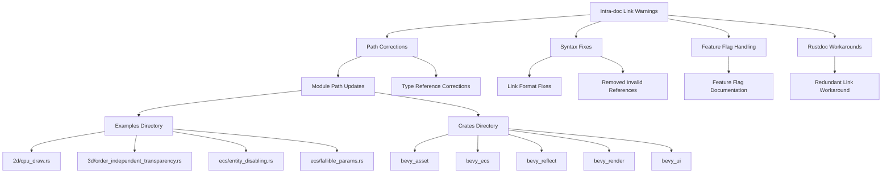

+++
title = "#20530 Fix intra-doc link warnings"
date = "2025-08-20T00:00:00"
draft = false
template = "pull_request_page.html"
in_search_index = true

[taxonomies]
list_display = ["show"]

[extra]
current_language = "en"
available_languages = {"en" = { name = "English", url = "/pull_request/bevy/2025-08/pr-20530-en-20250820" }, "zh-cn" = { name = "中文", url = "/pull_request/bevy/2025-08/pr-20530-zh-cn-20250820" }}
labels = ["C-Docs", "D-Trivial", "S-Blocked", "A-Cross-Cutting"]
+++

# Fix intra-doc link warnings

## Basic Information
- **Title**: Fix intra-doc link warnings
- **PR Link**: https://github.com/bevyengine/bevy/pull/20530
- **Author**: GuillaumeGomez
- **Status**: MERGED
- **Labels**: C-Docs, D-Trivial, S-Blocked, A-Cross-Cutting
- **Created**: 2025-08-12T10:50:01Z
- **Merged**: 2025-08-20T18:19:00Z
- **Merged By**: mockersf

## Description Translation
Fixes intra-doc links appearing when generating documentation.

## The Story of This Pull Request

This PR addresses a common but important documentation maintenance issue: fixing broken intra-doc links in Rust documentation. Intra-doc links are Rust's system for creating cross-references between documentation items using special syntax like `[Type]` or `[Type::method]`. When these links are malformed or reference non-existent items, they generate warnings during documentation generation.

The problem emerged as the Bevy codebase evolved - as types were moved, renamed, or had their visibility changed, documentation links that once worked became broken. These warnings don't prevent compilation but create noise in build outputs and indicate potential documentation quality issues.

The solution approach was systematic: identify all intra-doc link warnings during documentation generation and fix them one by one. The fixes fall into several categories:

1. **Correcting module paths**: When types moved between modules, the documentation links needed updating to reflect their new locations
2. **Fixing syntax issues**: Some links used incorrect syntax or referenced items that didn't exist
3. **Handling feature flags**: Links to feature-gated items needed special handling to avoid broken references
4. **Workarounds for rustdoc limitations**: In some cases, creative solutions were needed to satisfy rustdoc's parsing requirements

The implementation shows attention to detail in handling different types of link issues. For example, in `bevy_ui/src/ui_node.rs`, the developer encountered a rustdoc limitation where explicit links in certain contexts weren't being properly recognized. The solution was both pragmatic and well-documented:

```rust
#[expect(
    rustdoc::redundant_explicit_links,
    reason = "To go around the `<code>` limitations, we put the link twice so we're \
sure it's recognized as a markdown link."
)]
```

This comment explains why what might look like redundant code is actually necessary - it's a workaround for a rustdoc parsing limitation when links appear inside `<code>` blocks.

Another common fix was updating paths to reflect module reorganizations. In `examples/3d/order_independent_transparency.rs`, the link needed to point to the correct module:

```rust
// Before:
//! [`OrderIndependentTransparencyPlugin`]: bevy::render::pipeline::OrderIndependentTransparencyPlugin

// After:
//! [`OrderIndependentTransparencyPlugin`]: bevy::core_pipeline::oit::OrderIndependentTransparencyPlugin
```

The technical insight here is that documentation maintenance is an ongoing concern in large codebases. As architecture evolves and modules are reorganized, documentation links can easily break. Regular cleanup of intra-doc link warnings helps maintain documentation quality and prevents these references from becoming increasingly outdated.

The impact of these changes is primarily on developer experience and codebase maintainability. While they don't affect runtime behavior, they:

1. Eliminate warning noise during documentation generation
2. Ensure documentation cross-references work correctly
3. Make the codebase more approachable for new contributors
4. Set a standard for documentation quality

This PR demonstrates the importance of treating documentation as first-class code - it requires the same level of care and maintenance as the implementation itself.

## Visual Representation



## Key Files Changed

### `crates/bevy_ui/src/ui_node.rs` (+7/-1)
**What changed**: Added a workaround for rustdoc's link parsing limitations in code blocks
**Why**: To ensure the ZIndex documentation link is properly recognized

```rust
// Added expect attribute to handle rustdoc limitation
#[expect(
    rustdoc::redundant_explicit_links,
    reason = "To go around the `<code>` limitations, we put the link twice so we're \
sure it's recognized as a markdown link."
)]
// Updated documentation with proper link formatting
/// Nodes without this component will be treated as if they had a value of
/// <code>[ZIndex][ZIndex]\(0\)</code>.
```

### `crates/bevy_reflect/src/lib.rs` (+2/-2)
**What changed**: Fixed feature flag documentation that incorrectly used link syntax
**Why**: Feature flags shouldn't be linked as they're not actual Rust items

```rust
// Before:
//! | ✅      | [`bevy_reflect_derive/auto_register_inventory`] |
//! | ❌      | [`bevy_reflect_derive/auto_register_static`] |

// After:
//! | ✅      | `bevy_reflect_derive/auto_register_inventory` |
//! | ❌      | `bevy_reflect_derive/auto_register_static` |
```

### `examples/ecs/fallible_params.rs` (+1/-2)
**What changed**: Fixed method reference in documentation
**Why**: The method name was incorrect in the documentation

```rust
// Before:
//! - [`Res<R>`], [`ResMut<R>`] - Resource has to exist, and the [`World::get_default_error_handler`] will be called if it doesn't.

// After:
//! - [`Res<R>`], [`ResMut<R>`] - Resource has to exist, and the [`World::default_error_handler`] will be called if it doesn't.
```

### `crates/bevy_asset/src/io/file/mod.rs` (+1/-1)
**What changed**: Fixed link to use fully qualified path syntax
**Why**: Intra-doc links need explicit crate paths when referencing items

```rust
// Before:
//! To change this, set [`AssetPlugin.file_path`].

// After:
//! To change this, set [`AssetPlugin::file_path`][crate::AssetPlugin::file_path].
```

### `crates/bevy_ecs/src/schedule/stepping.rs` (+1/-1)
**What changed**: Fixed field reference syntax in documentation
**Why**: Field references need proper struct::field syntax

```rust
// Before:
//! Updates to [`Stepping.schedule_states`] that will be applied at the start

// After:
//! Updates to [`Stepping::schedule_states`] that will be applied at the start
```

## Further Reading

- [Rust Documentation: Intra-doc Links](https://doc.rust-lang.org/rustdoc/write-documentation/linking-to-items-by-name.html)
- [Rustdoc: How to Write Documentation](https://doc.rust-lang.org/rustdoc/how-to-write-documentation.html)
- [Bevy Documentation Guidelines](https://github.com/bevyengine/bevy/blob/main/docs/plugins_guidelines.md#documentation)
- [Rust RFC: Intra-doc Links](https://rust-lang.github.io/rfcs/1946-intra-rustdoc-links.html)