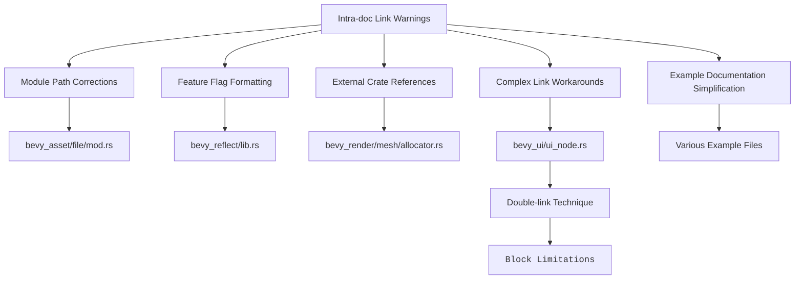

+++
title = "#20530 Fix intra-doc link warnings"
date = "2025-08-20T00:00:00"
draft = false
template = "pull_request_page.html"
in_search_index = false

[extra]
current_language = "zh-cn"
available_languages = {"en" = { name = "English", url = "/pull_request/bevy/2025-08/pr-20530-en-20250820" }, "zh-cn" = { name = "中文", url = "/pull_request/bevy/2025-08/pr-20530-zh-cn-20250820" }}
labels = ["C-Docs", "D-Trivial", "S-Blocked", "A-Cross-Cutting"]
+++

# Fix intra-doc link warnings

## Basic Information
- **Title**: Fix intra-doc link warnings
- **PR Link**: https://github.com/bevyengine/bevy/pull/20530
- **Author**: GuillaumeGomez
- **Status**: MERGED
- **Labels**: C-Docs, D-Trivial, S-Blocked, A-Cross-Cutting
- **Created**: 2025-08-12T10:50:01Z
- **Merged**: 2025-08-20T18:19:00Z
- **Merged By**: mockersf

## Description Translation
修复生成文档时出现的 intra-doc 链接警告。

## The Story of This Pull Request

这个 PR 解决了一个看似简单但影响广泛的文档生成问题：Rustdoc 的 intra-doc 链接警告。当开发者运行 `cargo doc` 生成项目文档时，这些警告会污染构建输出，降低开发体验，并可能掩盖真正的文档问题。

问题的核心在于 Rustdoc 对链接解析的严格性。intra-doc 链接是 Rust 文档系统中的一项功能，允许在文档注释中直接引用其他 Rust 项（如结构体、函数、模块等），而无需使用完整的 Markdown 链接语法。但当链接格式不正确或目标不存在时，Rustdoc 会产生警告。

GuillaumeGomez 通过系统性地检查整个代码库，识别并修复了多种类型的链接问题：

1. **模块路径引用问题**：在 `bevy_asset/src/io/file/mod.rs` 中，原来的 `[AssetPlugin.file_path]` 链接格式不正确。正确的 intra-doc 链接应该使用 `::` 而不是 `.` 来分隔模块和项：

```rust
// Before:
/// To change this, set [`AssetPlugin.file_path`].

// After:  
/// To change this, set [`AssetPlugin::file_path`][crate::AssetPlugin::file_path].
```

这里使用了双链接格式 `[display text][actual link]` 来确保链接被正确解析。

2. **特性标记格式问题**：在 `bevy_reflect/src/lib.rs` 中，特性标记被错误地用方括号包裹，这会被 Rustdoc 误认为是链接：

```rust
// Before:
//! | ✅      | [`bevy_reflect_derive/auto_register_inventory`] |
//! | ❌      | [`bevy_reflect_derive/auto_register_static`] |

// After:
//! | ✅      | `bevy_reflect_derive/auto_register_inventory` |
//! | ❌      | `bevy_reflect_derive/auto_register_static` |
```

通过使用反引号而不是方括号，明确表示这些是代码标识符而非链接。

3. **外部 crate 引用问题**：在 `bevy_render/src/mesh/allocator.rs` 中，对 `offset-allocator` crate 的引用需要明确使用下划线：

```rust
// Before:
/// [`offset-allocator`], a Rust port of Sebastian Aaltonen's hard-real-time C++

// After:
/// [`offset_allocator`], a Rust port of Sebastian Aaltonen's hard-real-time C++
```

这是因为 Rust crate 名称使用下划线而非连字符，尽管它们在包名中可以互换。

4. **复杂链接处理**：最有趣的解决方案在 `bevy_ui/src/ui_node.rs` 中，这里使用了一个巧妙的技巧来处理 Rustdoc 对 `<code>` 标签内链接的限制：

```rust
#[expect(
    rustdoc::redundant_explicit_links,
    reason = "To go around the <code> limitations, we put the link twice so we're \
sure it's recognized as a markdown link."
)]
/// Nodes without this component will be treated as if they had a value of
/// <code>[ZIndex][ZIndex]\(0\)</code>.
```

这种双链接格式 `[ZIndex][ZIndex]` 是为了绕过 Rustdoc 在 `<code>` 块内不解析 Markdown 链接的限制。注释中的 `expect` 属性明确告知编译器这个冗余是有意的。

5. **简化示例文档**：在多个示例文件中，不必要的完整路径链接被简化为简单的标识符引用，使文档更清晰：

```rust
// Before:
//! Bevy provides user-friendly APIs that work with [`Color`](bevy::color::Color)

// After:
//! Bevy provides user-friendly APIs that work with [`Color`]
```

这些修改虽然看似琐碎，但对维护代码库的文档健康至关重要。干净的文档构建不仅提高开发者体验，还能确保文档链接实际指向正确的位置，避免误导读者。

从工程角度看，这个 PR 展示了良好的代码维护实践：定期清理警告、保持文档准确性、使用适当的工具（如 `#[expect]` 属性）来管理已知的假阳性警告。这些实践对于大型开源项目的长期健康至关重要。

## Visual Representation



## Key Files Changed

### `crates/bevy_ui/src/ui_node.rs` (+7/-1)
**修改内容**：修复 ZIndex 文档中的 intra-doc 链接，使用双链接技巧绕过 `<code>` 标签限制。
```rust
// 修改后：
#[expect(
    rustdoc::redundant_explicit_links,
    reason = "To go around the <code> limitations, we put the link twice so we're \
sure it's recognized as a markdown link."
)]
/// Nodes without this component will be treated as if they had a value of
/// <code>[ZIndex][ZIndex]\(0\)</code>.
```

### `crates/bevy_reflect/src/lib.rs` (+2/-2)
**修改内容**：修复特性标记的格式，将方括号改为反引号以避免被误认为是链接。
```rust
// 修改前：
//! | ✅      | [`bevy_reflect_derive/auto_register_inventory`] |
//! | ❌      | [`bevy_reflect_derive/auto_register_static`] |

// 修改后：
//! | ✅      | `bevy_reflect_derive/auto_register_inventory` |
//! | ❌      | `bevy_reflect_derive/auto_register_static` |
```

### `examples/ecs/fallible_params.rs` (+1/-2)
**修改内容**：简化文档中的资源引用链接，移除不必要的完整路径。
```rust
// 修改前：
//! - [`Res<R>`], [`ResMut<R>`] - Resource has to exist, and the [`World::get_default_error_handler`] will be called if it doesn't.

// 修改后：
//! - [`Res<R>`], [`ResMut<R>`] - Resource has to exist, and the [`World::default_error_handler`] will be called if it doesn't.
```

### `crates/bevy_asset/src/io/file/mod.rs` (+1/-1)
**修改内容**：修复 AssetPlugin 文件路径的文档链接，使用正确的模块路径语法。
```rust
// 修改前：
//! To change this, set [`AssetPlugin.file_path`].

// 修改后：
//! To change this, set [`AssetPlugin::file_path`][crate::AssetPlugin::file_path].
```

### `crates/bevy_ecs/src/schedule/stepping.rs` (+1/-1)
**修改内容**：修复 Stepping 结构体字段的文档链接，使用正确的 Rustdoc 语法。
```rust
// 修改前：
/// Updates to [`Stepping.schedule_states`] that will be applied at the start

// 修改后：
/// Updates to [`Stepping::schedule_states`] that will be applied at the start
```

## Further Reading

- [Rustdoc Intra-doc Links Documentation](https://doc.rust-lang.org/rustdoc/linking-to-items-by-name.html)
- [Rustdoc Link Checker](https://doc.rust-lang.org/rustdoc/linkchecker.html)
- [Bevy Documentation Guidelines](https://github.com/bevyengine/bevy/blob/main/docs/plugins_guidelines.md#documentation)
- [Rust Attribute `expect`](https://doc.rust-lang.org/reference/attributes/diagnostics.html#the-expect-attribute)