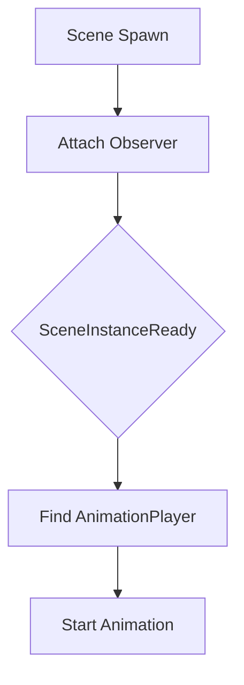

+++
title = "#20531 Update `morph_targets` and `many_foxes` examples to use observers"
date = "2025-08-14T00:00:00"
draft = false
template = "pull_request_page.html"
in_search_index = true

[taxonomies]
list_display = ["show"]

[extra]
current_language = "en"
available_languages = {"en" = { name = "English", url = "/pull_request/bevy/2025-08/pr-20531-en-20250814" }, "zh-cn" = { name = "中文", url = "/pull_request/bevy/2025-08/pr-20531-zh-cn-20250814" }}
labels = ["C-Examples", "C-Code-Quality", "A-Animation"]
+++

## Update `morph_targets` and `many_foxes` examples to use observers

### Basic Information
- **Title**: Update `morph_targets` and `many_foxes` examples to use observers
- **PR Link**: https://github.com/bevyengine/bevy/pull/20531
- **Author**: greeble-dev
- **Status**: MERGED
- **Labels**: C-Examples, C-Code-Quality, S-Ready-For-Final-Review, A-Animation
- **Created**: 2025-08-12T12:35:55Z
- **Merged**: 2025-08-14T21:02:26Z
- **Merged By**: alice-i-cecile

### Description
Change some examples to follow best practices for playing animations, and as a bonus work around an issue with scenes spawning multiple times.

#### Background
Examples that play skeletal animations usually have two steps:
1) Start scene spawning.
2) Play animations after the scene has spawned.

Different examples use different approaches for triggering part 2, including a scene spawning observer and `Added<AnimationPlayer>` queries.

The observer approach is arguably best as it's more tightly scoped and easier for users to extend. The other approaches work in simple examples but fall down when users want multiple scenes or animations. See #17421 for more detail.

As a bonus, the scene spawning observer works around a current issue with scenes spawning multiple times - see #20393, #20430. Although there's an argument that this PR shouldn't land until the issue is properly fixed, as these examples are a useful test case.

#### Solution
Update the `morph_targets` and `many_foxes` examples to use observers.

I also made a few tweaks and fixes to `morph_targets`:
- Fix documentation referring to an `update_weights` feature that isn't in the example.
- Use the same `AnimationToPlay` component as the `animated_mesh` example.
- Change the `name_morphs` system to be event driven and print the asset name.
  - This is maybe too complex, but could also be nice for users to c&p into their app for debugging.

I haven't updated the `animated_mesh_control`, `animated_mesh_events`, and `animation_masks` examples, which still use `Added<AnimationPlayer>`.

#### Testing
```sh
cargo run --example morph_targets
cargo run --example many_foxes
```

### The Story of This Pull Request
This PR addresses inconsistent animation setup patterns in Bevy examples. The core problem was that examples used different approaches to trigger animations after scene loading - some used frame-based checks with local flags, while others used component-added queries. These approaches were fragile when handling multiple scenes or animations, as discussed in issue #17421.

The solution migrates both `morph_targets` and `many_foxes` examples to use Bevy's observer system. Observers provide event-driven scene readiness detection through the `SceneInstanceReady` component. This approach:
1. Eliminates frame-based polling with `Local<bool>` flags
2. Avoids broad `Added<AnimationPlayer>` queries
3. Works around scene spawning issues (#20393, #20430)
4. Provides a reusable pattern for animation setup

For `morph_targets`, we implemented several improvements alongside the observer migration:
1. Replaced the resource-based `MorphData` with an `AnimationToPlay` component
2. Converted the `name_morphs` system to use `AssetEvent<Mesh>` for event-driven logging
3. Added asset path information to morph target logs
4. Simplified the scene setup flow

The observer systems work by:
1. Attaching observers to scene entities during spawning
2. Triggering when `SceneInstanceReady` appears
3. Traversing entity descendants to find `AnimationPlayer` components
4. Starting animations with proper configuration

This pattern ensures animations start exactly once per scene instance without frame-based polling. The `morph_targets` example now also demonstrates practical use of `AssetEvent` for reactive asset handling.

### Visual Representation


### Key Files Changed
1. **examples/animation/morph_targets.rs** (+60/-74)  
   Migrated to observer pattern, added event-driven morph target logging  
   Key changes:
   ```rust
   // Before: Frame-based animation setup
   fn setup_animations(
       mut has_setup: Local<bool>,
       mut commands: Commands,
       mut players: Query<(Entity, &Name, &mut AnimationPlayer)>,
       morph_data: Res<MorphData>,
       mut graphs: ResMut<Assets<AnimationGraph>>,
   ) {
       if *has_setup { return; }
       // ... frame-based player search
   }
   
   // After: Observer-based animation setup
   fn play_animation_when_ready(
       trigger: On<SceneInstanceReady>,
       mut commands: Commands,
       children: Query<&Children>,
       animations_to_play: Query<&AnimationToPlay>,
       mut players: Query<&mut AnimationPlayer>,
   ) {
       if let Ok(animation_to_play) = animations_to_play.get(trigger.target()) {
           for child in children.iter_descendants(trigger.target()) {
               if let Ok(mut player) = players.get_mut(child) {
                   player.play(animation_to_play.index).repeat();
                   // ... component setup
               }
           }
       }
   }
   ```

2. **examples/stress_tests/many_foxes.rs** (+18/-18)  
   Converted to per-instance observer pattern  
   Key changes:
   ```rust
   // Before: Global frame-based animation starter
   fn setup_scene_once_loaded(
       animations: Res<Animations>,
       foxes: Res<Foxes>,
       mut commands: Commands,
       mut player: Query<(Entity, &mut AnimationPlayer)>,
       mut done: Local<bool>,
   ) {
       if !*done && player.iter().len() == foxes.count {
           // ... process all players
           *done = true;
       }
   }
   
   // After: Per-instance observer system
   fn setup_scene_once_loaded(
       trigger: On<SceneInstanceReady>,
       animations: Res<Animations>,
       foxes: Res<Foxes>,
       mut commands: Commands,
       children: Query<&Children>,
       mut players: Query<&mut AnimationPlayer>,
   ) {
       for child in children.iter_descendants(trigger.target()) {
           if let Ok(mut player) = players.get_mut(child) {
               // ... start animation per instance
           }
       }
   }
   ```

### Further Reading
1. [Bevy Observers RFC](https://github.com/bevyengine/rfcs/pull/39) - Observer pattern design
2. [Scene System Documentation](https://bevyengine.org/learn/book/next/scenes/) - Scene loading workflow
3. [Animation Graph API](https://docs.rs/bevy/latest/bevy/animation/struct.AnimationGraph.html) - Animation control reference
4. Issue [#17421](https://github.com/bevyengine/bevy/issues/17421) - Animation setup discussion
5. PR [#11531](https://github.com/bevyengine/bevy/pull/11531) - Original observer implementation