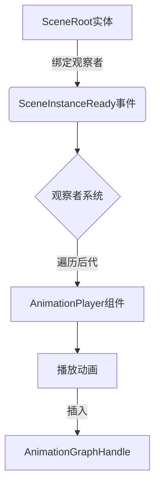

+++
title = "#20531 Update `morph_targets` and `many_foxes` examples to use observers"
date = "2025-08-14T00:00:00"
draft = false
template = "pull_request_page.html"
in_search_index = false

[extra]
current_language = "zh-cn"
available_languages = {"en" = { name = "English", url = "/pull_request/bevy/2025-08/pr-20531-en-20250814" }, "zh-cn" = { name = "中文", url = "/pull_request/bevy/2025-08/pr-20531-zh-cn-20250814" }}
+++

## 技术分析报告：PR #20531

### 基础信息
- **标题**: Update `morph_targets` and `many_foxes` examples to use observers
- **PR链接**: https://github.com/bevyengine/bevy/pull/20531
- **作者**: greeble-dev
- **状态**: 已合并
- **标签**: C-Examples, C-Code-Quality, S-Ready-For-Final-Review, A-Animation
- **创建时间**: 2025-08-12T12:35:55Z
- **合并时间**: 2025-08-14T21:02:26Z
- **合并人**: alice-i-cecile

### 描述翻译
#### Objective
更新示例以遵循动画播放的最佳实践，同时解决场景多次生成的问题。

#### Background
播放骨骼动画的示例通常包含两个步骤：
1. 启动场景生成
2. 场景生成后播放动画

不同示例使用不同方法触发第2步，包括场景生成观察者(scene spawning observer)和`Added<AnimationPlayer>`查询。

观察者方法更精确且易于扩展，而其他方法在复杂场景（如多场景或多动画）中会失效（详见 #17421）。此外，观察者方法可规避当前场景多次生成的问题（#20393, #20430）。

#### Solution
更新`morph_targets`和`many_foxes`示例使用观察者模式。对`morph_targets`的额外改进：
- 修复文档中引用不存在的`update_weights`功能
- 使用与`animated_mesh`示例相同的`AnimationToPlay`组件
- 将`name_morphs`系统改为事件驱动并打印资源名称

未更新仍使用`Added<AnimationPlayer>`的示例：`animated_mesh_control`, `animated_mesh_events`, `animation_masks`。

#### Testing
```sh
cargo run --example morph_targets
cargo run --example many_foxes
```

---

### PR技术分析

#### 问题背景
在Bevy中，播放骨骼动画的示例需要解决两个关键问题：
1. **动画触发时机**：需确保动画在场景完全加载后播放
2. **多场景处理**：当存在多个相同场景实例时，需独立控制每个实例的动画

原实现使用`Added<AnimationPlayer>`查询存在以下问题：
- 全局状态管理复杂（依赖`Local<bool>`标志位）
- 难以扩展到多场景（所有播放器同时触发）
- 无法处理场景重复生成问题（#20393, #20430）

#### 解决方案
PR采用观察者模式(observer pattern)重构动画触发逻辑：
1. 使用`On<SceneInstanceReady>`事件替代状态标志
2. 通过实体观察者(entity observer)绑定场景就绪事件
3. 在事件系统中精确控制每个场景实例的动画

#### 技术实现
##### 1. `morph_targets`示例重构
**核心变更**：
- 移除资源型状态管理（`MorphData` + `Local<bool>`）
- 引入事件驱动的动画触发
- 改进变形目标名称输出

**关键代码对比**：
```rust
// 文件: examples/animation/morph_targets.rs
// 之前: 基于标志位的动画设置
fn setup_animations(
    mut has_setup: Local<bool>,
    mut players: Query<(Entity, &Name, &mut AnimationPlayer)>,
    morph_data: Res<MorphData>,
) {
    if *has_setup { return; }
    for (entity, name, mut player) in &mut players {
        if name.as_str() == "Main" {
            player.play(...).repeat();
            *has_setup = true;
        }
    }
}

// 之后: 观察者模式
fn play_animation_when_ready(
    trigger: On<SceneInstanceReady>, // 场景就绪事件
    mut players: Query<&mut AnimationPlayer>,
    children: Query<&Children>,
) {
    for child in children.iter_descendants(trigger.target()) {
        if let Ok(mut player) = players.get_mut(child) {
            player.play(...).repeat(); // 精确触发单个实例
        }
    }
}

// 场景绑定观察者
commands.spawn((
    SceneRoot(asset_server.load(...)),
    AnimationToPlay { ... }
)).observe(play_animation_when_ready); // 关键绑定
```

**变形目标名称输出改进**：
```rust
// 之前: 单次打印
fn name_morphs(mut has_printed: Local<bool>, ...) {
    if *has_printed { return; }
    // ...打印逻辑
}

// 之后: 事件驱动
fn name_morphs(
    mut events: EventReader<AssetEvent<Mesh>>,
    asset_server: Res<AssetServer>,
    meshes: Res<Assets<Mesh>>,
) {
    for event in events.read() {
        if let AssetEvent::Added { id } = event {
            if let (Some(path), Some(mesh)) = (asset_server.get_path(*id), meshes.get(*id)) {
                info!("Morph target names for {path:?}:");
                // ...打印所有变形目标名称
            }
        }
    }
}
```

##### 2. `many_foxes`示例重构
**核心变更**：
- 移除全局状态同步机制
- 为每个狐狸实例单独注册观察者
- 基于实体ID的动画偏移计算

**关键代码对比**：
```rust
// 文件: examples/stress_tests/many_foxes.rs
// 之前: 全局状态控制
fn setup_scene_once_loaded(
    mut done: Local<bool>,
    player: Query<(Entity, &mut AnimationPlayer)>,
) {
    if !*done && player.iter().len() == foxes.count {
        for (entity, mut player) in &mut player {
            let anim = player.play(...);
            anim.seek_to(entity.index() as f32 / 10.0); // 基于实体ID偏移
        }
        *done = true;
    }
}

// 之后: 基于场景的观察者
fn setup_scene_once_loaded(
    trigger: On<SceneInstanceReady>, // 单个场景事件
    mut players: Query<&mut AnimationPlayer>,
    children: Query<&Children>,
) {
    for child in children.iter_descendants(trigger.target()) {
        if let Ok(mut player) = players.get_mut(child) {
            let anim = player.play(...);
            anim.seek_to(trigger.target().index() as f32 / 10.0); // 基于触发实体ID
        }
    }
}

// 每个狐狸实例注册观察者
builder.spawn((
    SceneRoot(fox_handle.clone()),
    Transform::from_xyz(...)
)).observe(setup_scene_once_loaded); // 关键绑定
```

#### 技术洞察
1. **观察者模式优势**：
   - 消除帧循环检查（frame polling）
   - 精确绑定事件与实体关系
   - 自动处理多实例场景
   - 代码结构更符合ECS范式

2. **实体ID的应用**：
   ```rust
   anim.seek_to(trigger.target().index() as f32 / 10.0)
   ```
   利用实体ID生成唯一动画偏移量，解决同步问题同时保持随机性

3. **资源事件处理**：
   `AssetEvent::Added`事件机制确保：
   - 动态加载资源正确处理
   - 避免初始化顺序问题
   - 支持热重载场景

#### 影响分析
1. **正向影响**：
   - 示例代码更符合最佳实践
   - 解决场景重复生成导致的动画问题
   - 提供可复用的动画触发模式
   - 改进的变形目标调试输出

2. **注意事项**：
   - 观察者系统需严格匹配组件层级
   - 实体遍历存在固定开销（但可忽略）

---

### 关键文件变更

#### 1. `examples/animation/morph_targets.rs` (+60/-74)
**变更概要**：重构为观察者模式，改进变形目标输出  
**关键代码**：
```rust
// 新事件驱动动画触发
fn play_animation_when_ready(
    trigger: On<SceneInstanceReady>,
    mut commands: Commands,
    children: Query<&Children>,
    animations_to_play: Query<&AnimationToPlay>,
    mut players: Query<&mut AnimationPlayer>,
) {
    if let Ok(animation_to_play) = animations_to_play.get(trigger.target()) {
        for child in children.iter_descendants(trigger.target()) {
            if let Ok(mut player) = players.get_mut(child) {
                player.play(animation_to_play.index).repeat();
                commands.entity(child)
                    .insert(AnimationGraphHandle(animation_to_play.graph_handle.clone()));
            }
        }
    }
}

// 事件驱动的变形目标输出
fn name_morphs(
    asset_server: Res<AssetServer>,
    mut events: EventReader<AssetEvent<Mesh>>,
    meshes: Res<Assets<Mesh>>,
) {
    for event in events.read() {
        if let AssetEvent::<Mesh>::Added { id } = event
            && let Some(path) = asset_server.get_path(*id)
            && let Some(mesh) = meshes.get(*id)
            && let Some(names) = mesh.morph_target_names()
        {
            info!("Morph target names for {path:?}:");
            for name in names {
                info!("  {name}");
            }
        }
    }
}
```

#### 2. `examples/stress_tests/many_foxes.rs` (+18/-18)
**变更概要**：狐狸实例动画触发重构  
**关键代码**：
```rust
// 观察者绑定
builder.spawn((
    SceneRoot(fox_handle.clone()),
    Transform::from_xyz(x, 0.0, z)
)).observe(setup_scene_once_loaded); // 关键观察者注册

// 单场景动画触发
fn setup_scene_once_loaded(
    trigger: On<SceneInstanceReady>,
    animations: Res<Animations>,
    foxes: Res<Foxes>,
    mut commands: Commands,
    children: Query<&Children>,
    mut players: Query<&mut AnimationPlayer>,
) {
    for child in children.iter_descendants(trigger.target()) {
        if let Ok(mut player) = players.get_mut(child) {
            let playing_animation = player.play(animations.node_indices[0]).repeat();
            if !foxes.sync {
                playing_animation.seek_to(trigger.target().index() as f32 / 10.0);
            }
            commands.entity(child)
                .insert(AnimationGraphHandle(animations.graph.clone()));
        }
    }
}
```

---

### 架构关系图


---

### 延伸阅读
1. Bevy观察者机制文档：
   https://bevyengine.org/learn/book/events/observers/

2. 场景系统工作原理：
   https://bevyengine.org/learn/book/scenes/

3. 动画系统最佳实践：
   https://github.com/bevyengine/bevy/discussions/17421

4. 相关未解决问题：
   - #20393: 场景重复生成问题
   - #20430: 动画同步问题