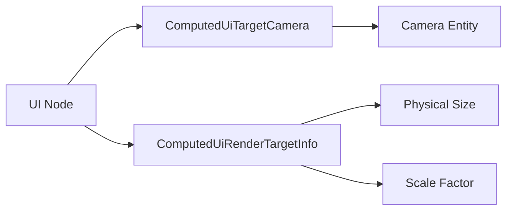

+++
title = "#20535 Split up `ComputedUiTargetCamera`"
date = "2025-08-15T00:00:00"
draft = false
template = "pull_request_page.html"
in_search_index = true

[taxonomies]
list_display = ["show"]

[extra]
current_language = "en"
available_languages = {"en" = { name = "English", url = "/pull_request/bevy/2025-08/pr-20535-en-20250815" }, "zh-cn" = { name = "中文", url = "/pull_request/bevy/2025-08/pr-20535-zh-cn-20250815" }}
labels = ["A-Rendering", "A-UI", "C-Code-Quality", "D-Straightforward", "A-Camera"]
+++

## Split up `ComputedUiTargetCamera`

### Basic Information
- **Title**: Split up `ComputedUiTargetCamera`
- **PR Link**: https://github.com/bevyengine/bevy/pull/20535
- **Author**: ickshonpe
- **Status**: MERGED
- **Labels**: A-Rendering, A-UI, C-Code-Quality, S-Ready-For-Final-Review, M-Needs-Migration-Guide, D-Straightforward, A-Camera
- **Created**: 2025-08-12T13:59:30Z
- **Merged**: 2025-08-15T16:28:36Z
- **Merged By**: alice-i-cecile

### Description Translation
# Objective

Remove the render target info from `ComputedUiTargetCamera` so it just holds the camera id that is only needed for rendering and picking.

Fixes #20534

## Solution

* Remove the render target info from `ComputedUiTargetCamera`.
* Create a new component `ComputedUiRenderTargetInfo` and move the render target info (physical size and scale factor) into it.
* Update the systems to use the `ComputedUiRenderTargetInfo` as needed.

## Testing

The behaviour of the UI examples should be unchanged.

### The Story of This Pull Request

The `ComputedUiTargetCamera` component previously combined two distinct responsibilities: identifying the target camera for UI rendering and storing render target information (physical size and scale factor). This coupling caused unnecessary data propagation through systems that only required the camera entity reference, such as picking and focus handling. Additionally, it forced systems that needed physical size/scale factor to carry the entire camera entity reference, even when it wasn't required.

To resolve this, we split the component:
1. `ComputedUiTargetCamera` now exclusively holds the camera entity ID
2. `ComputedUiRenderTargetInfo` contains the physical size and scale factor

This separation reduces memory usage and processing overhead in systems that only need one piece of information. For example:
- Picking systems only require camera entity IDs to map input coordinates
- Layout systems primarily need physical size/scale factor for pixel-perfect measurements
- Rendering systems require both but can access them independently

The implementation required coordinated changes across multiple systems:
1. Modified the propagation system to generate both components
```rust
// In propagate_ui_target_cameras:
commands.entity(root_entity).insert(Propagate(ComputedUiTargetCamera { camera }));
commands.entity(root_entity).insert(Propagate(ComputedUiRenderTargetInfo {
    scale_factor,
    physical_size,
}));
```
2. Updated all downstream systems to use the appropriate component:
- Layout calculations switched to `ComputedUiRenderTargetInfo`
- Text measurement now uses `ComputedUiRenderTargetInfo` for scale factor
- Box shadow rendering accesses physical size via `ComputedUiRenderTargetInfo`
- Focus handling continues using `ComputedUiTargetCamera` for camera references

The changes maintain identical UI behavior while optimizing data access patterns. Systems now query only the necessary components, reducing unnecessary data processing. For instance, text measurement no longer needs to process camera entity data when recalculating layouts after scale factor changes.

Testing confirmed no behavioral changes in UI examples. The migration guide alerts users to update their systems where they previously accessed physical size or scale factor through `ComputedUiTargetCamera`.

### Visual Representation



### Key Files Changed

1. **`crates/bevy_ui/src/ui_node.rs`**  
   Split component definitions and updated accessors:
```rust
// BEFORE:
pub struct ComputedUiTargetCamera {
    pub(crate) camera: Entity,
    pub(crate) scale_factor: f32,
    pub(crate) physical_size: UVec2,
}

// AFTER:
pub struct ComputedUiTargetCamera {
    pub(crate) camera: Entity,
}

pub struct ComputedUiRenderTargetInfo {
    pub(crate) scale_factor: f32,
    pub(crate) physical_size: UVec2,
}
```

2. **`crates/bevy_ui/src/update.rs`**  
   Refactored propagation logic:
```rust
// BEFORE:
commands.insert(Propagate(ComputedUiTargetCamera {
    camera,
    scale_factor,
    physical_size,
}));

// AFTER:
commands.insert(Propagate(ComputedUiTargetCamera { camera }));
commands.insert(Propagate(ComputedUiRenderTargetInfo {
    scale_factor,
    physical_size,
}));
```

3. **`crates/bevy_ui/src/layout/mod.rs`**  
   Updated layout system dependencies:
```rust
// BEFORE:
query<Ref<ComputedUiTargetCamera>>

// AFTER:
query<Ref<ComputedUiRenderTargetInfo>>
```

4. **`crates/bevy_ui_render/src/box_shadow.rs`**  
   Fixed rendering parameter access:
```rust
// BEFORE:
let scale_factor = uinode.inverse_scale_factor.recip();

// AFTER:
let scale_factor = target.scale_factor();
```

5. **`crates/bevy_ui/src/widget/text.rs`**  
   Corrected text measurement inputs:
```rust
// BEFORE:
query<&ComputedUiTargetCamera>

// AFTER:
query<Ref<ComputedUiRenderTargetInfo>>
```

### Further Reading
- [Bevy UI System Documentation](https://bevyengine.org/learn/book/getting-started/ui/)
- [Component Data Optimization Patterns](https://gameprogrammingpatterns.com/component.html)
- [Bevy Hierarchy Propagation](https://github.com/bevyengine/bevy/blob/main/crates/bevy_hierarchy/src/lib.rs)