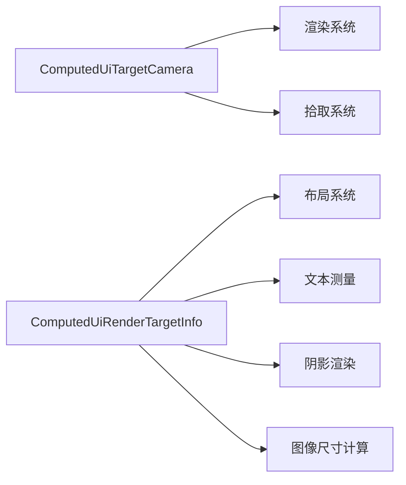

+++
title = "#20535 Split up `ComputedUiTargetCamera"
date = "2025-08-15T00:00:00"
draft = false
template = "pull_request_page.html"
in_search_index = false

[extra]
current_language = "zh-cn"
available_languages = {"en" = { name = "English", url = "/pull_request/bevy/2025-08/pr-20535-en-20250815" }, "zh-cn" = { name = "中文", url = "/pull_request/bevy/2025-08/pr-20535-zh-cn-20250815" }}
+++

# Split up `ComputedUiTargetCamera`

## 基本信息
- **标题**: Split up `ComputedUiTargetCamera`
- **PR 链接**: https://github.com/bevyengine/bevy/pull/20535
- **作者**: ickshonpe
- **状态**: 已合并
- **标签**: A-Rendering, A-UI, C-Code-Quality, S-Ready-For-Final-Review, M-Needs-Migration-Guide, D-Straightforward, A-Camera
- **创建时间**: 2025-08-12T13:59:30Z
- **合并时间**: 2025-08-15T16:28:36Z
- **合并者**: alice-i-cecile

## 描述翻译

# Objective

Remove the render target info from `ComputedUiTargetCamera` so it just holds the camera id that is only needed for rendering and picking.

Fixes #20534

## Solution

* Remove the render target info from `ComputedUiTargetCamera`.
* Create a new component `ComputedUiRenderTargetInfo` and move the render target info (physical size and scale factor) into it.
* Update the systems to use the `ComputedUiRenderTargetInfo` as needed.

## Testing

The behaviour of the UI examples should be unchanged.

## 本次 Pull Request 的技术分析

### 问题背景
在 Bevy 的 UI 系统中，`ComputedUiTargetCamera` 组件同时承担了两个职责：
1. 存储目标相机的实体 ID（用于渲染和拾取）
2. 存储渲染目标的物理尺寸（physical size）和缩放因子（scale factor）

这种设计导致以下问题：
1. 关注点分离不清晰：相机 ID 主要用于渲染和拾取操作，而渲染目标信息主要用于布局计算和尺寸测量
2. 不必要的依赖：当渲染目标信息变化时（如窗口缩放），所有依赖 `ComputedUiTargetCamera` 的系统都会被触发
3. 性能浪费：布局系统只需要渲染目标信息，却被强制依赖完整的相机组件

具体问题在 issue #20534 中有详细描述，核心是组件承担过多职责导致系统依赖关系不合理。

### 解决方案
采用组件拆分策略：
1. 创建新组件 `ComputedUiRenderTargetInfo` 专门存储渲染目标信息
2. 重构 `ComputedUiTargetCamera` 仅保留相机实体 ID
3. 更新所有相关系统，使其正确引用新组件

这种分离遵循单一职责原则（Single Responsibility Principle），使系统依赖更加精确。

### 实现细节
核心改动在组件定义和传播系统：

**1. 组件重构 (`crates/bevy_ui/src/ui_node.rs`)**
```rust
// 重构前:
#[reflect(Component, Default, PartialEq, Clone)]
pub struct ComputedUiTargetCamera {
    pub(crate) camera: Entity,
    pub(crate) scale_factor: f32,
    pub(crate) physical_size: UVec2,
}

// 重构后:
#[reflect(Component, Default, PartialEq, Clone)]
pub struct ComputedUiTargetCamera {
    pub(crate) camera: Entity,
}

// 新增组件:
#[derive(Component, Clone, Copy, Debug, Reflect, PartialEq)]
#[reflect(Component, Default, PartialEq, Clone)]
pub struct ComputedUiRenderTargetInfo {
    pub(crate) scale_factor: f32,
    pub(crate) physical_size: UVec2,
}
```

**2. 传播系统更新 (`crates/bevy_ui/src/update.rs`)**
```rust
// 修改传播逻辑:
commands
    .entity(root_entity)
    .insert(Propagate(ComputedUiTargetCamera { camera }));  // 仅传播相机ID

commands
    .entity(root_entity)
    .insert(Propagate(ComputedUiRenderTargetInfo {  // 传播渲染目标信息
        scale_factor,
        physical_size,
    }));
```

**3. 系统依赖更新**
所有依赖渲染目标信息的系统改为使用新组件：
```rust
// 例如在文本测量系统 (crates/bevy_ui/src/widget/text.rs)
// 之前:
fn measure_text_system(/* ... */ &ComputedUiTargetCamera, /* ... */)

// 之后:
fn measure_text_system(/* ... */ Ref<ComputedUiRenderTargetInfo>, /* ... */)
```

**4. 层级传播扩展**
新增组件的层级传播支持：
```rust
// 在 UI 插件初始化 (crates/bevy_ui/src/lib.rs)
.add_plugins(HierarchyPropagatePlugin::<ComputedUiRenderTargetInfo>::new(PostUpdate))
```

### 技术洞察
1. **组件粒度优化**：通过拆分组件，使每个组件保持单一职责，减少不必要的数据变更传播
2. **系统性能优化**：当渲染目标信息变化时（如窗口缩放），只有依赖 `ComputedUiRenderTargetInfo` 的系统会触发，不再影响仅需相机ID的系统
3. **ECS 设计模式**：展示了如何通过组件重构优化系统依赖关系，是典型的 ECS 架构优化案例
4. **后向兼容**：通过迁移指南提供清晰的升级路径（见 `release-content/migration-guides/split_up_computeduitargetcamera.md`）

### 影响
1. **性能提升**：减少不必要的系统执行，特别是布局相关系统
2. **代码清晰度**：组件职责更明确，系统依赖关系更合理
3. **扩展性增强**：为未来可能的渲染目标优化提供更好的扩展点
4. **迁移需求**：需要更新所有使用 `ComputedUiTargetCamera` 获取渲染目标信息的代码

## 组件关系图



## 关键文件变更

### `crates/bevy_ui/src/update.rs` (+47/-28)
**变更原因**：重构相机和渲染目标信息的传播逻辑  
**关键代码**：
```rust
// 之前:
commands.entity(root_entity).insert(Propagate(ComputedUiTargetCamera {
    camera,
    scale_factor,
    physical_size,
}));

// 之后:
commands.entity(root_entity).insert(Propagate(ComputedUiTargetCamera { camera }));
commands.entity(root_entity).insert(Propagate(ComputedUiRenderTargetInfo {
    scale_factor,
    physical_size,
}));
```

### `crates/bevy_ui/src/ui_node.rs` (+23/-8)
**变更原因**：定义新组件并重构现有组件  
**关键代码**：
```rust
// 重构ComputedUiTargetCamera
pub struct ComputedUiTargetCamera {
    pub(crate) camera: Entity,  // 仅保留相机ID
}

// 新增组件
pub struct ComputedUiRenderTargetInfo {
    pub(crate) scale_factor: f32,
    pub(crate) physical_size: UVec2,
}
```

### `crates/bevy_ui/src/layout/mod.rs` (+13/-3)
**变更原因**：更新布局系统使用新组件  
**关键代码**：
```rust
// 之前:
Query<(..., Ref<ComputedUiTargetCamera>)>

// 之后:
Query<(..., Ref<ComputedUiRenderTargetInfo>)>  // 使用新组件
```

### `crates/bevy_ui_render/src/box_shadow.rs` (+8/-5)
**变更原因**：更新阴影渲染系统使用新组件  
**关键代码**：
```rust
// 之前:
fn extract_shadows(..., &ComputedUiTargetCamera)

// 之后:
fn extract_shadows(..., &ComputedUiTargetCamera, &ComputedUiRenderTargetInfo) {
    // 从新组件获取渲染目标信息
    let ui_physical_viewport_size = target.physical_size().as_vec2();
    let scale_factor = target.scale_factor();
}
```

### `crates/bevy_ui/src/widget/text.rs` (+4/-4)
**变更原因**：更新文本测量系统依赖  
**关键代码**：
```rust
// 之前:
&ComputedUiTargetCamera,

// 之后:
Ref<ComputedUiRenderTargetInfo>,  // 改为依赖渲染目标信息组件
```

## 延伸阅读
1. [Bevy ECS 最佳实践](https://bevyengine.org/learn/book/design-patterns/ecs-patterns/)
2. [组件设计原则](https://gameprogrammingpatterns.com/component.html)
3. [Bevy 层级系统文档](https://docs.rs/bevy_hierarchy/latest/bevy_hierarchy/)