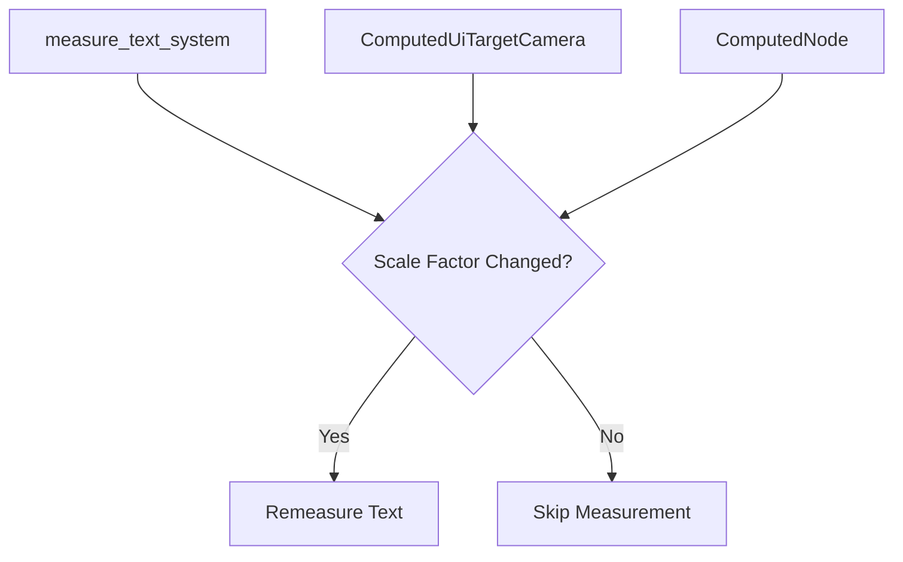

+++
title = "#20538 Optimizing Text Measurement by Reducing Unnecessary Recomputations in Bevy UI"
date = "2025-08-14T00:00:00"
draft = false
template = "pull_request_page.html"
in_search_index = true

[taxonomies]
list_display = ["show"]

[extra]
current_language = "en"
available_languages = {"en" = { name = "English", url = "/pull_request/bevy/2025-08/pr-20538-en-20250814" }, "zh-cn" = { name = "中文", url = "/pull_request/bevy/2025-08/pr-20538-zh-cn-20250814" }}
labels = ["C-Performance", "A-UI", "A-Text", "D-Straightforward"]
+++

## Title: Optimizing Text Measurement by Reducing Unnecessary Recomputations in Bevy UI

## Basic Information
- **Title**: Only regenerate text measure funcs on changes to the scale factor, not the camera or target size
- **PR Link**: https://github.com/bevyengine/bevy/pull/20538
- **Author**: ickshonpe
- **Status**: MERGED
- **Labels**: C-Performance, A-UI, S-Ready-For-Final-Review, A-Text, D-Straightforward
- **Created**: 2025-08-12T18:51:00Z
- **Merged**: 2025-08-14T17:57:45Z
- **Merged By**: alice-i-cecile

## Description Translation
# Objective

`measure_text_system` should only remeasure text nodes on changes to scale factor and their text, not the target camera or target size.

## Solution

Instead of checking if the `ComputedUiTargetCamera` component has changed, compare the computed target scale factor to the scale factor from the previous frame stored in `ComputedNode`.

## The Story of This Pull Request

### The Problem and Context
In Bevy's UI system, text measurement is an expensive operation that should only occur when necessary. The `measure_text_system` was triggering text remeasurement whenever any property of the `ComputedUiTargetCamera` component changed. This included not just scale factor changes (which legitimately affect text rendering), but also unrelated changes like camera position or render target size. These false positives caused unnecessary CPU work, particularly in applications with dynamic UI elements.

### The Solution Approach
The core insight was that text measurement only needs to recompute when either:
1. The text content itself changes
2. The scale factor affecting text rendering changes

Instead of using change detection on the entire `ComputedUiTargetCamera` component, we now directly compare the current scale factor with the previous frame's scale factor stored in `ComputedNode`. A small epsilon value (1e-5) prevents recomputation due to insignificant floating-point variations.

### The Implementation
The implementation required two key changes:

1. **System Query Modification**  
   The system query was updated to access both `ComputedUiTargetCamera` and `ComputedNode` by reference instead of using change detection:
   ```rust
   // Before:
   Ref<ComputedUiTargetCamera>
   
   // After:
   &ComputedUiTargetCamera,
   &ComputedNode,
   ```

2. **Precision Comparison**  
   The triggering condition was replaced with a direct scale factor comparison:
   ```rust
   // Before:
   if computed_target.is_changed() || ...
   
   // After:
   if 1e-5 < (computed_target.scale_factor() - computed_node.inverse_scale_factor.recip()).abs()
       || computed.needs_rerender()
       || text_flags.needs_measure_fn
       || content_size.is_added()
   ```

Additionally, an ambiguity relationship was resolved in `lib.rs` to ensure proper system scheduling:
```rust
ui_stack_system
    .in_set(UiSystems::Stack)
    .ambiguous_with(widget::measure_text_system)
```

### Technical Insights
The solution demonstrates several important optimization principles:
- **Precise Change Detection**: By comparing specific values rather than entire components, we avoid false positives
- **Floating-Point Handling**: The epsilon value (1e-5) handles floating-point precision issues common in scale calculations
- **Data Reuse**: Leveraging existing data (ComputedNode.inverse_scale_factor) avoids storing redundant state
- **System Scheduling**: Explicit ambiguity declaration prevents unnecessary execution ordering constraints

### The Impact
This optimization:
1. Reduces CPU overhead by skipping unnecessary text measurements
2. Maintains visual correctness by preserving all necessary measurement triggers
3. Improves frame times in UI-heavy applications
4. Simplifies the text measurement logic by focusing on actual requirements

## Visual Representation



## Key Files Changed

### crates/bevy_ui/src/lib.rs (+1/-0)
Added explicit ambiguity relationship between text measurement and UI stack systems.

```rust
ui_stack_system
    .in_set(UiSystems::Stack)
    // These systems don't care about stack index
    .ambiguous_with(widget::measure_text_system)
    .ambiguous_with(update_clipping_system)
```

### crates/bevy_ui/src/widget/text.rs (+8/-3)
Modified text measurement condition to use direct scale factor comparison.

```rust
// Before:
for (entity, block, content_size, text_flags, computed, computed_target) in &mut text_query {
    if computed_target.is_changed()
        || computed.needs_rerender()
        || text_flags.needs_measure_fn
        || content_size.is_added()

// After:
for (entity, block, content_size, text_flags, computed, computed_target, computed_node) in
    &mut text_query
{
    if 1e-5
        < (computed_target.scale_factor() - computed_node.inverse_scale_factor.recip()).abs()
        || computed.needs_rerender()
        || text_flags.needs_measure_fn
        || content_size.is_added()
```

## Further Reading
1. [Bevy UI System Documentation](https://docs.rs/bevy_ui/latest/bevy_ui/)
2. [ECS Change Detection Patterns](https://bevyengine.org/learn/book/development-practices/change-detection/)
3. [Floating-Point Comparison Techniques](https://randomascii.wordpress.com/2012/02/25/comparing-floating-point-numbers-2012-edition/)