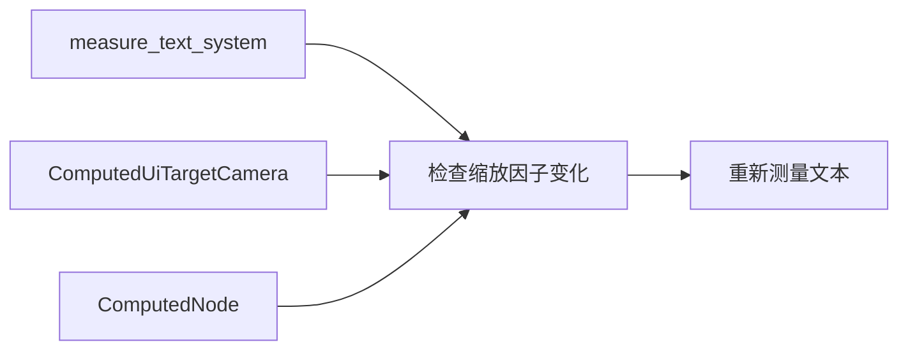

+++
title = "#20538 Only regenerate text measure funcs on changes to the scale factor, not the camera or target size"
date = "2025-08-14T00:00:00"
draft = false
template = "pull_request_page.html"
in_search_index = false

[extra]
current_language = "zh-cn"
available_languages = {"en" = { name = "English", url = "/pull_request/bevy/2025-08/pr-20538-en-20250814" }, "zh-cn" = { name = "中文", url = "/pull_request/bevy/2025-08/pr-20538-zh-cn-20250814" }}
+++

# PR分析报告：Only regenerate text measure funcs on changes to the scale factor, not the camera or target size

## 基本信息
- **标题**: Only regenerate text measure funcs on changes to the scale factor, not the camera or target size
- **PR链接**: https://github.com/bevyengine/bevy/pull/20538
- **作者**: ickshonpe
- **状态**: 已合并
- **标签**: C-Performance, A-UI, S-Ready-For-Final-Review, A-Text, D-Straightforward
- **创建时间**: 2025-08-12T18:51:00Z
- **合并时间**: 2025-08-14T17:57:45Z
- **合并者**: alice-i-cecile

## 描述翻译
**目标**  
`measure_text_system` 应该仅在缩放因子（scale factor）和文本内容发生变化时重新测量文本节点，而不是在目标相机或目标尺寸变化时。

**解决方案**  
不再检查 `ComputedUiTargetCamera` 组件是否发生变化，而是将计算得到的目标缩放因子与存储在 `ComputedNode` 中的上一帧的缩放因子进行比较。

---

## 这个PR的故事

### 问题和背景
在Bevy的UI系统中，`measure_text_system`负责计算文本节点的尺寸信息。优化前，该系统在以下情况下会触发文本重新测量：
1. 目标相机变化（`ComputedUiTargetCamera`）
2. 文本内容需要重新渲染（`ComputedTextBlock::needs_rerender`）
3. 文本测量标志变化（`TextNodeFlags::needs_measure_fn`）
4. 内容尺寸组件被添加（`ContentSize.is_added()`）
5. 文本节点被添加（`TextBlock.is_added()`）

问题在于目标相机变化（如相机位置或投影变化）经常发生，但这并不影响文本测量的核心参数——缩放因子（scale factor）。不必要的重新测量导致CPU资源浪费，特别是在相机频繁移动但缩放因子保持不变的场景中。

### 解决方案方法
核心洞察：文本测量只应依赖于缩放因子变化，而非相机其他属性。解决方案：
1. 移除对`ComputedUiTargetCamera`变化的依赖
2. 添加对`ComputedNode`的访问以获取历史缩放因子
3. 比较当前帧与上一帧的缩放因子差值
4. 设置1e-5的阈值忽略浮点计算误差

### 实现细节
#### 文本测量逻辑重构
关键修改在`text.rs`的查询和条件判断：
```rust
// 修改前：
Ref<ComputedUiTargetCamera>

// 修改后：
&ComputedUiTargetCamera,
&ComputedNode,
```

条件判断优化：
```rust
// 修改前：
if computed_target.is_changed() ...

// 修改后：
if 1e-5 < (computed_target.scale_factor() - computed_node.inverse_scale_factor.recip()).abs()
    || computed.needs_rerender()
    || text_flags.needs_measure_fn
    || content_size.is_added()
    || block.is_added()
{
    // 触发重新测量
}
```
这里`computed_node.inverse_scale_factor.recip()`获取上一帧的缩放因子，与当前帧的`computed_target.scale_factor()`比较。

#### 系统执行顺序优化
在`lib.rs`中添加歧义关系解析：
```rust
ui_stack_system
    .in_set(UiSystems::Stack)
    .ambiguous_with(widget::measure_text_system) // 新增行
    ...
```
这确保`ui_stack_system`和`measure_text_system`不会因执行顺序冲突，因为两者都操作UI节点但无严格依赖。

### 技术洞察
1. **性能优化**：避免相机位置变化等无关事件触发昂贵文本测量
2. **浮点比较**：采用epsilon阈值(1e-5)处理浮点精度问题
3. **数据复用**：利用现有`ComputedNode.inverse_scale_factor`存储历史值
4. **EC查询优化**：通过调整查询组件减少不必要的系统执行

### 影响
1. **CPU开销降低**：在相机移动但缩放不变的场景显著减少计算量
2. **行为更精确**：文本测量只在实际影响渲染的参数变化时触发
3. **系统解耦**：减少UI系统与相机系统的非必要耦合

### 潜在改进点
1. 可考虑将缩放因子历史值存入专用组件而非复用布局组件
2. 对缩放因子变化实现更精细的事件通知机制

## 视觉表示


## 关键文件更改

### 1. `crates/bevy_ui/src/widget/text.rs` (+8/-3)
**修改目的**：优化文本测量触发条件

```diff
 pub fn measure_text_system(
     mut text_query: Query<
         (
             Entity,
             &TextBlock,
             &mut ContentSize,
             &mut TextNodeFlags,
             &mut ComputedTextBlock,
-            Ref<ComputedUiTargetCamera>,
+            &ComputedUiTargetCamera,
+            &ComputedNode,
         ),
         With<Node>,
     >,
     mut text_pipeline: ResMut<TextPipeline>,
     mut font_system: ResMut<CosmicFontSystem>,
 ) {
-    for (entity, block, content_size, text_flags, computed, computed_target) in &mut text_query {
+    for (entity, block, content_size, text_flags, computed, computed_target, computed_node) in
+        &mut text_query
+    {
         // Note: the ComputedTextBlock::needs_rerender bool is cleared in create_text_measure().
-        if computed_target.is_changed()
+        // 1e-5 epsilon to ignore tiny scale factor float errors
+        if 1e-5
+            < (computed_target.scale_factor() - computed_node.inverse_scale_factor.recip()).abs()
             || computed.needs_rerender()
             || text_flags.needs_measure_fn
             || content_size.is_added()
```

### 2. `crates/bevy_ui/src/lib.rs` (+1/-0)
**修改目的**：解决系统执行顺序歧义

```diff
 impl Plugin for UiPlugin {
                 ui_stack_system
                     .in_set(UiSystems::Stack)
                     // These systems don't care about stack index
+                    .ambiguous_with(widget::measure_text_system)
                     .ambiguous_with(update_clipping_system)
                     .ambiguous_with(ui_layout_system)
                     .ambiguous_with(widget::update_viewport_render_target_size)
```

## 进一步阅读
1. [Bevy UI系统文档](https://docs.rs/bevy_ui/latest/bevy_ui/)
2. [ECS中的系统调度最佳实践](https://bevy-cheatbook.github.io/programming/systems.html)
3. [浮点数比较的精度处理](https://floating-point-gui.de/errors/comparison/)
4. [Bevy UI测量原理](https://github.com/bevyengine/bevy/blob/main/crates/bevy_ui/src/measure.rs)