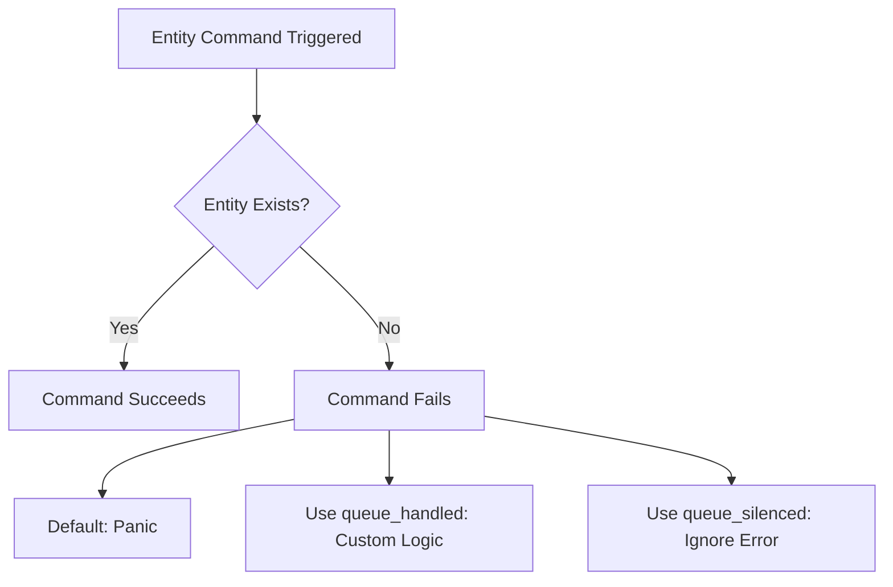

+++
title = "#20544 Improve error message for failed entity commands"
date = "2025-08-14T00:00:00"
draft = false
template = "pull_request_page.html"
in_search_index = true

[taxonomies]
list_display = ["show"]

[extra]
current_language = "en"
available_languages = {"en" = { name = "English", url = "/pull_request/bevy/2025-08/pr-20544-en-20250814" }, "zh-cn" = { name = "中文", url = "/pull_request/bevy/2025-08/pr-20544-zh-cn-20250814" }}
labels = ["C-Bug", "C-Docs", "A-ECS", "C-Usability", "X-Contentious", "D-Straightforward"]
+++

## Improve error message for failed entity commands

### Basic Information
- **Title**: Improve error message for failed entity commands
- **PR Link**: https://github.com/bevyengine/bevy/pull/20544
- **Author**: alice-i-cecile
- **Status**: MERGED
- **Labels**: C-Bug, C-Docs, A-ECS, C-Usability, S-Ready-For-Final-Review, X-Contentious, D-Straightforward
- **Created**: 2025-08-13T00:08:59Z
- **Merged**: 2025-08-13T20:07:40Z
- **Merged By**: alice-i-cecile

### Description
# Objective

- If an entity command is sent targeting a despawned entity, that command will error, and then panic by default.
- This occurs even if the entity exists at the time the command was sent.
- This can cause surprising panics when working with observers that depend on each other, especially when using entity events that cause entities to be despawned.
- Closes #19623.

## Solution

As outlined in #19623, this behavior isn't exactly a bug, although it is surprising.

When you attempt to trigger an observer for an entity that doesn't exist, Bevy should give you some indication that something has gone wrong!

The standard mechanism we have for doing so is to return an error in the command, which is passed to the default error handler. By default, this panics, reproducing the problem reported in #19623.

Unfortunately, the error reporting was so bad that neither the OP nor the contributors could quickly isolate the problem and tell them what they should be doing differently.

The actual solution is both standard to the rest of Bevy and quite simple: just queue the command in a way that makes the error not panic. We should explain that!

I've added commentary to that effect on both `EntityCommands::trigger/trigger_targets` and the error message returned.

## Testing

I've added a new test demonstrating the fix for this failure mode. Swapping that test to plain `.trigger` fixes the problem.

### The Story of This Pull Request

#### The Problem and Context
When working with Bevy's ECS, developers use entity commands to perform operations like triggering events. However, if a command targets an entity that has been despawned by the time the command is applied, the command fails. By default, this failure triggers a panic. This behavior is particularly problematic when using observers that depend on each other, as one observer might despawn an entity while another observer attempts to trigger an event on that same entity in the same frame. The panic occurs even if the entity existed when the command was originally queued, leading to confusing debugging scenarios as reported in issue #19623.

#### The Solution Approach
The core issue wasn't the panic itself—Bevy's default error handling for failed commands is intentionally panic-based. The real problem was the lack of clear guidance in both the error messages and API documentation. Developers encountering these panics didn't understand why they occurred or how to handle them properly. The solution focused on two key improvements: enhancing the error message to explicitly suggest proper error handling techniques, and adding documentation to relevant command methods to warn about this failure mode upfront.

#### The Implementation
The changes were implemented in two files:

1. **Error message enhancement** in `error.rs`: The existing `EntityMutableFetchError::EntityDoesNotExist` error was modified to include actionable guidance. Previously, it only indicated the entity didn't exist. Now it explicitly suggests using `EntityCommands::queue_handled` or `queue_silenced` when applying commands to potentially despawned entities:

```rust
#[derive(thiserror::Error, Debug, Clone, Copy, PartialEq, Eq)]
pub enum EntityMutableFetchError {
    /// The entity with the given ID does not exist.
    #[error(
        "{0}\n
    If you were attempting to apply a command to this entity,
    and want to handle this error gracefully, consider using `EntityCommands::queue_handled` or `queue_silenced`."
    )]
    EntityDoesNotExist(#[from] EntityDoesNotExistError),
    // ...
}
```

2. **API documentation** in `commands/mod.rs`: The `trigger`, `trigger_targets`, and entity-specific `trigger` methods now include warnings about the failure mode and guidance on handling it:

```rust
/// Sends a global [`Event`] without any targets.
///
/// This will run any [`Observer`] of the given [`Event`] that isn't scoped to specific targets.
///
/// If the entity that this command targets does not exist when the command is applied,
/// the command will fail, possibly causing it to panic based on the default [error handler](crate::error) set.
///
/// To queue this command with a specific handler, use [`EntityCommands::queue_handled`]
/// with [`entity_command::trigger(event)`](entity_command::trigger).
/// [`EntityCommands::queue_silenced`] may also be used to ignore the error completely.
#[track_caller]
pub fn trigger(&mut self, event: impl Event) {
    self.queue(command::trigger(event));
}
```

3. **Validation test**: A new test case was added to demonstrate proper handling of commands targeting despawned entities. The test simulates a scenario where one observer despawns an entity while another observer attempts to trigger an event on it. Using `queue_silenced` prevents the panic:

```rust
#[test]
fn fixing_panicking_entity_commands() {
    // ... setup ...
    fn followup(on: On<Kill>, mut commands: Commands) {
        commands
            .entity(on.target())
            .queue_silenced(trigger(FollowupEvent));
    }
    // ... test execution ...
}
```

#### Technical Insights
The implementation leverages Bevy's existing command queuing mechanisms. The key insight is that commands targeting potentially despawned entities should use error-handling strategies already available in the API:
- `queue_handled`: Allows custom error handling logic
- `queue_silenced`: Silently ignores errors

These methods were already present but underutilized due to insufficient documentation. The changes don't modify core command execution logic—they simply improve developer guidance at the failure points.

#### The Impact
These changes significantly improve the developer experience when working with entity commands and observers:
1. Clear error messages guide developers to solutions instead of leaving them to debug panics
2. API documentation proactively warns about the failure mode
3. The included test demonstrates the correct pattern for dependent observers
4. Fixes #19623 by providing actionable solutions to a common pitfall

### Visual Representation



### Key Files Changed

#### `crates/bevy_ecs/src/world/error.rs` (+52/-1)
**Purpose**: Improve error message for entity command failures  
**Key Changes**:
1. Enhanced error message with handling guidance
2. Added test case demonstrating proper error handling

```rust
// Before:
#[error(transparent)]
EntityDoesNotExist(#[from] EntityDoesNotExistError),

// After:
#[error(
    "{0}\n
If you were attempting to apply a command to this entity,
and want to handle this error gracefully, consider using `EntityCommands::queue_handled` or `queue_silenced`."
)]
EntityDoesNotExist(#[from] EntityDoesNotExistError),
```

#### `crates/bevy_ecs/src/system/commands/mod.rs` (+20/-0)
**Purpose**: Add warnings and guidance to command methods  
**Key Changes**: Added documentation to three methods:
1. `Commands::trigger`
2. `Commands::trigger_targets`
3. `EntityCommands::trigger`

```rust
// Added documentation block:
/// If the entity that this command targets does not exist when the command is applied,
/// the command will fail, possibly causing it to panic based on the default [error handler](crate::error) set.
///
/// To queue this command with a specific handler, use [`EntityCommands::queue_handled`]
/// with [`entity_command::trigger(event)`](entity_command::trigger).
/// [`EntityCommands::queue_silenced`] may also be used to ignore the error completely.
```

### Further Reading
- [Bevy Commands Documentation](https://docs.rs/bevy_ecs/latest/bevy_ecs/system/struct.Commands.html)
- [Bevy Observer System Guide](https://bevyengine.org/learn/book/events/#observers)
- Original Issue: [#19623](https://github.com/bevyengine/bevy/issues/19623)