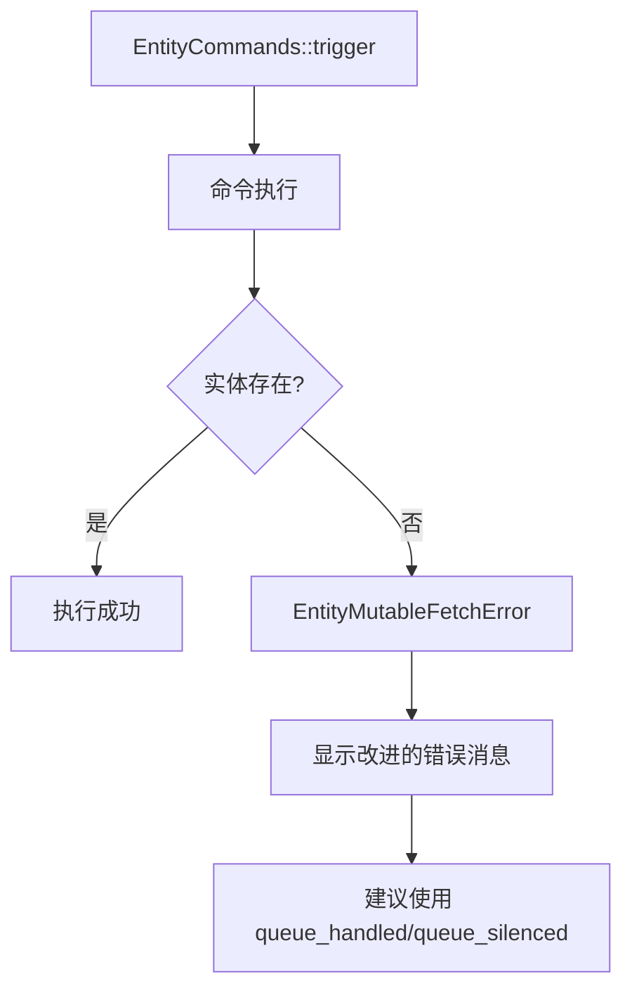

+++
title = "#20544 Improve error message for failed entity commands"
date = "2025-08-14T00:00:00"
draft = false
template = "pull_request_page.html"
in_search_index = false

[extra]
current_language = "zh-cn"
available_languages = {"en" = { name = "English", url = "/pull_request/bevy/2025-08/pr-20544-en-20250814" }, "zh-cn" = { name = "中文", url = "/pull_request/bevy/2025-08/pr-20544-zh-cn-20250814" }}
+++

## 实体命令错误消息改进分析

### 基本信息
- **标题**: Improve error message for failed entity commands
- **PR链接**: https://github.com/bevyengine/bevy/pull/20544
- **作者**: alice-i-cecile
- **状态**: MERGED
- **标签**: C-Bug, C-Docs, A-ECS, C-Usability, S-Ready-For-Final-Review, X-Contentious, D-Straightforward
- **创建时间**: 2025-08-13T00:08:59Z
- **合并时间**: 2025-08-13T20:07:40Z
- **合并者**: alice-i-cecile

### 描述翻译
#### Objective
- 当实体命令发送给已被销毁的实体时，该命令会出错，默认情况下会导致panic
- 即使命令发送时实体存在，也可能发生此问题
- 在使用相互依赖的观察器（observers）时，特别是使用导致实体销毁的实体事件（entity events）时，会引起意外panic
- 关闭 #19623

#### Solution
如 #19623 所述，此行为不完全是bug，但确实令人意外。

当尝试为不存在的实体触发观察器时，Bevy应提供错误指示！标准机制是在命令中返回错误，该错误会传递给默认错误处理程序。默认情况下，这会触发panic，重现 #19623 报告的问题。

不幸的是，错误报告质量很差，无论是问题提出者还是贡献者都无法快速定位问题并找到解决方案。

实际解决方案既符合Bevy标准又简单：以不引起panic的方式排队命令。我们应解释这一点！

我已在 `EntityCommands::trigger/trigger_targets` 和相关错误消息中添加了说明性注释。

#### Testing
我添加了新测试来验证对此故障模式的修复。将该测试切换为普通 `.trigger` 可解决问题。

### 问题与背景
在Bevy ECS中，当开发者使用实体命令（entity commands）操作已被销毁的实体时，系统会抛出 `EntityMutableFetchError` 错误。默认的错误处理机制会触发panic，导致程序崩溃。问题 #19623 揭示了一个典型场景：当使用观察器（observers）系统处理实体事件时，如果事件处理链中某个观察器销毁了实体，后续观察器尝试操作该实体会导致意外panic。

核心问题在于：
1. 错误消息没有提供明确的解决方案指导
2. API文档未说明如何处理此类错误
3. 默认panic行为对链式事件处理不友好

### 解决方案与实现
PR采用双管齐下的解决方案：

1. **增强错误消息**：修改 `EntityMutableFetchError` 的错误显示逻辑，添加明确的处理建议
2. **改进API文档**：在关键命令方法中添加错误处理说明

具体修改集中在两个文件：

#### `crates/bevy_ecs/src/world/error.rs`
```diff
#[derive(thiserror::Error, Debug, Clone, Copy, PartialEq, Eq)]
pub enum EntityMutableFetchError {
    /// The entity with the given ID does not exist.
-    #[error(transparent)]
+    #[error(
+        "{0}\n
+    If you were attempting to apply a command to this entity,
+    and want to handle this error gracefully, consider using `EntityCommands::queue_handled` or `queue_silenced`."
+    )]
     EntityDoesNotExist(#[from] EntityDoesNotExistError),
```
修改后，当实体不存在错误发生时，错误消息会显示：
```
Entity does not exist
If you were attempting to apply a command to this entity,
and want to handle this error gracefully, consider using `EntityCommands::queue_handled` or `queue_silenced`.
```

#### `crates/bevy_ecs/src/system/commands/mod.rs`
在三个触发方法中添加文档警告：
```diff
+    /// If the entity that this command targets does not exist when the command is applied,
+    /// the command will fail, possibly causing it to panic based on the default [error handler](crate::error) set.
+    ///
+    /// To queue this command with a specific handler, use [`EntityCommands::queue_handled`]
+    /// with [`entity_command::trigger(event)`](entity_command::trigger).
+    /// [`EntityCommands::queue_silenced`] may also be used to ignore the error completely.
     #[track_caller]
     pub fn trigger(&mut self, event: impl Event) {
```
这些文档更新明确指出了：
1. 命令可能因目标实体不存在而失败
2. 默认处理会导致panic
3. 替代方案：使用 `queue_handled` 或 `queue_silenced`

### 技术验证
新增测试用例验证了解决方案：
```rust
#[test]
fn fixing_panicking_entity_commands() {
    #[derive(EntityEvent)]
    struct Kill;

    #[derive(EntityEvent)]
    struct FollowupEvent;

    fn despawn(trigger: On<Kill>, mut commands: Commands) {
        commands.entity(trigger.target()).despawn();
    }

    fn followup(on: On<Kill>, mut commands: Commands) {
        commands
            .entity(on.target())
            .queue_silenced(trigger(FollowupEvent)); // 关键修复
    }
    
    // ...测试设置和验证逻辑
}
```
测试模拟了原始问题场景：
1. 创建观察器链：`kill_everything` → `despawn` → `followup`
2. 使用 `queue_silenced` 避免对已销毁实体的操作触发panic
3. 验证链式事件处理不会崩溃

### 技术洞察
1. **错误处理策略**：Bevy采用显式错误处理机制，开发者需主动选择处理方式：
   - `queue()`：使用默认错误处理（可能panic）
   - `queue_handled()`：自定义错误处理
   - `queue_silenced()`：忽略错误

2. **观察器执行顺序**：关键问题是观察器执行顺序不确定。即使命令发送时实体存在，在命令执行前实体可能已被销毁

3. **API设计原则**：此修改遵循Rust的显式错误处理哲学，避免隐藏潜在失败点

### 影响与改进
1. **开发者体验提升**：错误消息直接指导解决方案，减少调试时间
2. **文档完善**：API文档明确说明潜在错误和替代方案
3. **模式推广**：鼓励使用更安全的 `queue_handled`/`queue_silenced` 方法
4. **测试覆盖**：新增测试防止回归

## 组件关系图


## 关键文件变更
### 1. `crates/bevy_ecs/src/world/error.rs`
**变更目的**：增强实体不存在错误的可操作性  
**关键修改**：
```diff
#[derive(thiserror::Error, Debug, Clone, Copy, PartialEq, Eq)]
pub enum EntityMutableFetchError {
-    #[error(transparent)]
+    #[error(
+        "{0}\n
+    If you were attempting to apply a command to this entity,
+    and want to handle this error gracefully, consider using `EntityCommands::queue_handled` or `queue_silenced`."
+    )]
     EntityDoesNotExist(#[from] EntityDoesNotExistError),
```

### 2. `crates/bevy_ecs/src/system/commands/mod.rs`
**变更目的**：在API文档中添加错误处理指导  
**关键修改**：
```diff
+    /// If the entity that this command targets does not exist when the command is applied,
+    /// the command will fail, possibly causing it to panic based on the default [error handler](crate::error) set.
+    ///
+    /// To queue this command with a specific handler, use [`EntityCommands::queue_handled`]
+    /// with [`entity_command::trigger(event)`](entity_command::trigger).
+    /// [`EntityCommands::queue_silenced`] may also be used to ignore the error completely.
     #[track_caller]
     pub fn trigger(&mut self, event: impl Event) {
```

## 进一步阅读
1. [Bevy Commands 文档](https://docs.rs/bevy_ecs/latest/bevy_ecs/system/struct.Commands.html)
2. [Bevy 观察器系统](https://docs.rs/bevy_ecs/latest/bevy_ecs/event/struct.Observer.html)
3. [Rust 错误处理最佳实践](https://doc.rust-lang.org/book/ch09-00-error-handling.html)
4. 原始问题 [#19623](https://github.com/bevyengine/bevy/issues/19623)