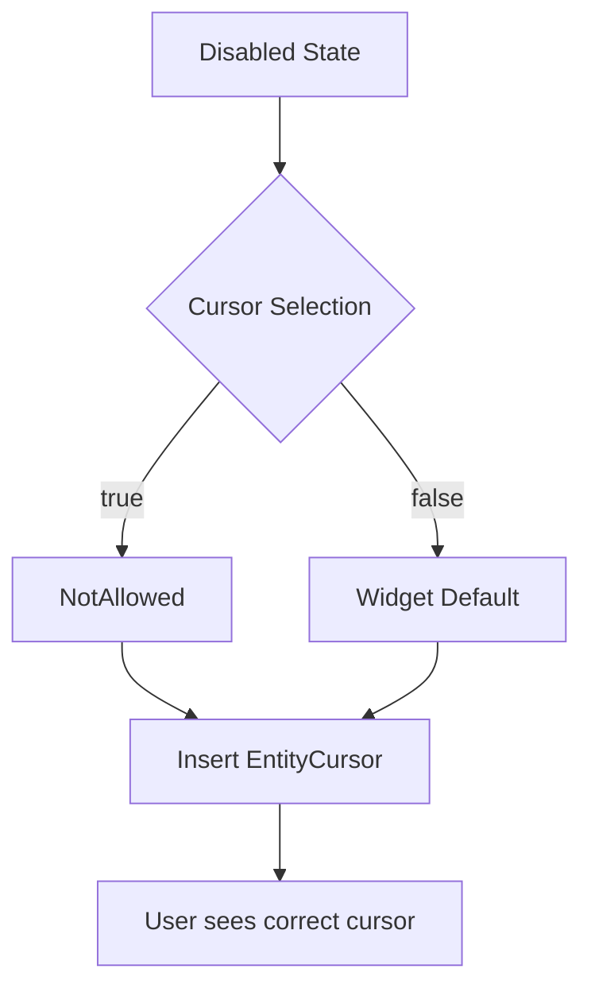

+++
title = "#20548"
date = "2025-08-14T00:00:00"
draft = false
template = "pull_request_page.html"
in_search_index = true

[taxonomies]
list_display = ["show"]

[extra]
current_language = "en"
available_languages = {"en" = { name = "English", url = "/pull_request/bevy/2025-08/pr-20548-en-20250814" }, "zh-cn" = { name = "中文", url = "/pull_request/bevy/2025-08/pr-20548-zh-cn-20250814" }}
+++

## Technical Analysis of PR #20548: Change cursor shape for disabled widgets

### The Problem and Context
The core issue (#20499) involved disabled UI widgets displaying the same cursor icon as enabled ones. This created a confusing user experience where disabled elements appeared interactive. The problem affected all major UI controls: buttons, checkboxes, radio buttons, toggle switches, and sliders. The technical constraint was that cursor styling logic only considered enabled states, with no handling for disabled status. This oversight occurred because cursor styling was originally implemented alongside color changes but wasn't extended to disabled states.

### The Solution Approach
The solution standardized cursor behavior across widgets by:
1. Adding conditional cursor selection based on `disabled` state
2. Renaming color-setting functions to `set_*_styles` to reflect expanded responsibilities
3. Inserting `EntityCursor` components during style updates

The pattern is consistent across widgets:
```rust
let cursor_shape = match disabled {
    true => bevy_window::SystemCursorIcon::NotAllowed,
    false => /* widget-specific default */
};
commands.entity(widget_ent).insert(EntityCursor::System(cursor_shape));
```

For sliders, the implementation required passing `Commands` to style functions since they previously only modified existing components.

### The Implementation
All widget controls followed the same pattern:
1. Rename `set_*_colors()` to `set_*_styles()`
2. Add cursor selection logic
3. Insert `EntityCursor` component

**Button widget changes** (`crates/bevy_feathers/src/controls/button.rs`):
```rust
// Before:
fn set_button_colors(...) { /* only color logic */ }

// After:
fn set_button_styles(...) {
    // ... existing color logic
    let cursor_shape = match disabled {
        true => bevy_window::SystemCursorIcon::NotAllowed,
        false => bevy_window::SystemCursorIcon::Pointer,
    };
    commands.entity(button_ent).insert(EntityCursor::System(cursor_shape));
}
```

**Slider required more significant changes** (`crates/bevy_feathers/src/controls/slider.rs`):
```rust
// Before:
fn update_slider_colors(...) {
    for (disabled, mut gradient) in ... {
        set_slider_colors(&theme, disabled, gradient.as_mut());
    }
}

// After:
fn update_slider_styles(...) {
    for (slider_ent, disabled, mut gradient) in ... {
        set_slider_styles(slider_ent, &theme, disabled, gradient.as_mut(), &mut commands);
    }
}

fn set_slider_styles(..., commands: &mut Commands) {
    // ... color updates
    commands.entity(slider_ent).insert(EntityCursor::System(cursor_shape));
}
```

### Technical Insights
Key implementation details:
1. **Cursor semantics**:
   - `NotAllowed` for disabled state
   - Widget-specific defaults when enabled (e.g., `Pointer` for buttons, `EwResize` for sliders)
2. **System ordering**: Changes hook into existing style update systems that already handle state transitions
3. **EntityCursor component**: Leverages Bevy's existing cursor management system
4. **Consistency**: Uniform pattern applied across all UI controls ensures maintainability

The solution avoids performance concerns by:
- Using the same query patterns as existing style systems
- Only modifying cursor components when disabled state changes
- Maintaining existing system scheduling

### The Impact
These changes:
1. Fix visual inconsistency for disabled widgets
2. Improve UX by providing proper affordances
3. Maintain existing performance characteristics
4. Set consistent patterns for future widget development

The implementation demonstrates proper use of Bevy's ECS patterns:
- Components modified through systems rather than direct access
- State-driven logic using simple boolean checks
- Minimal overhead by piggybacking on existing systems

## Visual Representation



## Key Files Changed

1. `crates/bevy_feathers/src/controls/button.rs` (+13/-3)
   - Renamed `set_button_colors` to `set_button_styles`
   - Added cursor insertion logic
   ```rust
   let cursor_shape = match disabled {
       true => bevy_window::SystemCursorIcon::NotAllowed,
       false => bevy_window::SystemCursorIcon::Pointer,
   };
   commands.entity(button_ent).insert(EntityCursor::System(cursor_shape));
   ```

2. `crates/bevy_feathers/src/controls/checkbox.rs` (+13/-3)
   - Same pattern as button with `set_checkbox_styles`
   - Added cursor to checkbox entity

3. `crates/bevy_feathers/src/controls/radio.rs` (+13/-3)
   - Renamed `set_radio_colors` to `set_radio_styles`
   - Identical cursor selection logic

4. `crates/bevy_feathers/src/controls/slider.rs` (+44/-12)
   - Most complex change due to new Commands requirement
   - Updated queries to include entity IDs
   ```rust
   // Before:
   Query<(Has<InteractionDisabled>, &mut BackgroundGradient)>
   
   // After:
   Query<(Entity, Has<InteractionDisabled>, &mut BackgroundGradient)>
   ```
   - Passed commands through to style function

5. `crates/bevy_feathers/src/controls/toggle_switch.rs` (+13/-3)
   - Renamed `set_switch_colors` to `set_switch_styles`
   - Added cursor insertion with same match logic

6. `release-content/release-notes/feathers.md` (+1/-1)
   - Added PR reference to release notes
   ```diff
   -pull_requests: [19730, 19900, 19928, 20237, 20169, 20422, 20350]
   +pull_requests: [19730, 19900, 19928, 20237, 20169, 20422, 20350, 20548]
   ```

## Further Reading
1. [Bevy UI System Documentation](https://bevyengine.org/learn/book/features/ui/)
2. [Bevy Input Handling](https://bevyengine.org/learn/book/features/input/)
3. [Cursor Icons Specification](https://developer.mozilla.org/en-US/docs/Web/CSS/cursor)
4. [EntityCursor Component API](https://docs.rs/bevy/latest/bevy/window/struct.EntityCursor.html)