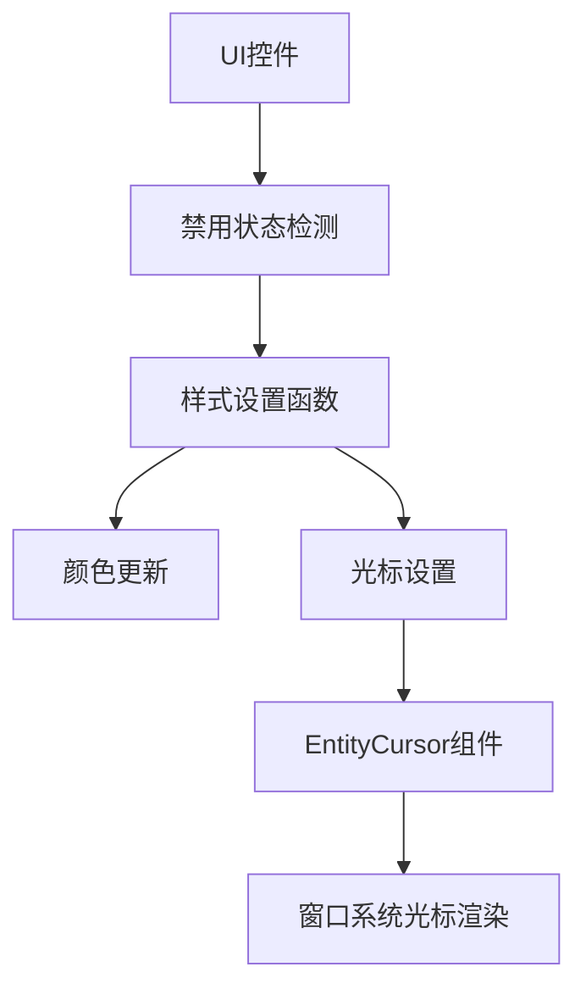

+++
title = "#20548 Change cursor shape for disabled widgets"
date = "2025-08-14T00:00:00"
draft = false
template = "pull_request_page.html"
in_search_index = false

[extra]
current_language = "zh-cn"
available_languages = {"en" = { name = "English", url = "/pull_request/bevy/2025-08/pr-20548-en-20250814" }, "zh-cn" = { name = "中文", url = "/pull_request/bevy/2025-08/pr-20548-zh-cn-20250814" }}
labels = ["C-Feature", "A-UI", "D-Straightforward"]
+++

# PR分析报告：修改禁用控件的光标形状

## Basic Information
- **Title**: Change cursor shape for disabled widgets
- **PR Link**: https://github.com/bevyengine/bevy/pull/20548
- **Author**: amedoeyes
- **Status**: MERGED
- **Labels**: C-Feature, A-UI, S-Ready-For-Final-Review, M-Needs-Release-Note, X-Uncontroversial, D-Straightforward
- **Created**: 2025-08-13T03:45:07Z
- **Merged**: 2025-08-14T02:16:24Z
- **Merged By**: alice-i-cecile

## Description Translation
# 目标 (Objective)

- 修复 #20499

## 解决方案 (Solution)

- 在 `set_*_colors` 函数中重新插入 `EntityCursor`，根据控件是否禁用设置对应的光标形状。

## 测试 (Testing)

- 在 `feathers` 示例中测试了这些更改。

## 该PR的故事

### 问题背景
在Bevy引擎的Feathers UI模块中，存在一个用户体验问题：当UI控件（如按钮、滑块等）被禁用时，鼠标光标形状不会改变。这导致用户无法直观区分控件是否可用（#20499）。具体来说：
- 禁用控件仍显示指针光标（pointer），暗示可交互
- 缺少视觉反馈降低界面可用性
- 不符合常见UI设计规范

### 解决方案设计
开发者采用直接扩展现有样式系统的方案：
1. 复用控件禁用状态检测逻辑
2. 在样式更新函数中添加光标设置
3. 根据控件类型选择合适的光标：
   - 普通控件：禁用时用`NotAllowed`，启用时用`Pointer`
   - 滑块：启用时用`EwResize`（水平调整）
4. 保持现有颜色更新逻辑不变

替代方案考虑：
- 全局禁用状态处理器：被否决，因需控件特定逻辑
- 独立系统：被否决，因会导致代码重复

### 具体实现
核心修改是将所有控件的`set_*_colors`函数重命名为`set_*_styles`，并添加光标设置逻辑。以按钮为例：

```rust
// 修改前:
fn set_button_colors(...) {
    // 仅设置颜色
}

// 修改后:
fn set_button_styles(...) {
    // 颜色设置保持不变...
    
    // 新增光标逻辑
    let cursor_shape = match disabled {
        true => bevy_window::SystemCursorIcon::NotAllowed,
        false => bevy_window::SystemCursorIcon::Pointer,
    };
    
    commands.entity(button_ent).insert(EntityCursor::System(cursor_shape));
}
```

关键实现细节：
1. **统一处理模式**：所有控件类型采用相同逻辑结构
2. **条件选择**：基于`disabled`布尔值切换光标
3. **组件插入**：使用ECS的`commands`插入`EntityCursor`
4. **滑块特殊处理**：单独实现水平调整光标

### 架构影响
修改完全在现有UI样式系统内完成：
- 复用`InteractionDisabled`组件检测状态
- 扩展而非替换样式设置函数
- 保持Bevy ECS的组件更新模式

### 性能考量
- 仅当禁用状态变化时更新
- 新增的EntityCursor组件内存开销极小
- 无额外查询或复杂计算

### 测试验证
通过在`feathers`示例中手动测试：
1. 验证各控件禁用/启用时光标变化正确
2. 确认禁用状态与其他样式属性同步更新
3. 检查滑块特殊光标行为

### 后续改进
潜在优化方向：
- 提取光标选择逻辑到共享函数
- 支持自定义禁用光标
- 添加自动化测试

## 关键文件变更

### 按钮控件
`crates/bevy_feathers/src/controls/button.rs` (+13/-3)
```rust
// 主要变更:
// 函数重命名 + 光标插入
fn set_button_styles(...) {
    // ...原有颜色设置代码
    
    // 新增光标设置
    let cursor_shape = match disabled {
        true => bevy_window::SystemCursorIcon::NotAllowed,
        false => bevy_window::SystemCursorIcon::Pointer,
    };
    commands.entity(button_ent).insert(EntityCursor::System(cursor_shape));
}
```

### 滑块控件
`crates/bevy_feathers/src/controls/slider.rs` (+44/-12)
```rust
// 主要变更:
// 1. 函数重命名
// 2. 增加commands参数
// 3. 特殊光标处理
fn set_slider_styles(...) {
    // ...原有渐变设置
    
    // 新增滑块特定光标
    let cursor_shape = match disabled {
        true => bevy_window::SystemCursorIcon::NotAllowed,
        false => bevy_window::SystemCursorIcon::EwResize,
    };
    
    commands.entity(slider_ent).insert(EntityCursor::System(cursor_shape));
}
```

### 复选框/单选按钮/切换开关
`crates/bevy_feathers/src/controls/{checkbox,radio,toggle_switch}.rs` (各+13/-3)
```rust
// 统一变更模式:
// 1. 函数重命名(set_*_colors → set_*_styles)
// 2. 添加相同的光标选择逻辑
let cursor_shape = match disabled {
    true => bevy_window::SystemCursorIcon::NotAllowed,
    false => bevy_window::SystemCursorIcon::Pointer,
};
commands.entity(ent).insert(EntityCursor::System(cursor_shape));
```

### 发布说明
`release-content/release-notes/feathers.md` (+1/-1)
```markdown
authors: ["@viridia", "@Atlas16A", "@ickshonpe", "@amedoeyes"]
pull_requests: [..., 20548]
```

## 组件关系图



## 进一步阅读

1. Bevy UI系统文档：
   https://bevyengine.org/learn/book/getting-started/ui/

2. Bevy光标组件API参考：
   https://docs.rs/bevy/latest/bevy/window/struct.CursorIcon.html

3. W3C无障碍光标规范：
   https://www.w3.org/WAI/WCAG21/Techniques/css/C15

4. 人机交互视觉反馈设计原则：
   https://www.nngroup.com/articles/feedback-visibility-system-status/