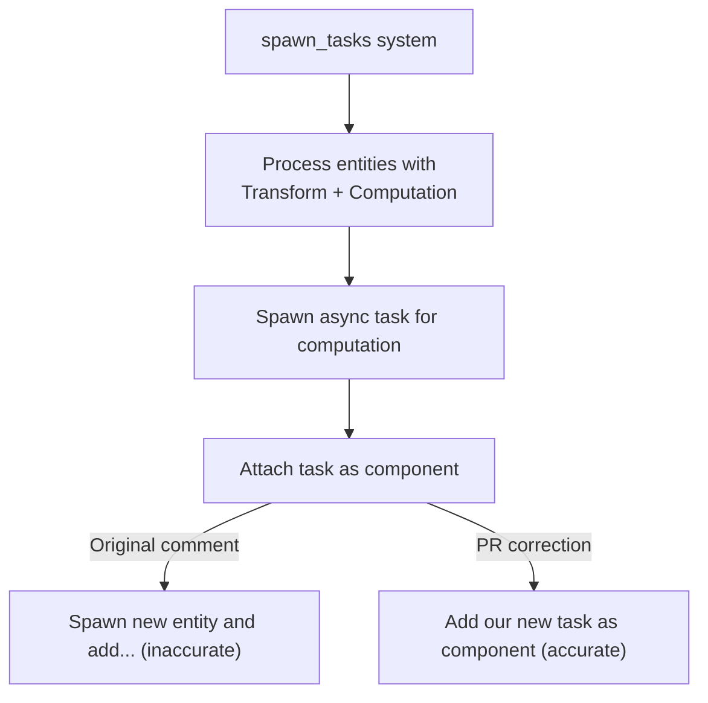

+++
title = "#20550 correct comment in async_compute example"
date = "2025-08-14T00:00:00"
draft = false
template = "pull_request_page.html"
in_search_index = true

[taxonomies]
list_display = ["show"]

[extra]
current_language = "en"
available_languages = {"en" = { name = "English", url = "/pull_request/bevy/2025-08/pr-20550-en-20250814" }, "zh-cn" = { name = "中文", url = "/pull_request/bevy/2025-08/pr-20550-zh-cn-20250814" }}
+++

# Technical Analysis of PR #20550: correct comment in async_compute example

## Basic Information
- **Title**: correct comment in async_compute example
- **PR Link**: https://github.com/bevyengine/bevy/pull/20550
- **Author**: tomara-x
- **Status**: MERGED
- **Labels**: None
- **Created**: 2025-08-13T09:38:36Z
- **Merged**: 2025-08-13T17:31:03Z
- **Merged By**: mockersf

## Description Translation
# Objective

- make comment less confusing

## Solution

- yeet confusing part

## The Story of This Pull Request
The async_compute.rs example demonstrates how to handle computationally intensive operations in Bevy using asynchronous tasks. In this system, heavy computations are offloaded to separate threads to maintain frame rate stability. The `spawn_tasks` function processes entities with both `Transform` and `Computation` components, creates async tasks for expensive calculations, and attaches these tasks as components to the original entities.

The issue arose from a misleading code comment in the task attachment section. The original comment stated:
```rust
// Spawn new entity and add our new task as a component
```
This description was technically inaccurate since the code wasn't creating a new entity - it was modifying an existing entity by adding a new component. The comment could confuse developers learning about Bevy's ECS patterns, potentially leading to misunderstandings about entity management during async operations.

The fix was straightforward: update the comment to accurately reflect the operation being performed. The new comment:
```rust
// Add our new task as a component
```
precisely describes the single operation occurring at that point in the code. This change improves the example's educational value by providing accurate technical documentation that matches the actual behavior.

Examples serve as critical learning resources, and accurate comments help developers understand proper patterns faster. While minor, this correction prevents potential confusion about Bevy's entity-component modification patterns, especially for developers new to ECS architecture.

## Visual Representation



## Key Files Changed
### `examples/async_tasks/async_compute.rs`
**Change**: Corrected misleading comment about entity creation  
**Why**: The original comment didn't match the actual code behavior  

Before:
```rust
// Spawn new entity and add our new task as a component
commands.entity(entity).insert(ComputeTransform(task));
```

After:
```rust
// Add our new task as a component
commands.entity(entity).insert(ComputeTransform(task));
```

## Further Reading
1. [Bevy Async Compute Documentation](https://bevyengine.org/learn/book/patterns/async-compute/)
2. [Bevy Tasks API Reference](https://docs.rs/bevy/latest/bevy/tasks/struct.AsyncComputeTaskPool.html)
3. [Entity Commands Documentation](https://docs.rs/bevy/latest/bevy/ecs/system/struct.EntityCommands.html#method.insert)

# Full Code Diff
```diff
diff --git a/examples/async_tasks/async_compute.rs b/examples/async_tasks/async_compute.rs
index 908ae6e4c41a8..7e24525cb6230 100644
--- a/examples/async_tasks/async_compute.rs
+++ b/examples/async_tasks/async_compute.rs
@@ -95,7 +95,7 @@ fn spawn_tasks(mut commands: Commands) {
                     command_queue
                 });
 
-                // Spawn new entity and add our new task as a component
+                // Add our new task as a component
                 commands.entity(entity).insert(ComputeTransform(task));
             }
         }
```