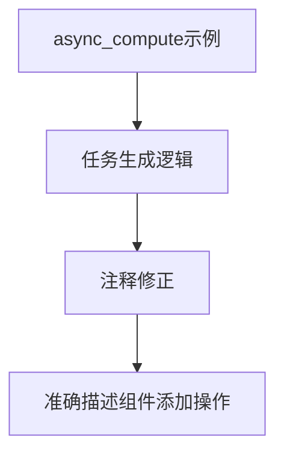

+++
title = "#20550 correct comment in async_compute example"
date = "2025-08-14T00:00:00"
draft = false
template = "pull_request_page.html"
in_search_index = false

[extra]
current_language = "zh-cn"
available_languages = {"en" = { name = "English", url = "/pull_request/bevy/2025-08/pr-20550-en-20250814" }, "zh-cn" = { name = "中文", url = "/pull_request/bevy/2025-08/pr-20550-zh-cn-20250814" }}
+++

# PR 分析报告：correct comment in async_compute example

## Basic Information
- **Title**: correct comment in async_compute example
- **PR Link**: https://github.com/bevyengine/bevy/pull/20550
- **Author**: tomara-x
- **Status**: MERGED
- **Labels**: None
- **Created**: 2025-08-13T09:38:36Z
- **Merged**: 2025-08-13T17:31:03Z
- **Merged By**: mockersf

## Description Translation
```
# 目标

- 让注释更清晰

## 解决方案

- 移除令人困惑的部分
```

## The Story of This Pull Request

### 问题背景
在 Bevy 引擎的 async_compute 示例代码中，存在一处不准确的代码注释。该注释位于异步任务生成逻辑的关键位置，错误地描述了实体创建操作：
```rust
// Spawn new entity and add our new task as a component
```
实际上，此处的代码并未创建新实体，而是向**已有实体**添加新组件。这种描述与实现不符的情况可能误导开发者理解异步计算任务的实现机制。

### 解决方案分析
开发者 tomara-x 识别到注释与实际代码行为存在差异，决定修正注释以准确反映代码行为。解决方案直接明了：移除注释中关于实体创建的描述，仅保留组件添加操作的说明：
```rust
// Add our new task as a component
```
这种修改遵循了最小变更原则，既解决了文档与实现不一致的问题，又避免了引入不必要的改动。

### 技术影响
1. **准确性提升**：修正后的注释精确描述了`commands.entity(entity).insert(ComputeTransform(task))`的操作本质——向现有实体添加组件而非创建新实体
2. **认知负荷降低**：消除描述与实现的分歧后，开发者能更高效理解异步计算任务的组件管理逻辑
3. **示例质量改进**：作为官方示例，保持代码注释的准确性对新手学习异步任务处理模式至关重要

### 工程考量
- **最小变更**：采用单字符修改（移除"Spaw new entity and "）实现最大准确度提升
- **上下文保留**：保留"Add our new task as a component"确保核心操作说明仍存在
- **零风险修正**：纯文档变更不影响实际代码执行，无功能回归风险

## Visual Representation



## Key Files Changed

### `examples/async_tasks/async_compute.rs`
**修改说明**：修正任务生成逻辑中的误导性注释，准确描述组件添加操作

**代码变更**：
```rust
# Before:
// Spawn new entity and add our new task as a component

# After:
// Add our new task as a component
```

**关联性**：此单行修改直接实现PR目标，消除代码文档与实际行为的不一致

## Further Reading
1. Bevy 异步任务文档：[Async Tasks in Bevy](https://bevyengine.org/learn/book/async-tasks/)
2. 实体组件系统模式：[ECS Pattern Explained](https://en.wikipedia.org/wiki/Entity_component_system)
3. 代码文档最佳实践：[Rust Documentation Guidelines](https://doc.rust-lang.org/rustdoc/how-to-write-documentation.html)