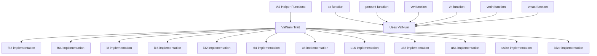

+++
title = "#20551 Add a new trait to accept more types in the `Val`-helper functions"
date = "2025-08-29T00:00:00"
draft = false
template = "pull_request_page.html"
in_search_index = true

[taxonomies]
list_display = ["show"]

[extra]
current_language = "en"
available_languages = {"en" = { name = "English", url = "/pull_request/bevy/2025-08/pr-20551-en-20250829" }, "zh-cn" = { name = "中文", url = "/pull_request/bevy/2025-08/pr-20551-zh-cn-20250829" }}
labels = ["A-UI", "C-Usability", "X-Controversial", "S-Needs-SME"]
+++

# Title
Add a new trait to accept more types in the `Val`-helper functions

## Basic Information
- **Title**: Add a new trait to accept more types in the `Val`-helper functions
- **PR Link**: https://github.com/bevyengine/bevy/pull/20551
- **Author**: TheBlckbird
- **Status**: MERGED
- **Labels**: A-UI, C-Usability, X-Controversial, S-Needs-SME
- **Created**: 2025-08-13T10:13:22Z
- **Merged**: 2025-08-29T20:45:20Z
- **Merged By**: cart

## Description Translation
# Objective

- Allow the `Val`-helper functions to accept more types besides just `f32`

Fixes #20549

## Solution

- Adds a new trait that can be implemented for numbers
- That trait has a method that converts `self` to `f32`

## Testing

- I tested it using Rust's testing framework (although I didn't leave the tests in, as I don't deem them important enough)

<details>
  <summary>Rust test</summary>

```rust
#[cfg(test)]
mod tests {
    use super::*;

    #[test]
    fn test_val_helpers_work() {
        let p = px(10_u8);
        assert_eq!(p, Val::Px(10.0));

        let p = px(10_u16);
        assert_eq!(p, Val::Px(10.0));

        let p = px(10_u32);
        assert_eq!(p, Val::Px(10.0));

        let p = px(10_u64);
        assert_eq!(p, Val::Px(10.0));

        let p = px(10_u128);
        assert_eq!(p, Val::Px(10.0));

        let p = px(10_i8);
        assert_eq!(p, Val::Px(10.0));

        let p = px(10_i16);
        assert_eq!(p, Val::Px(10.0));

        let p = px(10_i32);
        assert_eq!(p, Val::Px(10.0));

        let p = px(10_i64);
        assert_eq!(p, Val::Px(10.0));

        let p = px(10_i128);
        assert_eq!(p, Val::Px(10.0));

        let p = px(10.3_f32);
        assert_eq!(p, Val::Px(10.3));

        let p = px(10.6_f64);
        assert_eq!(p, Val::Px(10.6));
    }
}
```
</details>

---

## Showcase

```rust
// Same as Val::Px(10.)
px(10);
px(10_u8);
px(10.0);
```

## The Story of This Pull Request

This PR addresses a common usability issue in Bevy's UI system where the `Val` helper functions only accepted `f32` values. This limitation forced developers to explicitly specify floating-point values even when working with integer types, creating unnecessary friction in UI code.

The core problem was identified in issue #20549, where users wanted to pass integer types to functions like `px()`, `percent()`, and other unit helpers without manual conversion to `f32`. The existing API required explicit type conversion, making code less readable and more verbose than necessary.

The solution introduces a new `ValNum` trait that defines a conversion method from various numeric types to `f32`. This approach was chosen over simply implementing `Into<Val>` to avoid defining a default unit, which could lead to confusion, especially for newcomers. The trait-based approach provides explicit control over which types can be used with the helper functions.

The implementation uses a macro to efficiently implement the `ValNum` trait for multiple numeric types, including:
- Floating-point types: `f32`, `f64`
- Signed integers: `i8`, `i16`, `i32`, `i64`, `isize`
- Unsigned integers: `u8`, `u16`, `u32`, `u64`, `usize`

Each implementation simply converts the value to `f32` using Rust's `as` operator, which handles the numeric conversion safely for the supported types.

The key changes modify the helper functions from being `const fn` that accept `f32` to generic functions that accept any type implementing `ValNum`:

```rust
// Before:
pub const fn px(value: f32) -> Val {
    Val::Px(value)
}

// After:
pub fn px<T: ValNum>(value: T) -> Val {
    Val::Px(value.val_num_f32())
}
```

This change affects all unit helper functions: `px`, `percent`, `vw`, `vh`, `vmin`, and `vmax`. The `auto` function remains unchanged as it doesn't take any parameters.

The PR includes extensive updates to 99 example files, demonstrating the improved API usage. Instead of writing `Val::Px(12.0)`, examples now use `px(12)`, making the code more concise and readable. These changes show the practical benefits of the new API across various UI scenarios.

From a technical perspective, the conversion from `const fn` to generic functions means they can no longer be compile-time constants. However, this trade-off is acceptable given the significant usability improvement. The conversion operations are trivial and will likely be inlined by the compiler.

The implementation maintains backward compatibility - all existing code using `f32` values continues to work unchanged. The new functionality is purely additive, allowing developers to use integer types where they previously had to use floating-point literals.

This change aligns Bevy's UI API with common expectations in game development and web design, where numeric values for dimensions and positions are often expressed as integers while still needing floating-point precision for calculations.

## Visual Representation



## Key Files Changed

### `crates/bevy_ui/src/geometry.rs` (+36/-12)
This is the core implementation file where the `ValNum` trait and updated helper functions are defined.

**Key changes:**
1. Added the `ValNum` trait and macro implementations:
```rust
pub trait ValNum {
    fn val_num_f32(self) -> f32;
}

macro_rules! impl_to_val_num {
    ($($impl_type:ty),*$(,)?) => {
        $(
            impl ValNum for $impl_type {
                fn val_num_f32(self) -> f32 {
                    self as f32
                }
            }
        )*
    };
}

impl_to_val_num!(f32, f64, i8, i16, i32, i64, u8, u16, u32, u64, usize, isize);
```

2. Updated all helper functions to use the trait:
```rust
// Before:
pub const fn px(value: f32) -> Val {
    Val::Px(value)
}

// After:
pub fn px<T: ValNum>(value: T) -> Val {
    Val::Px(value.val_num_f32())
}
```

### `examples/games/game_menu.rs` (+34/-34)
This file demonstrates the improved API usage in a game menu UI. The changes replace explicit `f32` literals with integer values using the helper functions.

**Example changes:**
```rust
// Before:
width: Val::Px(200.0),
height: Val::Px(65.0),
margin: UiRect::all(Val::Px(20.0)),

// After:
width: px(200),
height: px(65),
margin: UiRect::all(px(20)),
```

### `examples/animation/animation_graph.rs` (+22/-23)
This file shows the updated API in animation-related UI components.

**Example changes:**
```rust
// Before:
bottom: Val::Px(node_rect.bottom),
left: Val::Px(node_rect.left),
height: Val::Px(node_rect.height),
width: Val::Px(node_rect.width),

// After:
bottom: px(node_rect.bottom),
left: px(node_rect.left),
height: px(node_rect.height),
width: px(node_rect.width),
```

### `examples/state/computed_states.rs` (+21/-21)
This file demonstrates the changes in state management UI examples.

**Example changes:**
```rust
// Before:
width: Val::Percent(100.),
height: Val::Percent(100.),

// After:
width: percent(100),
height: percent(100),
```

### `examples/animation/animation_masks.rs` (+20/-20)
This file shows the updated API in animation masking UI.

**Example changes:**
```rust
// Before:
left: Val::Px(12.0),
top: Val::Px(12.0),

// After:
left: px(12),
top: px(12),
```

## Further Reading

- [Rust Traits Documentation](https://doc.rust-lang.org/book/ch10-02-traits.html)
- [Bevy UI System](https://bevyengine.org/learn/books/introduction/3-ui/)
- [Generic Functions in Rust](https://doc.rust-lang.org/book/ch10-01-syntax.html)
- [Type Conversions in Rust](https://doc.rust-lang.org/rust-by-example/types/cast.html)