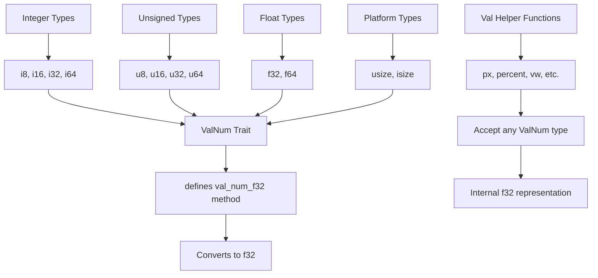

+++
title = "#20551 Add a new trait to accept more types in the `Val`-helper functions"
date = "2025-08-29T00:00:00"
draft = false
template = "pull_request_page.html"
in_search_index = false

[extra]
current_language = "zh-cn"
available_languages = {"en" = { name = "English", url = "/pull_request/bevy/2025-08/pr-20551-en-20250829" }, "zh-cn" = { name = "中文", url = "/pull_request/bevy/2025-08/pr-20551-zh-cn-20250829" }}
labels = ["A-UI", "C-Usability", "X-Controversial", "S-Needs-SME"]
+++

# Add a new trait to accept more types in the `Val`-helper functions

## Basic Information
- **Title**: Add a new trait to accept more types in the `Val`-helper functions
- **PR Link**: https://github.com/bevyengine/bevy/pull/20551
- **Author**: TheBlckbird
- **Status**: MERGED
- **Labels**: A-UI, C-Usability, X-Controversial, S-Needs-SME
- **Created**: 2025-08-13T10:13:22Z
- **Merged**: 2025-08-29T20:45:20Z
- **Merged By**: cart

## Description Translation
# Objective

- 允许 `Val` 辅助函数接受除 `f32` 之外的更多类型

修复 #20549

## Solution

- 添加一个新的 trait，可以为数字类型实现
- 该 trait 有一个方法可以将 `self` 转换为 `f32`

## Testing

- 我使用 Rust 的测试框架进行了测试（虽然我没有保留测试代码，因为我认为它们不够重要）

<details>
  <summary>Rust test</summary>

```rust
#[cfg(test)]
mod tests {
    use super::*;

    #[test]
    fn test_val_helpers_work() {
        let p = px(10_u8);
        assert_eq!(p, Val::Px(10.0));

        let p = px(10_u16);
        assert_eq!(p, Val::Px(10.0));

        let p = px(10_u32);
        assert_eq!(p, Val::Px(10.0));

        let p = px(10_u64);
        assert_eq!(p, Val::Px(10.0));

        let p = px(10_u128);
        assert_eq!(p, Val::Px(10.0));

        let p = px(10_i8);
        assert_eq!(p, Val::Px(10.0));

        let p = px(10_i16);
        assert_eq!(p, Val::Px(10.0));

        let p = px(10_i32);
        assert_eq!(p, Val::Px(10.0));

        let p = px(10_i64);
        assert_eq!(p, Val::Px(10.0));

        let p = px(10_i128);
        assert_eq!(p, Val::Px(10.0));

        let p = px(10.3_f32);
        assert_eq!(p, Val::Px(10.3));

        let p = px(10.6_f64);
        assert_eq!(p, Val::Px(10.6));
    }
}
```
</details>

---

## Showcase

```rust
// Same as Val::Px(10.)
px(10);
px(10_u8);
px(10.0);
```

## The Story of This Pull Request

### 问题背景与约束

在 Bevy 的 UI 系统中，`Val` 枚举用于表示各种尺寸和位置值，如像素、百分比、视口单位等。为了方便创建这些值，Bevy 提供了一系列辅助函数如 `px()`, `percent()`, `vw()` 等。然而，这些函数之前只能接受 `f32` 类型的参数，这给开发者带来了不便。

问题 #20549 明确指出，开发者希望能够使用整数和其他数字类型来调用这些辅助函数，而不是必须先将值转换为 `f32`。例如，开发者希望能够直接写 `px(10)` 而不是 `px(10.0)`，或者 `px(10_u8)` 而不是 `px(10.0)`。

这种限制增加了不必要的代码复杂性和视觉噪音，特别是对于常见的整数尺寸值。从工程角度来看，这是一个用户体验问题，阻碍了代码的简洁性和可读性。

### 解决方案设计

开发者选择了创建一个新的 trait `ValNum` 来解决这个问题，而不是直接为所有数字类型实现 `Into<Val>`。这是一个明智的设计决策，原因如下：

1. **避免默认单位混淆**：如果直接实现 `Into<Val>`，可能需要为每个数字类型选择一个默认的单位（像素、百分比等），这可能会导致 confusion，特别是对新用户。

2. **明确转换语义**：通过自定义 trait，可以明确表达"这是一个可以转换为 UI 数值的类型"的语义，而不是泛化的转换。

3. **控制实现范围**：自定义 trait 允许精确控制哪些类型可以实现这个转换，而不是为所有数字类型自动实现。

`ValNum` trait 的设计非常简单且专注：

```rust
pub trait ValNum {
    fn val_num_f32(self) -> f32;
}
```

这个设计遵循了单一职责原则，只关心如何将各种数字类型转换为 `f32`，这正是 `Val` 枚举内部存储所需的类型。

### 实现细节

实现使用了 Rust 的宏系统来为一系列数字类型批量实现 `ValNum` trait：

```rust
macro_rules! impl_to_val_num {
    ($($impl_type:ty),*$(,)?) => {
        $(
            impl ValNum for $impl_type {
                fn val_num_f32(self) -> f32 {
                    self as f32
                }
            }
        )*
    };
}

impl_to_val_num!(f32, f64, i8, i16, i32, i64, u8, u16, u32, u64, usize, isize);
```

这个实现覆盖了所有主要的标量数字类型，包括有符号和无符号整数、不同大小的浮点数，以及平台相关的 `usize` 和 `isize`。

然后，所有的辅助函数都被修改为泛型函数，接受任何实现了 `ValNum` trait 的类型：

```rust
pub fn px<T: ValNum>(value: T) -> Val {
    Val::Px(value.val_num_f32())
}

pub fn percent<T: ValNum>(value: T) -> Val {
    Val::Percent(value.val_num_f32())
}

// 其他辅助函数也类似修改...
```

这种实现方式保持了向后兼容性，因为 `f32` 仍然实现了 `ValNum` trait，所以现有的 `px(10.0)` 代码仍然有效。

### 代码库影响

这个改动的影响范围很大，涉及 100 个文件的修改，但这主要是正向的改进：

1. **crates/bevy_ui/src/geometry.rs**：核心改动，添加了 `ValNum` trait 和相关的实现
2. **99 个示例文件**：更新了现有的示例代码，使用新的更简洁的语法

示例代码的更改展示了这个改进的实际价值。例如：

```rust
// 之前：
top: Val::Px(12.0),
left: Val::Px(12.0),

// 之后：
top: px(12),
left: px(12),
```

这种变化虽然微小，但显著提高了代码的可读性和编写体验。整数字面量不再需要显式的 `.0` 后缀，代码更加简洁。

### 技术考量

从性能角度来看，这个改动基本上是零成本的。Rust 的泛型和 monomorphization 意味着在编译时会产生特定类型的函数实例，调用开销与直接使用 `f32` 相同。数字类型的 `as f32` 转换是轻量级操作，通常可以在编译时优化。

从 API 设计角度来看，这个解决方案很好地平衡了灵活性和明确性。它提供了更好的开发者体验，同时保持了类型的明确性和安全性。

### 总结

这个 PR 通过引入一个简单的 trait 和相应的泛型实现，显著改善了 Bevy UI 系统的开发者体验。它解决了实际开发中的痛点，让代码更加简洁和直观，同时保持了向后兼容性和性能特性。

这种改进体现了良好的 API 设计原则：通过小型的、专注的抽象来解决具体的用户体验问题，而不是通过复杂或过度设计的解决方案。

## Visual Representation



## Key Files Changed

### `crates/bevy_ui/src/geometry.rs` (+36/-12)
这是核心改动文件，引入了 `ValNum` trait 并修改了所有辅助函数。

**主要变更：**
```rust
// 新增的 trait 和宏实现
pub trait ValNum {
    fn val_num_f32(self) -> f32;
}

macro_rules! impl_to_val_num {
    ($($impl_type:ty),*$(,)?) => {
        $(
            impl ValNum for $impl_type {
                fn val_num_f32(self) -> f32 {
                    self as f32
                }
            }
        )*
    };
}

impl_to_val_num!(f32, f64, i8, i16, i32, i64, u8, u16, u32, u64, usize, isize);

// 修改后的辅助函数
pub fn px<T: ValNum>(value: T) -> Val {
    Val::Px(value.val_num_f32())
}

pub fn percent<T: ValNum>(value: T) -> Val {
    Val::Percent(value.val_num_f32())
}

// 其他辅助函数也类似修改...
```

### 示例文件（99个文件）
这些文件展示了新API的使用方式：

**典型变更示例：**
```rust
// 之前：
Node {
    position_type: PositionType::Absolute,
    top: Val::Px(12.0),
    left: Val::Px(12.0),
    ..default()
}

// 之后：
Node {
    position_type: PositionType::Absolute,
    top: px(12),
    left: px(12),
    ..default()
}
```

这些更改统一了整个代码库中 `Val` 辅助函数的使用方式，展示了新API的简洁性。

## Further Reading

- [Rust Traits: Defining Shared Behavior](https://doc.rust-lang.org/book/ch10-02-traits.html)
- [Rust Generics](https://doc.rust-lang.org/book/ch10-01-syntax.html)
- [Bevy UI System Documentation](https://bevyengine.org/learn/books/introduction/ui/)
- [API Design Guidelines](https://rust-lang.github.io/api-guidelines/)