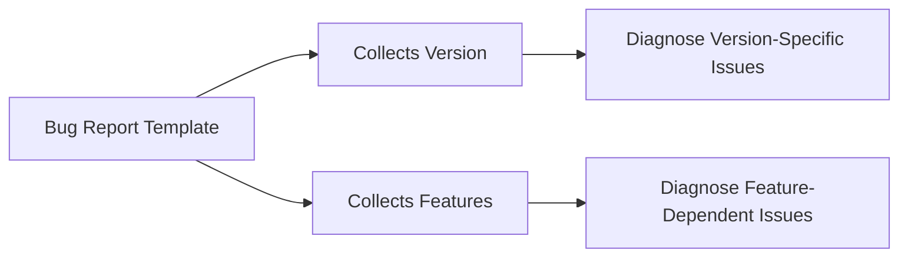

+++
title = "#20560 ask for features in bug report"
date = "2025-08-14T00:00:00"
draft = false
template = "pull_request_page.html"
in_search_index = true

[taxonomies]
list_display = ["show"]

[extra]
current_language = "en"
available_languages = {"en" = { name = "English", url = "/pull_request/bevy/2025-08/pr-20560-en-20250814" }, "zh-cn" = { name = "中文", url = "/pull_request/bevy/2025-08/pr-20560-zh-cn-20250814" }}
labels = ["D-Trivial", "A-Meta", "X-Contentious"]
+++

### Title: ask for features in bug report

### Basic Information
- **Title**: ask for features in bug report
- **PR Link**: https://github.com/bevyengine/bevy/pull/20560
- **Author**: hymm
- **Status**: MERGED
- **Labels**: D-Trivial, A-Meta, S-Ready-For-Final-Review, X-Contentious
- **Created**: 2025-08-13T18:55:43Z
- **Merged**: 2025-08-13T20:18:27Z
- **Merged By**: alice-i-cecile

### Description Translation
# Objective
- Sometimes when I see bug reports, I want to know if it's a specific combination of features that is causing the issue.

### The Story of This Pull Request

This PR addresses a gap in Bevy's bug reporting template. When triaging bug reports, maintainers often need to understand if issues are caused by specific feature combinations, not just the Bevy version. The existing template only asked for version information, which was insufficient for diagnosing feature-dependent bugs.

The solution modifies the bug report template to explicitly request information about cargo features used. This change is implemented through a straightforward edit to the markdown template file. By expanding the version section to include feature flags, reporters are now prompted to provide this critical information upfront.

The implementation required minimal changes: the section header was updated to "Bevy version and features", and the description was modified to explicitly ask for feature combinations when non-default features are used. This maintains backward compatibility while adding valuable context for maintainers.

The impact is improved bug triage efficiency. Maintainers no longer need to manually ask reporters about their feature configurations, reducing back-and-forth in issue threads. This is particularly valuable for Bevy where optional features like `bevy_gltf` or `bevy_pbr` can significantly impact behavior.

### Visual Representation


### Key Files Changed
- `.github/ISSUE_TEMPLATE/bug_report.md` (+3/-2)

```markdown
# File: .github/ISSUE_TEMPLATE/bug_report.md
# Before:
## Bevy version

The release number or commit hash of the version you're using.

# After:
## Bevy version and features

- The release number or commit hash of the version you're using.
- If you're not using default features, the combination of bevy's cargo features you are using.
```

Changes:
1. Section header expanded from "Bevy version" to "Bevy version and features"
2. Content restructured into bullet points
3. Explicit request added for feature combinations when non-default features are used

### Further Reading
- [GitHub Issue Templates Documentation](https://docs.github.com/en/communities/using-templates-to-encourage-useful-issues-and-pull-requests/configuring-issue-templates-for-your-repository)
- [Bevy's Feature Flags Documentation](https://github.com/bevyengine/bevy/blob/main/docs/plugins_guidelines.md#optional-features)
- [Cargo Features Reference](https://doc.rust-lang.org/cargo/reference/features.html)