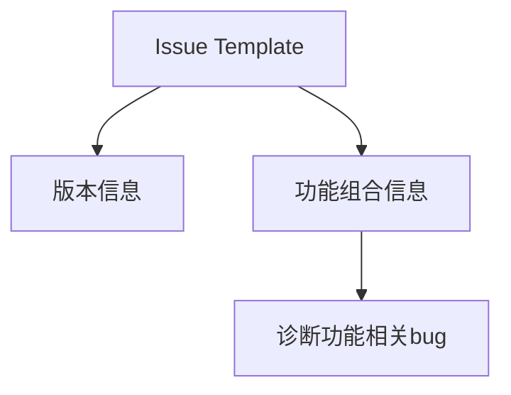

+++
title = "#20560 ask for features in bug report"
date = "2025-08-14T00:00:00"
draft = false
template = "pull_request_page.html"
in_search_index = false

[extra]
current_language = "zh-cn"
available_languages = {"en" = { name = "English", url = "/pull_request/bevy/2025-08/pr-20560-en-20250814" }, "zh-cn" = { name = "中文", url = "/pull_request/bevy/2025-08/pr-20560-zh-cn-20250814" }}
+++

## Basic Information
- **标题**: ask for features in bug report
- **PR链接**: https://github.com/bevyengine/bevy/pull/20560
- **作者**: hymm
- **状态**: 已合并
- **标签**: D-Trivial, A-Meta, S-Ready-For-Final-Review, X-Contentious
- **创建时间**: 2025-08-13T18:55:43Z
- **合并时间**: 2025-08-13T20:18:27Z
- **合并者**: alice-i-cecile

## 描述翻译
### Objective
- 有时查看bug报告时，我需要知道是否是特定功能组合导致了问题

## PR技术分析

### 问题背景
在开源项目协作中，有效的bug报告对问题诊断至关重要。Bevy引擎现有的bug报告模板(`bug_report.md`)仅要求用户提供版本信息，未收集功能启用情况。当用户使用非默认功能组合时，维护者无法快速判断bug是否与特定功能相关，增加了问题复现和定位的难度。

### 解决方案
PR通过修改GitHub issue模板，在bug报告表单中新增功能组合字段。具体修改将原"Bevy version"部分扩展为"Bevy version and features"，新增两点要求：
1. 保留原有版本号/commit hash要求
2. 新增非默认功能组合说明要求

### 实现细节
修改集中在`.github/ISSUE_TEMPLATE/bug_report.md`文件：
1. 标题从"Bevy version"改为"Bevy version and features"
2. 原单行描述拆分为带项目符号的两项说明
3. 新增明确的功能组合报告要求

### 技术影响
1. **诊断效率提升**：维护者可快速识别功能相关bug，减少追问环节
2. **问题分类优化**：可根据功能标签自动分类issue
3. **用户引导改进**：明确表单字段降低信息缺失率
4. **向后兼容**：不影响现有issue工作流，仅扩展信息收集

### 工程考量
- 最小化变更：仅修改模板文件，不涉及代码逻辑
- 明确性：使用"combination of bevy's cargo features"术语确保技术准确性
- 可选字段保留：原"[Optional] Relevant system information"保持不变

## 关键文件变更

### `.github/ISSUE_TEMPLATE/bug_report.md`
**变更原因**：收集功能组合信息以加速bug诊断  
**修改前后对比**：
```markdown
# 修改前
## Bevy version

The release number or commit hash of the version you're using.

# 修改后
## Bevy version and features

- The release number or commit hash of the version you're using.
- If you're not using default features, the combination of bevy's cargo features you are using.
```

## 关联关系图


## 延伸阅读
- [Cargo Features文档](https://doc.rust-lang.org/cargo/reference/features.html)
- [GitHub Issue模板指南](https://docs.github.com/en/communities/using-templates-to-encourage-useful-issues-and-pull-requests/configuring-issue-templates-for-your-repository)
- [Bevy功能标志实践](https://bevyengine.org/learn/book/getting-started/features/)