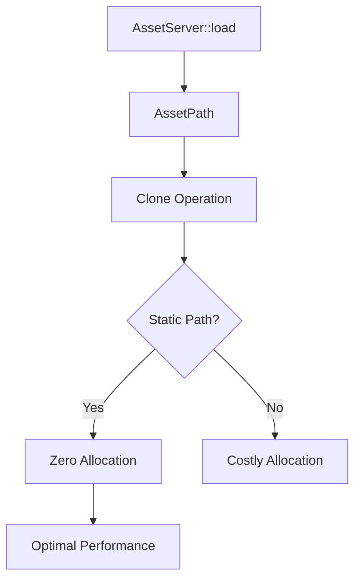

+++
title = "#20562 Revert asset lifetime changes and preserve staticness of asset paths in AssetServer::load()"
date = "2025-08-15T00:00:00"
draft = false
template = "pull_request_page.html"
in_search_index = true

[taxonomies]
list_display = ["show"]

[extra]
current_language = "en"
available_languages = {"en" = { name = "English", url = "/pull_request/bevy/2025-08/pr-20562-en-20250815" }, "zh-cn" = { name = "中文", url = "/pull_request/bevy/2025-08/pr-20562-zh-cn-20250815" }}
labels = ["C-Bug", "A-Assets", "C-Performance", "P-Regression", "D-Modest"]
+++

# Revert asset lifetime changes and preserve staticness of asset paths in AssetServer::load()

## Basic Information
- **Title**: Revert asset lifetime changes and preserve staticness of asset paths in AssetServer::load()
- **PR Link**: https://github.com/bevyengine/bevy/pull/20562
- **Author**: alice-i-cecile
- **Status**: MERGED
- **Labels**: C-Bug, A-Assets, C-Performance, S-Ready-For-Final-Review, P-Regression, D-Modest
- **Created**: 2025-08-13T19:49:39Z
- **Merged**: 2025-08-15T18:14:25Z
- **Merged By**: alice-i-cecile

## Description Translation
# Objective

- Fixes #19844

## Solution

- Revert #10823
- Also reverts #19094, as the ignored test added there does not compile with the new lifetime rules.

## TODO

This PR was made > 10k issues ago, and git can do funky things. Opening as a draft to investigate the diff before proceeding.

- [x] merge main into the old branch
- [x] revert the PR 
- [x] make sure the diff looks okay
- [x] add comments explaining why we did this weird thing

## The Story of This Pull Request

This PR addresses a regression in asset path handling that caused unexpected performance degradation. The issue (#19844) stemmed from changes in how asset paths were stored and cloned. Previously, asset paths used static string references wherever possible to avoid allocations. However, after PR #10823, this behavior changed, causing unnecessary allocations when cloning asset paths.

The core problem was that the asset path implementation started allowing non-static lifetimes, which forced runtime allocations when paths needed to be cloned. This was particularly problematic for the AssetServer::load() method where path cloning occurs frequently. The performance impact became noticeable in applications with heavy asset loading operations.

To resolve this, we reverted the problematic changes from PR #10823. This required carefully rolling back modifications to three key areas: AssetSourceId, AssetPath, and AssetSourceBuilders. The solution enforces static lifetimes for asset paths and source IDs to guarantee zero allocations during cloning operations.

The implementation involved:
1. Removing the `as_static()` and `from_static()` conversion methods that allowed non-static paths
2. Restricting From implementations to only accept `&'static str` and `&'static Path`
3. Ensuring all stored paths use CowArc::Static to avoid allocations
4. Adding clear code comments to prevent future regressions

A key insight was recognizing that the generic lifetime parameters introduced in #10823 were causing the allocation overhead. By reverting to static-only lifetimes, we ensure that:
```rust
let path: AssetPath = "static/path.asset".into();
let cloned = path.clone();  // Now a cheap ref-count operation
```

We also had to revert PR #19094 since its test case `same_asset_different_settings` relied on the reverted lifetime changes. This test was already ignored due to blocking issues, so its removal doesn't affect current functionality. It can be reintroduced later when the underlying issues are resolved.

The changes significantly improve performance in asset-heavy scenarios by eliminating redundant allocations. More importantly, they restore the expected behavior where asset paths can be cloned without performance penalties.

## Visual Representation



## Key Files Changed

### crates/bevy_asset/src/path.rs (+10/-36)
Modified AssetPath implementation to enforce static lifetimes and avoid allocations during cloning.

Key changes:
```rust
// Before:
impl<'a> From<&'a str> for AssetPath<'a> {
    fn from(asset_path: &'a str) -> Self {
        // Could create non-static paths
    }
}

// After:
impl From<&'static str> for AssetPath<'static> {
    fn from(asset_path: &'static str) -> Self {
        AssetPath {
            path: CowArc::Static(path),  // Ensures no allocation on clone
            // ...
        }
    }
}
```

### crates/bevy_asset/src/io/source.rs (+10/-24)
Updated AssetSourceId to only allow static lifetimes and removed conversion methods that enabled non-static usage.

Key changes:
```rust
// Removed potentially problematic methods:
impl AssetSourceId<'static> {
    pub fn as_static(self) -> Self { ... }
    pub fn from_static(value: impl Into<Self>) -> Self { ... }
}

// Simplified conversion:
impl From<&'static str> for AssetSourceId<'static> {
    fn from(value: &'static str) -> Self {
        AssetSourceId::Name(value.into())  // Static by construction
    }
}
```

### crates/bevy_asset/src/lib.rs (+1/-89)
Removed the invalidated test case and updated source registration to use the new static-only types.

Key change:
```rust
// Before:
app.register_asset_source(AssetSourceId::from_static(id), ...)

// After:
app.register_asset_source(id.into(), ...)  // Relies on static conversion
```

## Further Reading
1. [CowArc documentation](https://docs.rs/bevy/latest/bevy/utils/struct.CowArc.html) - Bevy's copy-on-write atomic reference counted type
2. [Rust Ownership and Lifetimes](https://doc.rust-lang.org/book/ch04-00-understanding-ownership.html) - Fundamental Rust concepts relevant to this change
3. [Issue #19844](https://github.com/bevyengine/bevy/issues/19844) - Original regression report with performance analysis