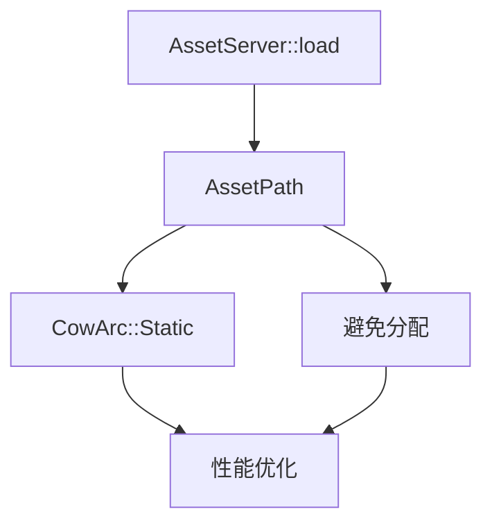

+++
title = "#20562 Revert asset lifetime changes and preserve staticness of asset paths in AssetServer::load()"
date = "2025-08-15T00:00:00"
draft = false
template = "pull_request_page.html"
in_search_index = false

[extra]
current_language = "zh-cn"
available_languages = {"en" = { name = "English", url = "/pull_request/bevy/2025-08/pr-20562-en-20250815" }, "zh-cn" = { name = "中文", url = "/pull_request/bevy/2025-08/pr-20562-zh-cn-20250815" }}
+++

# Revert asset lifetime changes and preserve staticness of asset paths in AssetServer::load()

## 基本资料
- **标题**: Revert asset lifetime changes and preserve staticness of asset paths in AssetServer::load()
- **PR链接**: https://github.com/bevyengine/bevy/pull/20562
- **作者**: alice-i-cecile
- **状态**: 已合并
- **标签**: C-Bug, A-Assets, C-Performance, S-Ready-For-Final-Review, P-Regression, D-Modest
- **创建时间**: 2025-08-13T19:49:39Z
- **合并时间**: 2025-08-15T18:14:25Z
- **合并人**: alice-i-cecile

## 描述翻译
### 目标
- 修复 #19844

### 解决方案
- 撤销 #10823
- 同时撤销 #19094，因为在该PR中添加的被忽略的测试在新的生命周期规则下无法编译。

### TODO
此PR是在超过10000个issue之前创建的，git可能会做一些奇怪的事情。作为草案打开，以便在继续之前检查差异。
- [x] 将main分支合并到旧分支
- [x] 撤销该PR
- [x] 确保差异看起来没问题
- [x] 添加注释解释为什么我们做了这个奇怪的事情

## 这个PR的故事

### 问题与背景
在Bevy的资产系统中，AssetPath和AssetSourceId负责标识和加载资产资源。先前的PR #10823引入了生命周期参数（lifetime parameter），允许这些结构处理非静态（non-static）路径。虽然这增加了灵活性，但意外破坏了静态路径（static paths）的关键优化路径。

具体问题在issue #19844中被发现：当使用静态字符串（如"texture.png"）调用AssetServer::load()时，系统会执行不必要的内存分配（allocation）。这是因为实现强制将&'static str转换为堆分配的CowArc::Borrowed，而非直接使用静态引用。在频繁加载资产的场景中，这种额外分配会显著影响性能。

### 解决方案
经过分析，决定撤销原PR #10823及其相关改动，因为：
1. 静态路径优化对性能至关重要
2. 非静态路径的使用场景有限
3. 完整解决方案需要更复杂的架构调整

实现方案包括：
1. 完全撤销PR #10823的代码变更
2. 移除依赖新生命周期的测试用例
3. 添加代码注释防止未来误改
4. 恢复AssetPath和AssetSourceId对静态路径的特殊处理

### 关键代码变更
主要修改集中在三个文件：

**1. crates/bevy_asset/src/path.rs**
恢复了AssetPath对静态路径的特殊处理，避免克隆分配：
```rust
// 修改前:
impl<'a> From<&'a str> for AssetPath<'a> {
    fn from(asset_path: &'a str) -> Self {
        let (source, path, label) = Self::parse_internal(asset_path).unwrap();
        AssetPath {
            source: source.into(),
            path: CowArc::Borrowed(path),
            label: label.map(CowArc::Borrowed),
        }
    }
}

// 修改后:
impl From<&'static str> for AssetPath<'static> {
    fn from(asset_path: &'static str) -> Self {
        let (source, path, label) = Self::parse_internal(asset_path).unwrap();
        AssetPath {
            source: source.into(),
            path: CowArc::Static(path),
            label: label.map(CowArc::Static),
        }
    }
}
```
关键变化：
- 仅实现&'static str转换
- 直接使用CowArc::Static避免分配
- 添加注释强调优化原因

**2. crates/bevy_asset/src/io/source.rs**
类似修改应用于AssetSourceId：
```rust
// 修改前:
impl<'a> From<&'a str> for AssetSourceId<'a> {
    fn from(value: &'a str) -> Self {
        AssetSourceId::Name(CowArc::Borrowed(value))
    }
}

// 修改后:
impl From<&'static str> for AssetSourceId<'static> {
    fn from(value: &'static str) -> Self {
        AssetSourceId::Name(value.into())
    }
}
```
同时移除不再需要的as_static()和from_static()方法。

**3. crates/bevy_asset/src/lib.rs**
移除依赖旧实现的测试用例：
```rust
// 被移除的测试:
#[test]
#[ignore = "blocked on https://github.com/bevyengine/bevy/issues/11111"]
fn same_asset_different_settings() {
    // ... 测试实现 ...
}
```
该测试依赖于被撤销的生命周期机制，在新实现中无法编译。

### 技术权衡
主要工程决策：
1. **性能优先**：选择保留静态路径优化，牺牲非静态路径的灵活性
2. **最小化变更**：通过撤销而非重构快速解决问题
3. **防御性注释**：添加代码注释防止优化被意外破坏



### 影响
1. 修复了静态路径加载时的多余分配
2. 恢复AssetPath.clone()的零成本特性
3. 移除了不兼容的测试用例
4. 通过代码注释记录优化约束

## 关键文件变更
1. **crates/bevy_asset/src/path.rs** (+10/-36)
   - 恢复静态路径优化
   - 限制转换仅适用于&'static str
   - 添加防御性代码注释

2. **crates/bevy_asset/src/io/source.rs** (+10/-24)
   - 类似AssetPath的静态优化
   - 简化转换实现
   - 移除多余方法

3. **crates/bevy_asset/src/lib.rs** (+1/-89)
   - 移除无效测试用例
   - 更新方法调用适配新类型

## 延伸阅读
1. [CowArc工作原理](https://docs.rs/bevy/latest/bevy/utils/struct.CowArc.html)
2. [Rust生命周期指南](https://doc.rust-lang.org/book/ch10-03-lifetime-syntax.html)
3. [零成本抽象原则](https://blog.rust-lang.org/2015/05/11/traits.html)