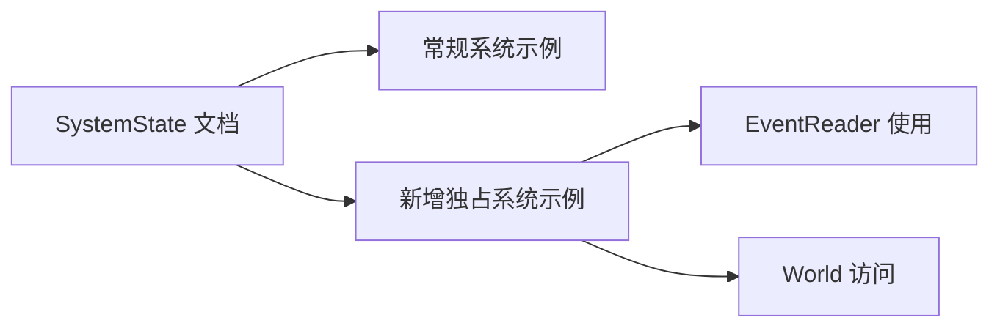

+++
title = "#20564 add example of using system state with an exclusive system"
date = "2025-08-14T00:00:00"
draft = false
template = "pull_request_page.html"
in_search_index = false

[extra]
current_language = "zh-cn"
available_languages = {"en" = { name = "English", url = "/pull_request/bevy/2025-08/pr-20564-en-20250814" }, "zh-cn" = { name = "中文", url = "/pull_request/bevy/2025-08/pr-20564-zh-cn-20250814" }}
labels = ["C-Docs", "A-ECS", "C-Examples", "D-Straightforward"]
+++

### PR 分析报告：add example of using system state with an exclusive system

## Basic Information
- **Title**: add example of using system state with an exclusive system
- **PR Link**: https://github.com/bevyengine/bevy/pull/20564
- **Author**: hymm
- **Status**: MERGED
- **Labels**: C-Docs, A-ECS, C-Examples, S-Ready-For-Final-Review, D-Straightforward
- **Created**: 2025-08-13T20:50:37Z
- **Merged**: 2025-08-14T02:26:43Z
- **Merged By**: james7132

## Description Translation
### 目标
- 提高 SystemState 作为 ExclusiveSystemParam 使用的可发现性

### 解决方案
- 在 SystemState 文档中添加与 exclusive system 配合使用的示例


## The Story of This Pull Request

### 问题与背景
在 Bevy 的 ECS 架构中，`SystemState` 是一种用于手动管理系统参数状态的重要机制。它允许开发者在常规系统(system)中缓存参数状态，但现有文档缺少在独占系统(exclusive system)中使用 `SystemState` 的明确示例。这导致开发者难以发现这种用法模式，特别是当需要直接操作 `World` 的独占访问时。

独占系统(exclusive system)是 Bevy 中需要直接访问 `&mut World` 的特殊系统类型，常用于需要完全控制 ECS 世界的场景。而 `SystemState` 作为系统参数容器，其文档只展示了在常规系统中的用法，没有说明如何在独占系统中正确初始化和管理其生命周期。

### 解决方案
该 PR 采用了最直接有效的解决方案：在 `SystemState` 的现有文档中添加代码示例。具体做法是在文档注释中插入新的示例代码块，展示：
1. 如何在独占系统函数签名中声明 `SystemState` 参数
2. 如何通过 `system_state.get_mut(world)` 获取实际参数
3. 如何在事件处理循环中使用获取的参数

这种方法无需修改任何功能代码，仅通过文档改进就能解决可发现性问题。选择在现有文档位置添加示例能确保开发者浏览 `SystemState` 时立即看到两种用法模式。

### 实现细节
核心实现是在 `SystemState` 结构体的文档注释中添加新的代码示例。该示例特意设计为自包含(self-contained)：
1. 包含必要的导入语句
2. 定义示例所需的虚拟事件类型
3. 展示完整的函数签名和实现
4. 保持与现有示例一致的 Rustdoc 格式

关键实现点：
- 使用 `#` 前缀隐藏示例中的辅助代码，使文档输出更整洁
- 明确展示 `SystemState<EventReader<MyEvent>>` 类型参数的使用
- 演示 `get_mut()` 方法在 `&mut World` 上下文中的正确调用方式

### 技术洞察
1. **生命周期管理**：示例展示了如何在独占系统中正确管理 `SystemState` 的生命周期，避免跨系统调用时的状态污染
2. **参数初始化**：澄清了 `SystemState` 不需要在系统外手动初始化，Bevy 会自动处理
3. **类型安全**：通过泛型参数 `EventReader<MyEvent>` 保持事件系统的类型安全
4. **模式复用**：该示例为其他需要缓存状态的独占系统提供了可复用的模式

### 影响与改进
1. **开发者体验**：显著降低学习曲线，开发者无需查阅外部资源即可了解该模式
2. **API 可发现性**：完善了 Bevy ECS 核心 API 的文档覆盖范围
3. **代码质量**：提供官方推荐模式，减少用户实现错误
4. **维护成本**：零运行时开销的纯文档变更，不影响现有功能

## Visual Representation



## Key Files Changed

### `crates/bevy_ecs/src/system/function_system.rs`
**变更描述**：在 SystemState 结构体的文档注释中添加独占系统使用示例  
**目的**：提高 API 可发现性，展示 SystemState 在独占系统中的正确用法  

**变更前**：
```rust
///     }
/// });
/// ```
pub struct SystemState<Param: SystemParam + 'static> {
    meta: SystemMeta,
    param_state: Param::State,
```

**变更后**：
```rust
///     }
/// });
/// ```
/// Exclusive System:
/// ```
/// # use bevy_ecs::prelude::*;
/// # use bevy_ecs::system::SystemState;
/// #
/// # #[derive(BufferedEvent)]
/// # struct MyEvent;
/// #
/// fn exclusive_system(world: &mut World, system_state: &mut SystemState<EventReader<MyEvent>>) {
///     let mut event_reader = system_state.get_mut(world);
///
///     for events in event_reader.read() {
///         println!("Hello World!");
///     }
/// }
/// ```
pub struct SystemState<Param: SystemParam + 'static> {
    meta: SystemMeta,
    param_state: Param::State,
```

## Further Reading
1. [Bevy 官方文档：Exclusive Systems](https://docs.rs/bevy/latest/bevy/ecs/system/trait.IntoSystem.html#exclusive-systems)
2. [SystemState API 文档](https://docs.rs/bevy/latest/bevy/ecs/system/struct.SystemState.html)
3. [Rustdoc 文档示例指南](https://doc.rust-lang.org/rustdoc/write-documentation/documentation-tests.html)
4. [Bevy 事件系统详解](https://bevy-cheatbook.github.io/programming/events.html)