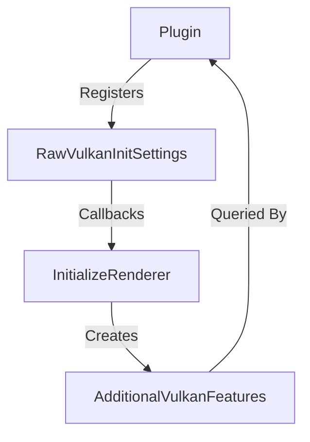

+++
title = "#20565 Opt-in raw vulkan initialization with hooks"
date = "2025-08-15T00:00:00"
draft = false
template = "pull_request_page.html"
in_search_index = true

[taxonomies]
list_display = ["show"]

[extra]
current_language = "en"
available_languages = {"en" = { name = "English", url = "/pull_request/bevy/2025-08/pr-20565-en-20250815" }, "zh-cn" = { name = "中文", url = "/pull_request/bevy/2025-08/pr-20565-zh-cn-20250815" }}
labels = ["C-Feature", "A-Rendering"]
+++

## Opt-in raw vulkan initialization with hooks

## Basic Information
- **Title**: Opt-in raw vulkan initialization with hooks
- **PR Link**: https://github.com/bevyengine/bevy/pull/20565
- **Author**: cart
- **Status**: MERGED
- **Labels**: C-Feature, A-Rendering, S-Ready-For-Final-Review
- **Created**: 2025-08-13T23:48:14Z
- **Merged**: 2025-08-15T03:17:22Z
- **Merged By**: alice-i-cecile

## Description Translation
# Objective

Currently registering additional required Vulkan features requires either hard-coding them into `bevy_render` (see the current [DLSS proposal](https://github.com/bevyengine/bevy/pull/19864)), or forcing the plugin to take full manual control over wgpu initialization. Neither is an acceptable or scalable option for a modular engine like Bevy. 

## Solution

* Add a new `raw_vulkan_init` Cargo feature, that when enabled switches to wgpu's raw Vulkan init path, which accepts callbacks that allow checking and requiring additional Vulkan features.
* Add a new `WgpuRawVulkanInitSettings` resource,  which provides wgpu Vulkan Instance and Device init callbacks, which can be used to detect and register vulkan features.
* These callbacks can register arbitrary features in the new `AdditionalVulkanFeatures` resource, which is inserted into the RenderApp at the same time that the RenderDevice is.

This enables plugins to register initialization callbacks, which must happen _before_ RenderPlugin. They can then feed off of `AdditionalVulkanFeatures`, after the renderer is initialized, to detect if a given feature is supported.

Due to the current lifecycles, this is best accomplished with either:
* A separate "init plugin" that is registered before RenderPlugin, and a "logic plugin" that does everything else. This should be used if the plugin logic needs `Plugin::build()` access to render device state, which needs to be registered _after_ RenderPlugin to have access. The proposed DLSS feature needs this pattern.
* A single "init plugin" that is registered before RenderPlugin and does everything. Use this pattern if you can as it is simpler.

With deferred plugin init, we could remove the need for this split.

## The Story of This Pull Request

### The Problem and Context
Bevy's rendering system uses wgpu for cross-platform graphics, but there was no clean way for plugins to extend Vulkan-specific initialization. Previously, adding Vulkan features like those required for DLSS required either hardcoding them into `bevy_render` (making engine modifications) or having plugins take complete control over wgpu initialization (breaking modularity). Both approaches were unsustainable for a plugin-based architecture.

The core limitation was that wgpu's standard initialization path didn't expose hooks for modifying Vulkan instance or device creation. Plugins needing Vulkan extensions had no way to safely inject their requirements during Bevy's standard renderer setup.

### The Solution Approach
The solution introduces an opt-in mechanism to use wgpu's raw Vulkan initialization path with custom hooks. Key decisions:

1. **Feature-flagged Implementation**: Added a `raw_vulkan_init` cargo feature that switches to wgpu's Vulkan HAL backend
2. **Callback Resource**: Created `RawVulkanInitSettings` to collect instance/device creation callbacks
3. **Feature Registry**: Added `AdditionalVulkanFeatures` resource to track custom feature support
4. **Lifecycle Handling**: Ensured callbacks execute before renderer initialization but their results are available after

The implementation uses wgpu's `wgpu::hal::vulkan` module which provides lower-level control over Vulkan initialization. Callbacks are passed through to wgpu's unsafe initialization functions with proper safety documentation.

### The Implementation
The core changes refactor renderer initialization to conditionally use raw Vulkan paths when the feature is enabled. The new `raw_vulkan_init.rs` module contains:

1. **Callback Structures**:
```rust
#[derive(Resource, Default, Clone)]
pub struct RawVulkanInitSettings {
    create_instance_callbacks: Vec<...>,
    create_device_callbacks: Vec<...>,
}
```
These hold callback functions that will modify Vulkan creation parameters.

2. **Unsafe Callback Registration**:
```rust
impl RawVulkanInitSettings {
    pub unsafe fn add_create_instance_callback(...) { ... }
    pub unsafe fn add_create_device_callback(...) { ... }
}
```
Callbacks are unsafe because they must not remove features or exceed hardware capabilities.

3. **Feature Tracking**:
```rust
#[derive(Resource, Default, Clone)]
pub struct AdditionalVulkanFeatures(HashSet<TypeId>);

impl AdditionalVulkanFeatures {
    pub fn register<T: Any>(&mut self) { ... }
    pub fn has<T: Any>(&self) -> bool { ... }
}
```
This allows plugins to register and check for custom features using Rust's type system.

The renderer initialization in `mod.rs` was refactored to:
```rust
#[cfg(feature = "raw_vulkan_init")]
let instance = raw_vulkan_init::create_raw_vulkan_instance(
    &instance_descriptor,
    &raw_vulkan_init_settings,
    &mut additional_vulkan_features,
);

#[cfg(feature = "raw_vulkan_init")]
let (device, queue) = raw_vulkan_init::create_raw_device(...).await?;
```
These functions invoke the registered callbacks during Vulkan object creation.

The `RenderPlugin` in `lib.rs` was updated to:
1. Conditionally include `RawVulkanInitSettings`
2. Pass settings to `initialize_renderer`
3. Insert `AdditionalVulkanFeatures` into the render app:
```rust
#[cfg(feature = "raw_vulkan_init")]
{
    let additional_vulkan_features = render_resources.5;
    render_app.insert_resource(additional_vulkan_features);
}
```

### Technical Insights
1. **Type-based Feature Tracking**: Using `TypeId` in `AdditionalVulkanFeatures` provides a lightweight way to represent arbitrary features without predefined enums
2. **Unsafe Boundaries**: Callbacks are marked unsafe with clear documentation about invariants:
   - Must not remove features
   - Must not exceed hardware capabilities
3. **Conditional Compilation**: The `#[cfg(feature = "raw_vulkan_init")]` attributes ensure no overhead when the feature is disabled
4. **Lifecycle Management**: The split between initialization (before renderer) and feature querying (after renderer) respects Bevy's plugin ordering constraints

A limitation is that plugins must be split into initialization and logic parts due to current lifecycle constraints. The PR mentions this could be resolved with deferred plugin initialization in the future.

### The Impact
This change enables several important capabilities:
1. DLSS support can be implemented as a plugin
2. Other Vulkan extensions (e.g., ray tracing) can be cleanly added
3. Advanced rendering techniques requiring Vulkan extensions become possible
4. Maintains Bevy's modular architecture without core engine modifications

The changes are backward-compatible and opt-in, preserving the default wgpu initialization path. The implementation adds approximately 300 lines of focused, testable code with comprehensive safety documentation.

## Visual Representation



## Key Files Changed

1. `crates/bevy_render/src/renderer/mod.rs` (+125/-43)
   - Refactored renderer initialization to support raw Vulkan path
   - Added conditional calls to raw Vulkan initialization functions

Key changes:
```rust
pub async fn initialize_renderer(
    backends: Backends,
    primary_window: Option<RawHandleWrapperHolder>,
    options: &WgpuSettings,
    #[cfg(feature = "raw_vulkan_init")]
    raw_vulkan_init_settings: raw_vulkan_init::RawVulkanInitSettings,
) -> RenderResources {
    // ...
    #[cfg(feature = "raw_vulkan_init")]
    let instance = raw_vulkan_init::create_raw_vulkan_instance(...);
    // ...
}
```

2. `crates/bevy_render/src/renderer/raw_vulkan_init.rs` (+146/-0)
   - New module implementing raw Vulkan initialization hooks

Key structures:
```rust
pub struct RawVulkanInitSettings { /* callbacks */ }
pub struct AdditionalVulkanFeatures(HashSet<TypeId>);

pub(crate) fn create_raw_vulkan_instance(...) -> Instance { ... }
pub(crate) async fn create_raw_device(...) -> Result<(Device, Queue), ...> { ... }
```

3. `crates/bevy_render/src/lib.rs` (+30/-70)
   - Updated RenderPlugin to handle new initialization flow

Key changes:
```rust
#[cfg(feature = "raw_vulkan_init")]
let raw_vulkan_init_settings = app.world_mut()
    .get_resource::<renderer::raw_vulkan_init::RawVulkanInitSettings>()
    .cloned()
    .unwrap_or_default();

let render_resources = renderer::initialize_renderer(...).await;

#[cfg(feature = "raw_vulkan_init")]
{
    let additional_vulkan_features = render_resources.5;
    render_app.insert_resource(additional_vulkan_features);
}
```

4. `crates/bevy_render/src/settings.rs` (+14/-1)
   - Extended RenderResources to include AdditionalVulkanFeatures

Change:
```rust
pub struct RenderResources(
    pub RenderDevice,
    pub RenderQueue,
    pub RenderAdapterInfo,
    pub RenderAdapter,
    pub RenderInstance,
    #[cfg(feature = "raw_vulkan_init")]
    pub crate::renderer::raw_vulkan_init::AdditionalVulkanFeatures,
);
```

5. `Cargo.toml` (+3/-0)
   - Added new feature flag

## Further Reading
1. [wgpu Vulkan HAL documentation](https://docs.rs/wgpu/latest/wgpu/hal/vulkan/index.html)
2. [Vulkan Instance Creation](https://www.khronos.org/registry/vulkan/specs/1.3-extensions/man/html/VkInstanceCreateInfo.html)
3. [Bevy Plugin System](https://bevyengine.org/learn/book/getting-started/plugins/)
4. [TypeId documentation](https://doc.rust-lang.org/std/any/struct.TypeId.html)