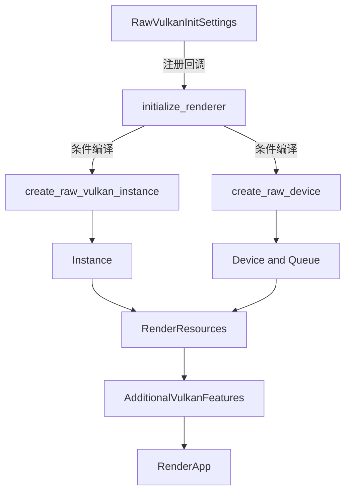

+++
title = "#20565 Opt-in raw vulkan initialization with hooks"
date = "2025-08-15T00:00:00"
draft = false
template = "pull_request_page.html"
in_search_index = false

[extra]
current_language = "zh-cn"
available_languages = {"en" = { name = "English", url = "/pull_request/bevy/2025-08/pr-20565-en-20250815" }, "zh-cn" = { name = "中文", url = "/pull_request/bevy/2025-08/pr-20565-zh-cn-20250815" }}
+++

# Opt-in raw vulkan initialization with hooks

## 基本信息
- **标题**: Opt-in raw vulkan initialization with hooks
- **PR链接**: https://github.com/bevyengine/bevy/pull/20565
- **作者**: cart
- **状态**: 已合并
- **标签**: C-Feature, A-Rendering, S-Ready-For-Final-Review
- **创建时间**: 2025-08-13T23:48:14Z
- **合并时间**: 2025-08-15T03:17:22Z
- **合并人**: alice-i-cecile

## 描述翻译
### 目标

当前注册额外的Vulkan功能需要将其硬编码到`bevy_render`中（参见当前的[DLSS提案](https://github.com/bevyengine/bevy/pull/19864)），或强制插件完全手动控制wgpu初始化。对于像Bevy这样的模块化引擎，这两种方式都不可接受且不可扩展。

### 解决方案

* 添加新的`raw_vulkan_init` Cargo特性，启用后切换到wgpu的原始Vulkan初始化路径，该路径接受允许检查和要求额外Vulkan功能的回调。
* 添加新的`WgpuRawVulkanInitSettings`资源，提供wgpu Vulkan实例和设备初始化的回调，可用于检测和注册vulkan功能。
* 这些回调可以在新的`AdditionalVulkanFeatures`资源中注册任意功能，该资源在创建RenderDevice时插入到RenderApp中。

这使得插件可以注册初始化回调，这些回调必须在RenderPlugin之前发生。然后在渲染器初始化后，它们可以从`AdditionalVulkanFeatures`中读取以检测特定功能是否受支持。

根据当前的生命周期，最好通过以下方式实现：
* 单独的"init plugin"在RenderPlugin之前注册，和"logic plugin"处理其他所有事情。如果插件逻辑需要`Plugin::build()`访问渲染设备状态（需要在RenderPlugin之后注册），应使用此模式。提议的DLSS功能需要此模式。
* 单个"init plugin"在RenderPlugin之前注册并处理所有事情。如果可能，请使用此模式，因为它更简单。

通过延迟插件初始化，我们可以消除对此拆分的需求。

## PR分析

### 问题背景
在Bevy渲染系统中，插件需要注册额外的Vulkan功能时面临架构限制。现有方案只有两种选择：
1. 硬编码功能到`bevy_render`核心模块
2. 插件完全接管wgpu初始化流程

这两种方案都不符合Bevy的模块化设计原则。硬编码方案缺乏灵活性且难以维护；完全接管方案破坏抽象层且实现复杂。这个问题在实现DLSS等高级功能时尤为明显，因为这些功能需要特定的Vulkan扩展支持。

### 解决方案设计
PR引入了可选(raw vulkan)初始化路径，通过三个核心组件解决：
1. **特性开关**：新增`raw_vulkan_init` Cargo特性
2. **回调资源**：`WgpuRawVulkanInitSettings`存储Vulkan初始化回调
3. **特性注册表**：`AdditionalVulkanFeatures`跟踪注册的Vulkan特性

技术方案的核心是允许插件通过回调干预Vulkan实例和设备的创建过程，同时保持与默认wgpu初始化路径的兼容性。

### 实现细节
#### 特性标志与依赖管理
在Cargo.toml中添加新特性并传递依赖：
```diff
# Cargo.toml
+raw_vulkan_init = ["bevy_internal/raw_vulkan_init"]
```

```diff
# crates/bevy_internal/Cargo.toml
+raw_vulkan_init = ["bevy_render/raw_vulkan_init"]
```

```diff
# crates/bevy_render/Cargo.toml
+raw_vulkan_init = ["wgpu/vulkan"]
```

#### 渲染器初始化重构
重构`initialize_renderer`函数以支持条件编译路径：
```rust
// crates/bevy_render/src/renderer/mod.rs
pub async fn initialize_renderer(
    backends: Backends,
    primary_window: Option<RawHandleWrapperHolder>,
    options: &WgpuSettings,
    #[cfg(feature = "raw_vulkan_init")]
    raw_vulkan_init_settings: raw_vulkan_init::RawVulkanInitSettings,
) -> RenderResources {
    // 实例创建选择
    #[cfg(not(feature = "raw_vulkan_init"))]
    let instance = Instance::new(&instance_descriptor);
    #[cfg(feature = "raw_vulkan_init")]
    let instance = raw_vulkan_init::create_raw_vulkan_instance(
        &instance_descriptor,
        &raw_vulkan_init_settings,
        &mut additional_vulkan_features,
    );
    
    // 设备创建选择
    #[cfg(not(feature = "raw_vulkan_init"))]
    let (device, queue) = adapter.request_device(&device_descriptor).await.unwrap();
    #[cfg(feature = "raw_vulkan_init")]
    let (device, queue) = raw_vulkan_init::create_raw_device(
        &adapter,
        &device_descriptor,
        &raw_vulkan_init_settings,
        &mut additional_vulkan_features,
    ).await.unwrap();
}
```

#### 原始Vulkan初始化模块
新增`raw_vulkan_init.rs`实现核心功能：
```rust
// crates/bevy_render/src/renderer/raw_vulkan_init.rs
#[derive(Resource, Default, Clone)]
pub struct RawVulkanInitSettings {
    create_instance_callbacks: Vec<...>,
    create_device_callbacks: Vec<...>,
}

impl RawVulkanInitSettings {
    pub unsafe fn add_create_instance_callback(...) { ... }
    pub unsafe fn add_create_device_callback(...) { ... }
}

#[derive(Resource, Default, Clone)]
pub struct AdditionalVulkanFeatures(HashSet<TypeId>);

impl AdditionalVulkanFeatures {
    pub fn register<T: Any>(&mut self) { ... }
    pub fn has<T: Any>(&self) -> bool { ... }
}
```

回调注册方法标记为`unsafe`，因为回调必须遵守严格的约束：
1. 不能移除已启用的特性
2. 不能添加设备不支持的功能

#### 资源传递机制
在渲染设备初始化后，将额外Vulkan特性插入RenderApp：
```diff
// crates/bevy_render/src/lib.rs
#[cfg(feature = "raw_vulkan_init")]
{
    let additional_vulkan_features: renderer::raw_vulkan_init::AdditionalVulkanFeatures =
        render_resources.5;
    render_app.insert_resource(additional_vulkan_features);
}
```

#### 资源结构扩展
扩展RenderResources以包含额外Vulkan特性：
```diff
// crates/bevy_render/src/settings.rs
pub struct RenderResources(
    ...
+    #[cfg(feature = "raw_vulkan_init")]
+    pub crate::renderer::raw_vulkan_init::AdditionalVulkanFeatures,
);
```

### 技术洞察
1. **条件编译隔离**：通过`#[cfg(feature = "raw_vulkan_init")]`将新路径与默认实现完全隔离，确保核心渲染逻辑不受影响
2. **类型安全特性注册**：`AdditionalVulkanFeatures`使用`TypeId`实现类型安全的特性检测
3. **资源生命周期管理**：利用ECS资源系统在RenderApp中传递特性状态
4. **错误处理**：定义专门的`CreateRawVulkanDeviceError`错误类型处理设备创建异常

### 影响评估
1. **架构灵活性**：插件现在可以安全扩展Vulkan功能支持
2. **向后兼容**：默认行为保持不变，新功能需要显式启用
3. **性能影响**：无额外运行时开销，特性检测为常量时间操作
4. **维护成本**：新增模块保持高内聚，与现有渲染逻辑解耦

## 组件关系图



## 关键文件变更

### crates/bevy_render/src/renderer/mod.rs (+125/-43)
重构渲染器初始化逻辑，支持条件编译的原始Vulkan路径：
```rust
// 修改后
pub async fn initialize_renderer(
    backends: Backends,
    primary_window: Option<RawHandleWrapperHolder>,
    options: &WgpuSettings,
    #[cfg(feature = "raw_vulkan_init")]
    raw_vulkan_init_settings: raw_vulkan_init::RawVulkanInitSettings,
) -> RenderResources {
    // 条件编译选择实例创建方式
    #[cfg(not(feature = "raw_vulkan_init"))]
    let instance = Instance::new(&instance_descriptor);
    #[cfg(feature = "raw_vulkan_init")]
    let instance = raw_vulkan_init::create_raw_vulkan_instance(...);
    
    // 条件编译选择设备创建方式
    #[cfg(not(feature = "raw_vulkan_init"))]
    let (device, queue) = adapter.request_device(&device_descriptor).await.unwrap();
    #[cfg(feature = "raw_vulkan_init")]
    let (device, queue) = raw_vulkan_init::create_raw_device(...).await.unwrap();
    
    // 返回包含额外特性的渲染资源
    RenderResources(...)
}
```

### crates/bevy_render/src/renderer/raw_vulkan_init.rs (+146/-0)
新增原始Vulkan初始化模块：
```rust
// 回调设置资源
#[derive(Resource, Default, Clone)]
pub struct RawVulkanInitSettings {
    create_instance_callbacks: Vec<...>,
    create_device_callbacks: Vec<...>,
}

// 特性注册资源
#[derive(Resource, Default, Clone)]
pub struct AdditionalVulkanFeatures(HashSet<TypeId>);

// 原始实例创建
pub(crate) fn create_raw_vulkan_instance(...) -> Instance {
    unsafe {
        wgpu::hal::vulkan::Instance::init_with_callback(...)
    }
}

// 原始设备创建
pub(crate) async fn create_raw_device(...) -> Result<(Device, Queue), CreateRawVulkanDeviceError> {
    unsafe {
        raw_adapter.open_with_callback(...)
    }
}
```

### crates/bevy_render/src/lib.rs (+30/-70)
修改渲染插件以处理新的资源结构：
```diff
 let render_resources = future_render_resources.0.lock().unwrap().take().unwrap();
-let RenderResources(device, queue, adapter_info, render_adapter, instance) = render_resources;
+let RenderResources(device, queue, adapter_info, render_adapter, instance, ..) = render_resources;

+#[cfg(feature = "raw_vulkan_init")]
+{
+    let additional_vulkan_features = render_resources.5;
+    render_app.insert_resource(additional_vulkan_features);
+}
```

### crates/bevy_render/src/settings.rs (+14/-1)
扩展渲染资源结构：
```diff
 pub struct RenderResources(
     pub RenderDevice,
     pub RenderQueue,
     pub RenderAdapterInfo,
     pub RenderAdapter,
     pub RenderInstance,
+    #[cfg(feature = "raw_vulkan_init")]
+    pub crate::renderer::raw_vulkan_init::AdditionalVulkanFeatures,
 );
```

### Cargo.toml (+3/-0)
添加特性开关：
```diff
+# Forces the wgpu instance to be initialized using the raw Vulkan HAL
+raw_vulkan_init = ["bevy_internal/raw_vulkan_init"]
```

## 扩展阅读
1. [wgpu Vulkan HAL文档](https://docs.rs/wgpu/latest/wgpu/hal/vulkan/index.html)
2. [Bevy插件系统指南](https://bevyengine.org/learn/book/getting-started/plugins/)
3. [Vulkan扩展机制](https://www.khronos.org/registry/vulkan/specs/1.3-extensions/html/vkspec.html)
4. [类型安全标识模式](https://doc.rust-lang.org/std/any/index.html)