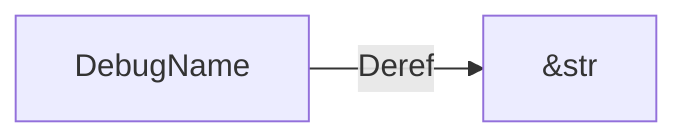

+++
title = "#20566 impl `Deref` for `DebugName`"
date = "2025-08-14T00:00:00"
draft = false
template = "pull_request_page.html"
in_search_index = true

[taxonomies]
list_display = ["show"]

[extra]
current_language = "en"
available_languages = {"en" = { name = "English", url = "/pull_request/bevy/2025-08/pr-20566-en-20250814" }, "zh-cn" = { name = "中文", url = "/pull_request/bevy/2025-08/pr-20566-zh-cn-20250814" }}
labels = ["D-Trivial", "C-Usability", "A-Utils", "D-Domain-Agnostic"]
+++

## impl `Deref` for `DebugName`

### Basic Information
- **Title**: impl `Deref` for `DebugName`
- **PR Link**: https://github.com/bevyengine/bevy/pull/20566
- **Author**: ItsDoot
- **Status**: MERGED
- **Labels**: D-Trivial, C-Usability, S-Ready-For-Final-Review, A-Utils, D-Domain-Agnostic
- **Created**: 2025-08-14T00:57:47Z
- **Merged**: 2025-08-14T01:35:54Z
- **Merged By**: alice-i-cecile

### Description Translation
# Objective

Remove the need for allocation by allowing `DebugName` -> `&str` conversion.

## Solution

Implemented `Deref<Target=str>` for `DebugName`.

### The Story of This Pull Request
The `DebugName` struct in Bevy's utils module serves as a wrapper for debug information, particularly for naming entities during development. Prior to this change, accessing the underlying string required either direct field access (`debug_name.name`) or conversion methods, which could lead to unnecessary allocations or boilerplate code. 

The core issue was ergonomic: developers needed a straightforward way to use `DebugName` values as string slices without extra allocations or verbose syntax. This became particularly relevant in debug-heavy contexts where entity names are frequently accessed and compared. The existing approach required explicit handling of both debug-enabled and debug-disabled cases, adding cognitive overhead.

The solution implements the `Deref` trait for `DebugName` with `Target = str`. This allows automatic dereferencing to `&str` through Rust's deref coercion. The implementation cleanly handles conditional compilation: when the `debug` feature is enabled, it returns the stored name; otherwise, it returns a constant string indicating the feature is disabled. This maintains existing behavior while eliminating allocation overhead.

The change is minimal but impactful. By implementing `Deref`, we enable natural usage patterns like:
```rust
let debug_name = get_debug_name();
println!("Entity: {debug_name}"); // Automatic &str conversion
if debug_name == "Player" { ... } // Direct string comparison
```
This avoids previous patterns like `debug_name.as_str()` or `&debug_name.name` that either allocated or exposed internal fields. The compiler now handles the conversion implicitly through deref coercion.

### Visual Representation


### Key Files Changed
#### `crates/bevy_utils/src/debug_info.rs`
Added `Deref` implementation for `DebugName` to enable automatic conversion to string slices.

**Code Changes:**
```rust
// Before: No Deref implementation
impl DebugName {
    #[cfg(feature = "debug")]
    pub fn new(name: impl Into<Cow<'static, str>>) -> Self {
        Self { name: name.into() }
    }
    // ... other methods
}

// After: Deref implementation added
use core::ops::Deref;

impl Deref for DebugName {
    type Target = str;

    fn deref(&self) -> &Self::Target {
        #[cfg(feature = "debug")]
        return &self.name;
        #[cfg(not(feature = "debug"))]
        return &FEATURE_DISABLED;
    }
}
```

### Further Reading
1. [Rust Deref Trait Documentation](https://doc.rust-lang.org/std/ops/trait.Deref.html)  
2. [Deref Coercion in Rust Book](https://doc.rust-lang.org/book/ch15-02-deref.html#implicit-deref-coercions-with-functions-and-methods)  
3. [Bevy Utils Module Overview](https://github.com/bevyengine/bevy/tree/main/crates/bevy_utils)  

### Full Code Diff
```diff
diff --git a/crates/bevy_utils/src/debug_info.rs b/crates/bevy_utils/src/debug_info.rs
index afedfbe7984e8..2703104ca4d8e 100644
--- a/crates/bevy_utils/src/debug_info.rs
+++ b/crates/bevy_utils/src/debug_info.rs
@@ -4,6 +4,7 @@ cfg::alloc! {
 }
 #[cfg(feature = "debug")]
 use core::any::type_name;
+use core::ops::Deref;
 use disqualified::ShortName;
 
 #[cfg(not(feature = "debug"))]
@@ -98,6 +99,17 @@ impl DebugName {
     }
 }
 
+impl Deref for DebugName {
+    type Target = str;
+
+    fn deref(&self) -> &Self::Target {
+        #[cfg(feature = "debug")]
+        return &self.name;
+        #[cfg(not(feature = "debug"))]
+        return &FEATURE_DISABLED;
+    }
+}
+
 cfg::alloc! {
     impl From<Cow<'static, str>> for DebugName {
         #[cfg_attr(
```