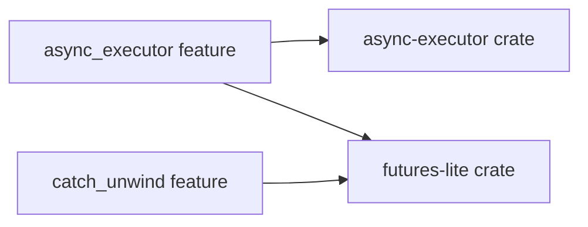

+++
title = "#20567 Fix bevy_tasks catch_unwind compilation error with --all-features"
date = "2025-08-14T00:00:00"
draft = false
template = "pull_request_page.html"
in_search_index = true

[taxonomies]
list_display = ["show"]

[extra]
current_language = "en"
available_languages = {"en" = { name = "English", url = "/pull_request/bevy/2025-08/pr-20567-en-20250814" }, "zh-cn" = { name = "中文", url = "/pull_request/bevy/2025-08/pr-20567-zh-cn-20250814" }}
labels = ["A-ECS", "C-Testing", "A-Tasks", "D-Straightforward"]
+++

## Fix bevy_tasks catch_unwind compilation error with --all-features

### Basic Information
- **Title**: Fix bevy_tasks catch_unwind compilation error with --all-features
- **PR Link**: https://github.com/bevyengine/bevy/pull/20567
- **Author**: fairhill1
- **Status**: MERGED
- **Labels**: A-ECS, S-Ready-For-Final-Review, C-Testing, A-Tasks, D-Straightforward
- **Created**: 2025-08-14T01:12:49Z
- **Merged**: 2025-08-14T03:16:44Z
- **Merged By**: alice-i-cecile

### Description Translation
Fixes the 'catch_unwind' compilation errors in bevy_tasks when building with --all-features

After file change,

Re-ran cargo test --package bevy_ecs --all-features and the 'catch_unwind' errors were gone

Part of #20542.

### The Story of This Pull Request

#### The Problem and Context
When building Bevy with `--all-features`, developers encountered compilation errors related to `catch_unwind` functionality in the `bevy_tasks` crate. The errors occurred because the `async_executor` feature in `bevy_tasks` lacked a required dependency when combined with the `catch_unwind` feature. This prevented successful builds using the comprehensive feature set, impacting development workflows and CI pipelines. The issue was tracked as part of the larger #20542 ticket.

#### The Solution Approach
The fix required adding the missing `futures-lite` dependency to the `async_executor` feature configuration. This ensures that when both `async_executor` and `catch_unwind` features are enabled (as occurs with `--all-features`), the necessary components from `futures-lite` are available to support unwinding behavior. The solution is minimal and targeted, modifying only the feature declaration in Cargo.toml without introducing new abstractions or architectural changes.

#### The Implementation
The change modifies the `async_executor` feature definition in `bevy_tasks`'s Cargo.toml to include `"futures-lite"` as a dependency. This explicit declaration ensures the required crate is included when the feature is active:

```toml
async_executor = ["bevy_platform/std", "dep:async-executor", "futures-lite"]
```

Previously, the `futures-lite` dependency was only activated through the separate `futures-lite` feature flag. The new dependency chain ensures `futures-lite` is always available when `async_executor` is enabled, resolving the missing symbol errors from `catch_unwind`.

#### Technical Insights
This fix demonstrates how Rust's feature unification works in Cargo: when building with `--all-features`, Cargo activates all features across all crates. The `catch_unwind` feature requires components from `futures-lite`, but the original configuration only activated `futures-lite` through a separate feature flag. The solution makes the dependency explicit in the feature that requires it, ensuring proper compilation under unified feature activation.

#### The Impact
This change resolves compilation errors when building with `--all-features`, enabling:
1. Successful CI builds using comprehensive feature sets
2. Developer workflows that rely on full-feature testing
3. Compatibility with tools requiring complete feature activation
The fix maintains backward compatibility while addressing a specific build configuration issue.

### Visual Representation



### Key Files Changed

#### `crates/bevy_tasks/Cargo.toml`
This file defines the crate's metadata and feature flags. The change adds an explicit dependency on `futures-lite` to the `async_executor` feature.

```toml
# Before:
async_executor = ["bevy_platform/std", "dep:async-executor"]

# After:
async_executor = ["bevy_platform/std", "dep:async-executor", "futures-lite"]
```

The modification ensures `futures-lite` is included whenever `async_executor` is enabled, resolving missing dependency errors when building with `--all-features`.

### Further Reading
1. [Cargo Features Documentation](https://doc.rust-lang.org/cargo/reference/features.html)
2. [Feature Unification Explanation](https://doc.rust-lang.org/cargo/reference/features.html#feature-unification)
3. [Bevy Tasks Architecture](https://github.com/bevyengine/bevy/tree/main/crates/bevy_tasks)
4. [Original Issue #20542](https://github.com/bevyengine/bevy/issues/20542)

### Full Code Diff
```diff
diff --git a/crates/bevy_tasks/Cargo.toml b/crates/bevy_tasks/Cargo.toml
index a476ca78e2776..7974e0c82cb23 100644
--- a/crates/bevy_tasks/Cargo.toml
+++ b/crates/bevy_tasks/Cargo.toml
@@ -22,7 +22,7 @@ multi_threaded = [
 
 # Uses `async-executor` as a task execution backend.
 # This backend is incompatible with `no_std` targets.
-async_executor = ["bevy_platform/std", "dep:async-executor"]
+async_executor = ["bevy_platform/std", "dep:async-executor", "futures-lite"]
 
 # Provide an implementation of `block_on` from  `futures-lite`.
 futures-lite = ["bevy_platform/std", "futures-lite/std"]
```