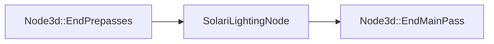

+++
title = "#20568 Adjust SolariLightingNode ordering"
date = "2025-08-14T00:00:00"
draft = false
template = "pull_request_page.html"
in_search_index = true

[taxonomies]
list_display = ["show"]

[extra]
current_language = "en"
available_languages = {"en" = { name = "English", url = "/pull_request/bevy/2025-08/pr-20568-en-20250814" }, "zh-cn" = { name = "中文", url = "/pull_request/bevy/2025-08/pr-20568-zh-cn-20250814" }}
labels = ["D-Trivial", "A-Rendering"]
+++

## Adjust SolariLightingNode ordering

### Basic Information
- **Title**: Adjust SolariLightingNode ordering
- **PR Link**: https://github.com/bevyengine/bevy/pull/20568
- **Author**: JMS55
- **Status**: MERGED
- **Labels**: D-Trivial, A-Rendering, S-Ready-For-Final-Review
- **Created**: 2025-08-14T02:30:21Z
- **Merged**: 2025-08-14T18:09:56Z
- **Merged By**: alice-i-cecile

### Description Translation
Tiny PR to better place the SolariLightingNode.

This allows denoisers like DLSS-RR, which orders itself after EndMainPass, to run before SolariLightingNode.

The new ordering also just makes more sense, as Solari essentially replaces the main pass, but runs after the gbuffer prepass.

### The Story of This Pull Request

The PR addresses a render graph ordering conflict between Solari's lighting system and third-party denoisers like DLSS-RR. In the original implementation, `SolariLightingNode` was scheduled immediately after `EndMainPass` in Bevy's render graph. This caused issues because DLSS-RR and similar denoisers also position themselves after `EndMainPass`, but need to execute before Solari's lighting calculations to function correctly.

The solution modifies the render graph dependencies to insert `SolariLightingNode` between `EndPrepasses` and `EndMainPass` instead of after `EndMainPass`. This change creates a logical ordering where:
1. Prepasses complete (including gbuffer preparation)
2. Solari lighting runs
3. Main pass concludes
4. Post-processing effects like denoisers execute

This new ordering provides two key benefits:
1. Compatibility with DLSS-RR and similar denoisers that require execution after the main pass but before Solari's lighting operations
2. Better logical alignment with Solari's role as a replacement for the main pass that depends on prepass-generated data (like gbuffers)

The implementation required modifying the render graph edges in Solari's plugin initialization. The change replaces a direct dependency between `EndMainPass` and `SolariLightingNode` with a chained dependency from `EndPrepasses` through `SolariLightingNode` to `EndMainPass`.

### Visual Representation



### Key Files Changed

1. `crates/bevy_solari/src/realtime/mod.rs`
   - Modified render graph dependencies to reposition SolariLightingNode
   - Change enables denoisers to run between EndMainPass and SolariLightingNode

```rust
// Before:
.add_render_graph_edges(
    Core3d,
    (Node3d::EndMainPass, node::graph::SolariLightingNode),
);

// After:
.add_render_graph_edges(
    Core3d,
    (
        Node3d::EndPrepasses,
        node::graph::SolariLightingNode,
        Node3d::EndMainPass,
    ),
);
```

2. `crates/bevy_solari/src/lib.rs`
   - Minor documentation correction to reflect plugin grouping

```rust
// Before:
/// [`WgpuFeatures`] required for this plugin to function.

// After:
/// [`WgpuFeatures`] required for these plugins to function.
```

### Further Reading
- [Bevy Render Graph Documentation](https://bevyengine.org/learn/book/getting-started/rendering/#render-graph) - Official guide to Bevy's render graph system
- [DLSS Ray Reconstruction](https://www.nvidia.com/en-us/geforce/news/rtx-ray-reconstruction/) - Technical overview of DLSS-RR denoising
- [Render Graph Best Practices](https://github.com/bevyengine/bevy/blob/main/docs/plugins_guidelines.md#render-graphs) - Bevy's render graph design patterns