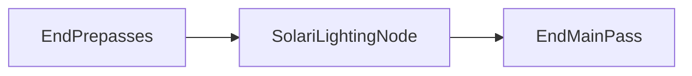

+++
title = "#20568 Adjust SolariLightingNode ordering"
date = "2025-08-14T00:00:00"
draft = false
template = "pull_request_page.html"
in_search_index = false

[extra]
current_language = "zh-cn"
available_languages = {"en" = { name = "English", url = "/pull_request/bevy/2025-08/pr-20568-en-20250814" }, "zh-cn" = { name = "中文", url = "/pull_request/bevy/2025-08/pr-20568-zh-cn-20250814" }}
+++

# 调整 SolariLightingNode 顺序 (Adjust SolariLightingNode ordering)

## 基本信息
- **标题**: Adjust SolariLightingNode ordering
- **PR 链接**: https://github.com/bevyengine/bevy/pull/20568
- **作者**: JMS55
- **状态**: 已合并
- **标签**: D-Trivial, A-Rendering, S-Ready-For-Final-Review
- **创建时间**: 2025-08-14T02:30:21Z
- **合并时间**: 2025-08-14T18:09:56Z
- **合并者**: alice-i-cecile

## 描述翻译
微小的 PR，用于更好地放置 SolariLightingNode。

这允许像 DLSS-RR 这样的降噪器（它们将自己排序在 EndMainPass 之后）在 SolariLightingNode 之前运行。

新的排序也更有意义，因为 Solari 本质上替代了主通道 (main pass)，但在 gbuffer 预通道 (prepass) 之后运行。

## PR 分析

### 问题背景
在 Bevy 的渲染管线中，节点顺序直接影响渲染结果和后期处理效果的正确性。原始实现将 `SolariLightingNode` 直接放在 `EndMainPass` 之后：

```rust
// 修改前代码:
.add_render_graph_edges(
    Core3d,
    (Node3d::EndMainPass, node::graph::SolariLightingNode),
);
```

这种顺序导致两个问题：
1. 像 DLSS-RR 这样的降噪器需要插入在 `EndMainPass` 之后，但被 `SolariLightingNode` 阻挡
2. 逻辑不一致：`SolariLightingNode` 实质上是主通道 (main pass) 的替代方案，但运行在 gbuffer 预通道 (prepass) 完成之后，更合理的顺序应该是在预通道结束和主通道结束之间

### 解决方案
核心修改是调整渲染图 (render graph) 中节点的连接顺序：

```rust
// 修改后代码:
.add_render_graph_edges(
    Core3d,
    (
        Node3d::EndPrepasses,     // 预通道结束
        node::graph::SolariLightingNode,  // Solari 光照节点
        Node3d::EndMainPass,      // 主通道结束
    ),
);
```

这个变更创建了新的节点顺序：
1. `EndPrepasses` 完成后执行 `SolariLightingNode`
2. `SolariLightingNode` 完成后执行 `EndMainPass`

### 技术影响
1. **兼容性提升**：为 DLSS-RR 等需要插入在 `EndMainPass` 之后的降噪器腾出位置
2. **逻辑合理化**：
   - Solari 作为主通道的替代方案，现在在预通道之后、主通道结束之前执行
   - 更符合 gbuffer 预通道 → 主通道替代方案 → 主通道结束的执行逻辑
3. **无功能变化**：修改仅调整节点顺序，不改变节点内部实现

### 架构示意


## 关键文件变更

### crates/bevy_solari/src/realtime/mod.rs
**变更说明**：重构渲染图连接顺序，将 SolariLightingNode 移至 EndPrepasses 和 EndMainPass 之间

```rust
// 修改前:
.add_render_graph_edges(
    Core3d,
    (Node3d::EndMainPass, node::graph::SolariLightingNode),
);

// 修改后:
.add_render_graph_edges(
    Core3d,
    (
        Node3d::EndPrepasses,
        node::graph::SolariLightingNode,
        Node3d::EndMainPass,
    ),
);
```

### crates/bevy_solari/src/lib.rs
**变更说明**：文档字符串优化，体现插件组 (PluginGroup) 的复数特性

```rust
// 修改前:
/// [`WgpuFeatures`] required for this plugin to function.

// 修改后:
/// [`WgpuFeatures`] required for these plugins to function.
```

## 总结
该 PR 通过微调渲染图中 `SolariLightingNode` 的位置：
1. 解决了降噪器插入点冲突的问题
2. 使节点顺序更符合渲染管线的逻辑流程
3. 保持了实现的简洁性（仅 2 文件改动）
4. 为后续渲染扩展提供了更灵活的节点排序空间

这种节点顺序调整展示了在复杂渲染管线中，精确控制执行顺序对功能扩展的重要性，特别是当集成第三方渲染技术（如 DLSS）时。

## 延伸阅读
1. [Bevy 渲染图文档](https://bevyengine.org/learn/book/features/rendering/render-graph/)
2. [WGSL 光线追踪规范](https://www.w3.org/TR/WGSL/#ray-tracing)
3. [DLSS 技术解析](https://developer.nvidia.com/dlss)