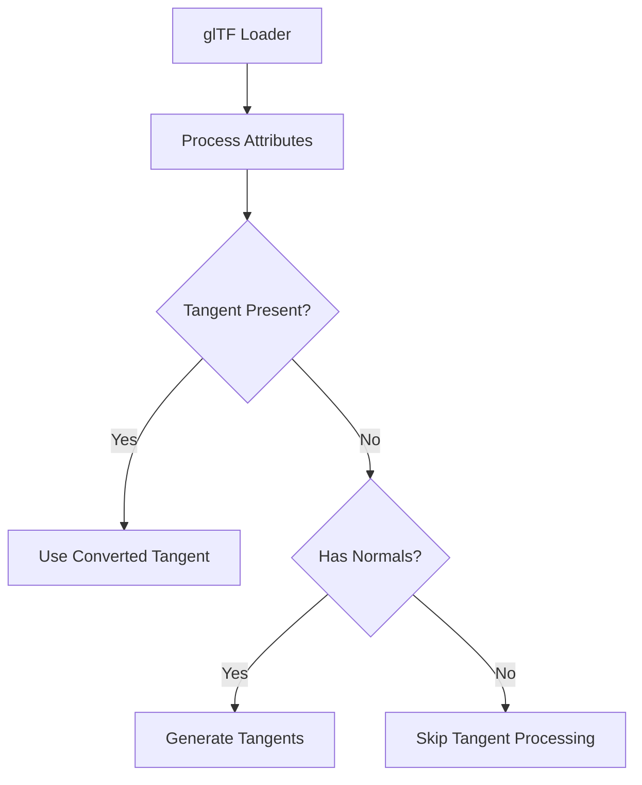

+++
title = "#20573"
date = "2025-08-14T00:00:00"
draft = false
template = "pull_request_page.html"
in_search_index = true

[taxonomies]
list_display = ["show"]

[extra]
current_language = "en"
available_languages = {"en" = { name = "English", url = "/pull_request/bevy/2025-08/pr-20573-en-20250814" }, "zh-cn" = { name = "中文", url = "/pull_request/bevy/2025-08/pr-20573-zh-cn-20250814" }}
+++

## The Story of This Pull Request

### The Problem and Context
When loading glTF assets into Bevy, coordinate conversion wasn't being applied to tangent vectors. This caused incorrect shading when using normal mapping, particularly noticeable when the `gltf_convert_coordinates_default` feature was enabled. The issue stemmed from a historical refactor in #5370 that moved attribute copying to a generic function (`convert_attribute`), but left one tangent-handling code path untouched. Later, #19633 added coordinate conversion capabilities that only affected the first tangent copy operation. The second copy operation would overwrite converted tangents with original values, breaking PBR rendering.

### The Solution Approach
The fix removes the redundant tangent copy operation while maintaining the fallback tangent generation logic. The solution is surgical - by eliminating the second tangent copy, we ensure coordinate conversions apply correctly while preserving the existing mikktspace-based tangent generation when needed. Additionally, the PR improves code clarity by replacing `attribute().is_some()` checks with `contains_attribute()` and fixes inconsistent indentation in logging statements.

### The Implementation
The key modification occurs in the mesh processing section of the glTF loader. Before the change, the code had two separate tangent handling paths:

```rust
// BEFORE: Problematic dual tangent handling
if let Some(vertex_attribute) = reader.read_tangents() {
    mesh.insert_attribute(Mesh::ATTRIBUTE_TANGENT, vertex_attribute);
} else if mesh.attribute(Mesh::ATTRIBUTE_NORMAL).is_some() {
    // Tangent generation logic
}
```

The new implementation simplifies this to:

```rust
// AFTER: Unified tangent handling
if !mesh.contains_attribute(Mesh::ATTRIBUTE_TANGENT)
    && mesh.contains_attribute(Mesh::ATTRIBUTE_NORMAL)
    && needs_tangents(&primitive.material())
{
    tracing::debug!(
        "Missing vertex tangents for {}, computing them...", file_name
    );
    // Tangent generation logic remains
}
```

This change ensures:
1. Tangents loaded from glTF files get processed through `convert_attribute` (where coordinate conversion happens)
2. The redundant overwrite is eliminated
3. The fallback tangent generation still functions when needed

The PR also improves code quality:
1. Replaced `mesh.attribute().is_some()` with `mesh.contains_attribute()` for clarity
2. Fixed inconsistent indentation in logging macros
3. Maintained identical tangent generation behavior for assets without precomputed tangents

### Technical Insights
The root issue was a layering violation in attribute processing. The generic `convert_attribute` system correctly handled coordinate conversion, but a specialized tangent-handling code path bypassed this system. This highlights the importance of centralizing attribute processing routines to avoid bypassing critical transformation steps.

The solution demonstrates how to:
1. Identify and remove redundant operations in asset pipelines
2. Maintain backward compatibility while fixing subtle rendering issues
3. Improve code clarity through standardized attribute checks

### The Impact
This fix ensures correct normal mapping for glTF assets when coordinate conversion is enabled. The changes are minimal (8 lines added, 12 removed) but resolve a critical rendering bug. The code quality improvements make the loader more maintainable by using consistent attribute checks and proper formatting.

## Visual Representation



## Key Files Changed

### `crates/bevy_gltf/src/loader/mod.rs`
**Changes:**
1. Removed redundant tangent insertion
2. Improved tangent presence checks
3. Fixed logging indentation

**Code Diff:**
```diff
@@ -771,26 +771,22 @@ impl GltfLoader {
                     }
                 }
 
-                if let Some(vertex_attribute) = reader
-                    .read_tangents()
-                    .map(|v| VertexAttributeValues::Float32x4(v.collect()))
-                {
-                    mesh.insert_attribute(Mesh::ATTRIBUTE_TANGENT, vertex_attribute);
-                } else if mesh.attribute(Mesh::ATTRIBUTE_NORMAL).is_some()
+                if !mesh.contains_attribute(Mesh::ATTRIBUTE_TANGENT)
+                    && mesh.contains_attribute(Mesh::ATTRIBUTE_NORMAL)
                     && needs_tangents(&primitive.material())
                 {
                     tracing::debug!(
-                    "Missing vertex tangents for {}, computing them using the mikktspace algorithm. Consider using a tool such as Blender to pre-compute the tangents.", file_name
-                );
+                        "Missing vertex tangents for {}, computing them using the mikktspace algorithm. Consider using a tool such as Blender to pre-compute the tangents.", file_name
+                    );
 
                     let generate_tangents_span = info_span!("generate_tangents", name = file_name);
 
                     generate_tangents_span.in_scope(|| {
                         if let Err(err) = mesh.generate_tangents() {
                             warn!(
-                            "Failed to generate vertex tangents using the mikktspace algorithm: {}",
-                            err
-                        );
+                                "Failed to generate vertex tangents using the mikktspace algorithm: {}",
+                                err
+                            );
                         }
                     });
                 }
```

## Further Reading
1. [glTF Tangent Space Specification](https://github.com/KhronosGroup/glTF/tree/master/specification/2.0#tangent-space)
2. [Bevy Coordinate Systems](https://bevyengine.org/learn/book/getting-started/coordinate-system/)
3. [Mikktspace Tangent Generation Paper](http://www.mikktspace.com/)