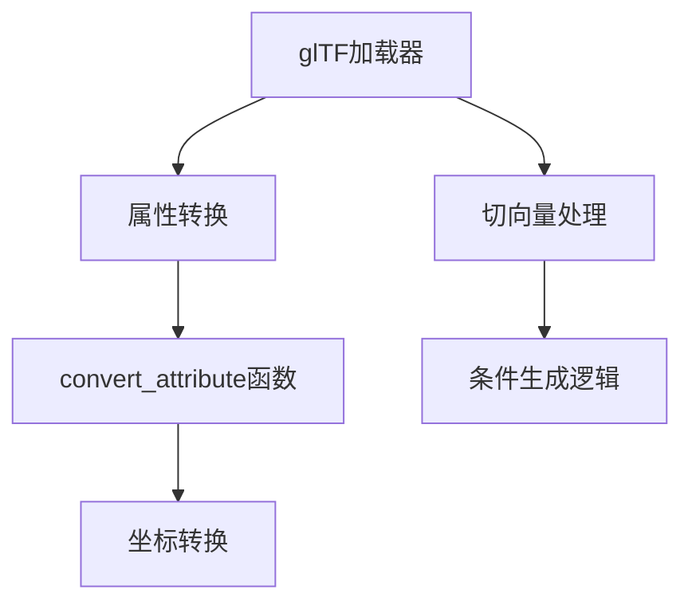

+++
title = "#20573 Fix glTF coordinate conversion not converting tangents"
date = "2025-08-14T00:00:00"
draft = false
template = "pull_request_page.html"
in_search_index = false

[extra]
current_language = "zh-cn"
available_languages = {"en" = { name = "English", url = "/pull_request/bevy/2025-08/pr-20573-en-20250814" }, "zh-cn" = { name = "中文", url = "/pull_request/bevy/2025-08/pr-20573-zh-cn-20250814" }}
+++

## 修复 glTF 坐标转换中切向量未转换的问题

### 基础信息
- **标题**: Fix glTF coordinate conversion not converting tangents
- **PR 链接**: https://github.com/bevyengine/bevy/pull/20573
- **作者**: greeble-dev
- **状态**: MERGED
- **标签**: C-Bug, S-Ready-For-Final-Review, D-Straightforward, A-glTF
- **创建时间**: 2025-08-14T12:45:30Z
- **合并时间**: 2025-08-14T19:03:40Z
- **合并者**: alice-i-cecile

### 问题描述
在 Bevy 的 glTF 加载流程中，当启用坐标转换功能时（例如将右手坐标系转换为左手坐标系），切向量（tangents）未能正确转换。这个问题源于历史代码重构导致的冗余操作：切向量属性被复制了两次，但只有第一次复制应用了坐标转换，第二次复制则用未转换的值覆盖了已转换的值。

具体表现为：当使用 `gltf_convert_coordinates_default` 功能时，模型材质出现异常渲染效果（如图）。该问题最初在 Discord 社区被报告，并经过多次讨论确认。


### 解决方案
根本原因是 #5370 PR 将属性复制逻辑提取到通用函数 `convert_attribute` 时，遗漏了切向量的处理路径，导致切向量被重复复制：
1. 第一次在 `convert_attribute` 中复制（应用坐标转换）
2. 第二次在显式读取切向量的代码块中复制（覆盖已转换的值）

修复方案直接移除了冗余的切向量复制代码段，仅保留条件生成切向量的逻辑：
```rust
// 修改后：仅当切向量缺失且需要时才生成
if !mesh.contains_attribute(Mesh::ATTRIBUTE_TANGENT)
    && mesh.contains_attribute(Mesh::ATTRIBUTE_NORMAL)
    && needs_tangents(&primitive.material())
{
    tracing::debug!(
        "Missing vertex tangents for {}, computing them using the mikktspace algorithm. Consider using a tool such as Blender to pre-compute the tangents.", file_name
    );
    // ...生成切向量逻辑
}
```

同时进行了两项代码质量改进：
1. 使用 `contains_attribute()` 替代 `attribute().is_some()` 提升可读性
2. 修复日志宏的缩进格式问题

### 技术验证
通过以下测试验证修复效果：
1. 修改 `load_gltf` 示例，分别启用/禁用 `gltf_convert_coordinates_default` 功能
2. 强制加载器使用切向量重新计算路径进行边界测试
3. 确认坐标转换后切向量数据与法线方向一致

### 关键文件变更
**文件路径**: `crates/bevy_gltf/src/loader/mod.rs` (+8/-12)

**变更说明**:
移除冗余的切向量复制逻辑，修复坐标转换失效问题，并优化条件判断和日志格式。

```rust
// 修改前：显式读取并插入切向量
if let Some(vertex_attribute) = reader
    .read_tangents()
    .map(|v| VertexAttributeValues::Float32x4(v.collect()))
{
    mesh.insert_attribute(Mesh::ATTRIBUTE_TANGENT, vertex_attribute);
} else if mesh.attribute(Mesh::ATTRIBUTE_NORMAL).is_some()
    && needs_tangents(&primitive.material())
{
    tracing::debug!(
    "Missing vertex tangents for {}, computing them using the mikktspace algorithm. Consider using a tool such as Blender to pre-compute the tangents.", file_name
);
    // ...生成切向量逻辑
}

// 修改后：直接检查属性存在性
if !mesh.contains_attribute(Mesh::ATTRIBUTE_TANGENT)
    && mesh.contains_attribute(Mesh::ATTRIBUTE_NORMAL)
    && needs_tangents(&primitive.material())
{
    tracing::debug!(
        "Missing vertex tangents for {}, computing them using the mikktspace algorithm. Consider using a tool such as Blender to pre-compute the tangents.", file_name
    );
    // ...生成切向量逻辑
}
```

### 组件关系


### 经验总结
该问题揭示了重构过程中的常见陷阱：
1. **冗余操作隐患**：无害的重复操作在后续功能扩展后可能变为致命错误
2. **属性处理一致性**：应通过统一接口处理顶点属性
3. **防御性编程**：使用 `contains_attribute()` 等显式方法提升代码健壮性

建议在涉及坐标转换的功能中建立属性处理清单，确保所有空间相关属性（位置、法线、切向量）均被覆盖。

### 延伸阅读
1. [glTF 坐标系规范](https://registry.khronos.org/glTF/specs/2.0/glTF-2.0.html#coordinate-system-and-units)
2. [Bevy 坐标转换实现 #19633](https://github.com/bevyengine/bevy/pull/19633)
3. [mikktspace 切向量生成算法](https://github.com/mmikk/mikktspace)