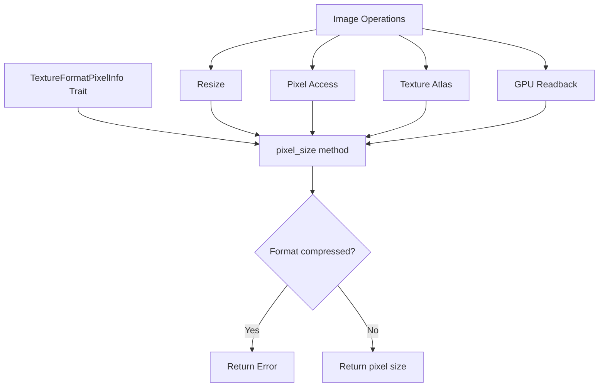

+++
title = "#20574 remove panic in TextureFormatPixelInfo::pixel_info"
date = "2025-08-24T00:00:00"
draft = false
template = "pull_request_page.html"
in_search_index = true

[taxonomies]
list_display = ["show"]

[extra]
current_language = "en"
available_languages = {"en" = { name = "English", url = "/pull_request/bevy/2025-08/pr-20574-en-20250824" }, "zh-cn" = { name = "中文", url = "/pull_request/bevy/2025-08/pr-20574-zh-cn-20250824" }}
labels = ["C-Bug", "A-Rendering", "D-Straightforward", "A-Picking"]
+++

# Title

## Basic Information
- **Title**: remove panic in TextureFormatPixelInfo::pixel_info
- **PR Link**: https://github.com/bevyengine/bevy/pull/20574
- **Author**: mirsella
- **Status**: MERGED
- **Labels**: C-Bug, A-Rendering, S-Ready-For-Final-Review, M-Needs-Migration-Guide, D-Straightforward, A-Picking
- **Created**: 2025-08-14T15:49:30Z
- **Merged**: 2025-08-24T21:11:18Z
- **Merged By**: alice-i-cecile

## Description Translation

# Objective

fixes #20365

## Solution

TextureFormatPixelInfo::pixel_info now return a Result instead of panic

maybe a custom error specific to this case is needed, to not have the other variants of `TextureAcessError`

## Testing

ran my game on it, using mesh, sprite, ui everything seems good.

**BUT** its my first time contributing this type of code, i dont know much about rendering and its integration in bevy. **REVIEW THIS LIKE I DON'T KNOW ANYTHING**. especially i dont know if there is some unwanted consequence of these changes in other places.

what remains, is maybe we should add some `warn!` ? at least in picking.
Currently in sprite picking backend if the pixel data couldn't be accessed (to determine if the alpha is greater than the threshold), the entity is skipped. maybe a `warn!` here at least ?

(imo it shouldn't be skipped, instead be taken as if it was valid: id rather have a sprite where the whole size of it is picked than having it not working at all. maybe a SpritePickingSettings per entity ?)

## The Story of This Pull Request

The problem started with issue #20365 where TextureFormatPixelInfo::pixel_info would panic when called on compressed texture formats. Compressed formats like BCn, ETC2, or ASTC don't have a straightforward pixel size in bytes because they use block compression, making the concept of "pixel size" invalid for these formats.

The developer identified that the core issue was in the TextureFormatPixelInfo trait implementation. Previously, when pixel_size() was called on compressed formats, it would panic with a generic error message. This created unreliable behavior throughout the codebase where any code dealing with texture formats had to know beforehand whether a format was compressed or not.

The solution approach was straightforward: convert the panic into a proper error return. Instead of panicking, the method now returns a Result<usize, TextureAccessError> where TextureAccessError::UnsupportedTextureFormat is returned for compressed formats. This change required updating all call sites throughout the Bevy codebase to handle the Result properly.

The implementation involved modifying the TextureFormatPixelInfo trait signature and then systematically updating every location that called pixel_size(). The changes affected multiple crates including bevy_image, bevy_render, bevy_pbr, and bevy_sprite_render. Each call site needed to handle the potential error, either by propagating it up the call stack or providing fallback behavior.

One key insight from this change is that it exposes where compressed textures might be used incorrectly. For example, several image manipulation operations like resizing, pixel access, and texture atlas building fundamentally don't work with compressed formats because they require direct pixel manipulation. The error return now makes these incompatibilities explicit rather than causing mysterious panics.

The impact of this change is significant for code reliability. Instead of crashing at runtime with compressed textures, applications can now handle these cases gracefully. The change also makes the API more honest about its limitations - compressed texture formats simply don't support certain operations, and now this is reflected in the type system rather than causing runtime failures.

## Visual Representation



## Key Files Changed

### `crates/bevy_image/src/image.rs` (+83/-60)
This was the most significantly modified file as it contains the core image manipulation logic. The changes involved adding error handling to all operations that depend on pixel size calculations.

**Key changes:**
```rust
// Before:
fn pixel_size(&self) -> usize {
    let info = self;
    match info.block_dimensions() {
        (1, 1) => info.block_copy_size(None).unwrap() as usize,
        _ => panic!("Using pixel_size for compressed textures is invalid"),
    }
}

// After:
fn pixel_size(&self) -> Result<usize, TextureAccessError> {
    let info = self;
    match info.block_dimensions() {
        (1, 1) => Ok(info.block_copy_size(None).unwrap() as usize),
        _ => Err(TextureAccessError::UnsupportedTextureFormat(*self)),
    }
}
```

### `crates/bevy_render/src/gpu_readback.rs` (+17/-14)
This file handles reading back data from the GPU. The changes ensure that compressed textures are handled properly during readback operations.

```rust
// Example of updated usage:
if let Some(gpu_image) = gpu_images.get(image)
    && let Ok(pixel_size) = gpu_image.texture_format.pixel_size()
{
    // Proceed with pixel_size
}
```

### `crates/bevy_pbr/src/render/mesh.rs` (+12/-11)
This file handles PBR mesh rendering. The changes ensure texture uploads only proceed when pixel size can be determined.

```rust
// Updated texture upload logic:
if let Ok(format_size) = image.texture_descriptor.format.pixel_size() {
    render_queue.write_texture(
        // texture upload parameters using format_size
    );
}
```

### `crates/bevy_sprite_render/src/mesh2d/mesh.rs` (+12/-11)
### `crates/bevy_sprite_render/src/render/mod.rs` (+12/-11)
These files handle 2D mesh and sprite rendering. Similar to the PBR changes, they now properly handle the Result return from pixel_size().

## Further Reading

- [WebGPU Texture Formats](https://gpuweb.github.io/gpuweb/#texture-format-caps) - Understanding which formats are compressed
- [Result Type in Rust](https://doc.rust-lang.org/std/result/) - Proper error handling patterns in Rust
- [Bevy Texture Documentation](https://docs.rs/bevy_render/latest/bevy_render/texture/struct.TextureFormat.html) - Official Bevy texture format documentation