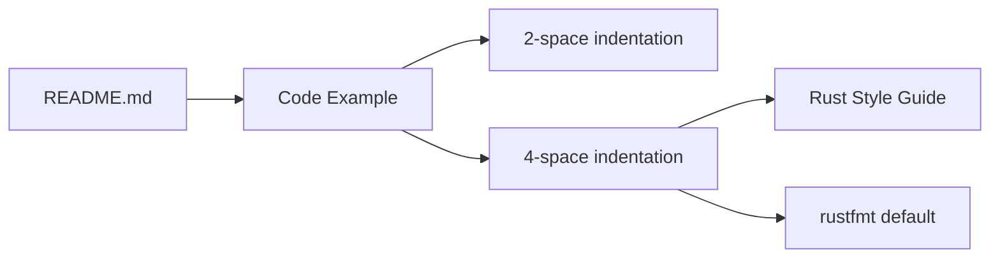

+++
title = "#20577 Fix code indentation in README"
date = "2025-08-15T00:00:00"
draft = false
template = "pull_request_page.html"
in_search_index = true

[taxonomies]
list_display = ["show"]

[extra]
current_language = "en"
available_languages = {"en" = { name = "English", url = "/pull_request/bevy/2025-08/pr-20577-en-20250815" }, "zh-cn" = { name = "中文", url = "/pull_request/bevy/2025-08/pr-20577-zh-cn-20250815" }}
labels = ["C-Docs", "D-Trivial", "C-Code-Quality"]
+++

# Fix code indentation in README

## Basic Information
- **Title**: Fix code indentation in README
- **PR Link**: https://github.com/bevyengine/bevy/pull/20577
- **Author**: Jondolf
- **Status**: MERGED
- **Labels**: C-Docs, D-Trivial, C-Code-Quality, S-Ready-For-Final-Review
- **Created**: 2025-08-14T23:32:30Z
- **Merged**: 2025-08-15T00:12:13Z
- **Merged By**: alice-i-cecile

## Description Translation
# Objective

Somehow the README's code example still uses a non-standard indentation level of 2 spaces (the [style guide](https://github.com/rust-lang/rust/tree/HEAD/src/doc/style-guide/src) recommends 4, and it is what rustfmt uses by default).

## Solution

Fix the indentation level!

## The Story of This Pull Request

This PR addresses a minor but important inconsistency in Bevy's README documentation. The code example demonstrating basic application setup used 2-space indentation, which conflicts with Rust's official style guide and standard rustfmt configuration. This discrepancy could potentially confuse new contributors who expect the project to follow standard Rust formatting conventions.

The Rust style guide explicitly recommends 4-space indentation for all Rust code. Since rustfmt, the official Rust formatter, uses 4 spaces by default, maintaining consistency with this standard reduces friction for developers. When newcomers encounter code examples that don't match their editor's rustfmt settings, it creates unnecessary confusion about project conventions.

The solution implemented is straightforward: update the indentation in the README's code example from 2 spaces to 4 spaces. This change aligns with both the Rust style guide and Bevy's own formatting practices. No functional changes are made to the code itself - only whitespace adjustments are applied to improve readability and consistency.

The fix is intentionally minimal in scope, focusing exclusively on the README file. This targeted approach ensures the change can be reviewed and merged quickly without introducing any risk to the codebase. The update helps maintain Bevy's documentation quality by ensuring all examples follow standard Rust formatting conventions.

## Visual Representation


## Key Files Changed

### README.md
This file contains Bevy's primary documentation visible to all GitHub visitors. The change updates a code example to use standard Rust indentation.

**Before:**
```rust
use bevy::prelude::*;

fn main() {
  App::new()
    .add_plugins(DefaultPlugins)
    .run();
}
```

**After:**
```rust
use bevy::prelude::*;

fn main() {
    App::new()
        .add_plugins(DefaultPlugins)
        .run();
}
```

The changes:
1. Increased indentation from 2 spaces to 4 spaces for the `App::new()` line
2. Increased indentation from 2 spaces to 4 spaces for the method chaining lines
3. Maintained all functional aspects of the code example

## Further Reading
- [Rust Style Guide](https://github.com/rust-lang/rust/tree/HEAD/src/doc/style-guide/src)
- [rustfmt Documentation](https://github.com/rust-lang/rustfmt)
- [Bevy Contribution Guidelines](https://github.com/bevyengine/bevy/blob/main/CONTRIBUTING.md)

## Full Code Diff
```diff
diff --git a/README.md b/README.md
index 9e9d49a5a37ec..73cc0e7a8d51c 100644
--- a/README.md
+++ b/README.md
@@ -76,9 +76,9 @@ To draw a window with standard functionality enabled, use:
 use bevy::prelude::*;
 
 fn main() {
-  App::new()
-    .add_plugins(DefaultPlugins)
-    .run();
+    App::new()
+        .add_plugins(DefaultPlugins)
+        .run();
 }
 ```
```