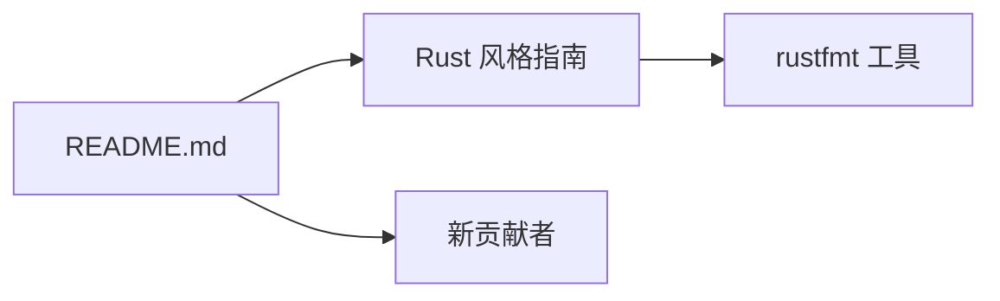

+++
title = "#20577 Fix code indentation in README"
date = "2025-08-15T00:00:00"
draft = false
template = "pull_request_page.html"
in_search_index = false

[extra]
current_language = "zh-cn"
available_languages = {"en" = { name = "English", url = "/pull_request/bevy/2025-08/pr-20577-en-20250815" }, "zh-cn" = { name = "中文", url = "/pull_request/bevy/2025-08/pr-20577-zh-cn-20250815" }}
+++

# Fix code indentation in README

## 基本信息
- **标题**: Fix code indentation in README
- **PR 链接**: https://github.com/bevyengine/bevy/pull/20577
- **作者**: Jondolf
- **状态**: 已合并
- **标签**: C-Docs, D-Trivial, C-Code-Quality, S-Ready-For-Final-Review
- **创建时间**: 2025-08-14T23:32:30Z
- **合并时间**: 2025-08-15T00:12:13Z
- **合并者**: alice-i-cecile

## 描述翻译

### 目标 (Objective)

不知何故，README 中的代码示例仍然使用了 2 个空格的非标准缩进（[风格指南](https://github.com/rust-lang/rust/tree/HEAD/src/doc/style-guide/src)推荐使用 4 个空格，这也是 rustfmt 的默认设置）。

### 解决方案 (Solution)

修复缩进级别！

## PR 背景说明

在 Rust 生态系统中，代码风格一致性是重要实践。Rust 官方风格指南明确指定使用 4 个空格作为标准缩进，这是 rustfmt（Rust 的官方格式化工具）的默认配置。Bevy 引擎作为重要的 Rust 游戏引擎项目，其 README 文件中的代码示例却使用了 2 个空格缩进，与社区标准不符。

这种不一致可能带来几个实际问题：首先，新贡献者可能误认为项目接受 2 空格缩进，导致提交代码时风格不统一；其次，rustfmt 等工具在格式化时会自动调整为 4 空格，造成不必要的格式变动；最后，这会影响项目的专业形象，让用户对代码质量规范产生疑问。

开发者 Jondolf 注意到这个问题后，决定提交修复。解决方案直接明了：将 README 中代码示例的缩进从 2 个空格统一调整为 4 个空格。这种修改属于文档维护范畴（C-Docs），被标记为简单修改（D-Trivial），但实际提升了代码质量（C-Code-Quality）。

修改虽然微小，但体现了对细节的关注。项目维护者 alice-i-cecile 在 40 分钟内就完成了审核合并，表明团队对文档一致性的重视。这类修复有助于：
1. 保持与 Rust 社区规范一致
2. 避免新贡献者被误导
3. 减少不必要的格式变动
4. 提升项目专业形象

## 可视化关系



## 关键文件变更

### README.md (+3/-3)
此文件是项目的门户文档，修改目的是使代码示例符合 Rust 标准缩进规范。

**变更前:**
```markdown
fn main() {
  App::new()
    .add_plugins(DefaultPlugins)
    .run();
}
```

**变更后:**
```markdown
fn main() {
    App::new()
        .add_plugins(DefaultPlugins)
        .run();
}
```

修改说明：
1. 主函数体缩进从 2 空格改为 4 空格
2. 方法链调用保持 4 空格缩进层级
3. 整体符合 rustfmt 默认配置

## 延伸阅读

1. [Rust 风格指南](https://github.com/rust-lang/rust/tree/HEAD/src/doc/style-guide/src) - Rust 官方代码格式规范
2. [rustfmt 文档](https://rust-lang.github.io/rustfmt/) - Rust 官方格式化工具
3. [Bevy 贡献指南](https://github.com/bevyengine/bevy/blob/main/CONTRIBUTING.md) - 项目贡献规范

## 完整代码变更

```diff
diff --git a/README.md b/README.md
index 9e9d49a5a37ec..73cc0e7a8d51c 100644
--- a/README.md
+++ b/README.md
@@ -76,9 +76,9 @@ To draw a window with standard functionality enabled, use:
 use bevy::prelude::*;
 
 fn main() {
-  App::new()
-    .add_plugins(DefaultPlugins)
-    .run();
+    App::new()
+        .add_plugins(DefaultPlugins)
+        .run();
 }
```