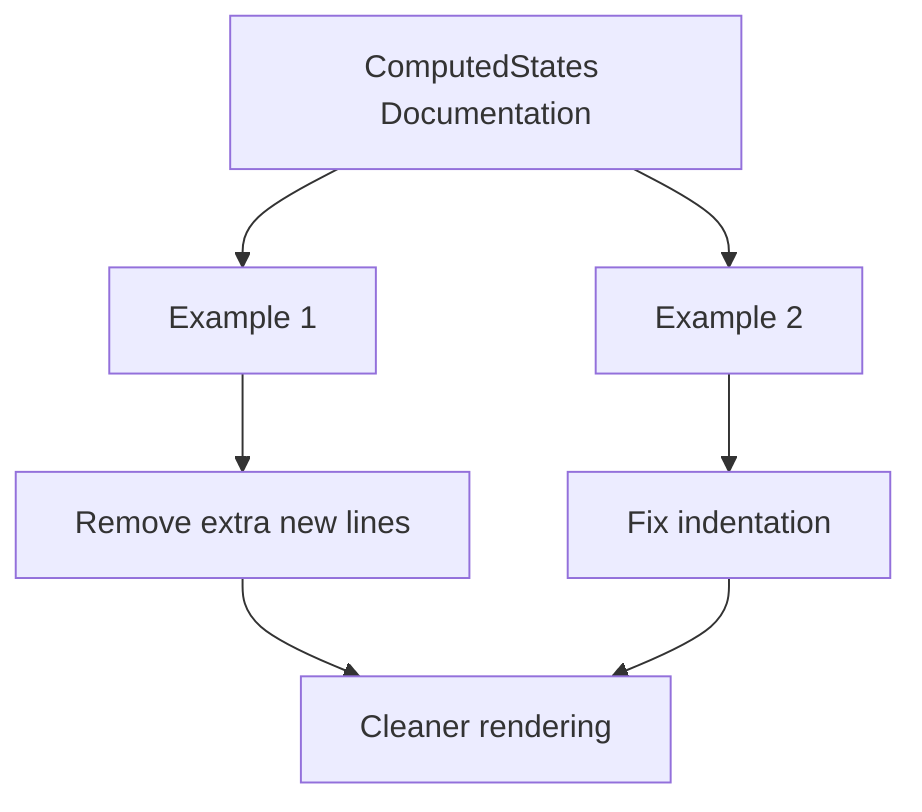

+++
title = "#20578 remove some new lines from ComputedStates docs"
date = "2025-08-15T00:00:00"
draft = false
template = "pull_request_page.html"
in_search_index = true

[taxonomies]
list_display = ["show"]

[extra]
current_language = "en"
available_languages = {"en" = { name = "English", url = "/pull_request/bevy/2025-08/pr-20578-en-20250815" }, "zh-cn" = { name = "中文", url = "/pull_request/bevy/2025-08/pr-20578-zh-cn-20250815" }}
labels = ["D-Trivial"]
+++

# Pull Request Analysis: #20578 - remove some new lines from ComputedStates docs

## Basic Information
- **Title**: remove some new lines from ComputedStates docs
- **PR Link**: https://github.com/bevyengine/bevy/pull/20578
- **Author**: hymm
- **Status**: MERGED
- **Labels**: D-Trivial, S-Ready-For-Final-Review
- **Created**: 2025-08-14T23:45:31Z
- **Merged**: 2025-08-15T00:33:42Z
- **Merged By**: alice-i-cecile

## Description Translation
# Objective

- In the docs examples for ComputedStates there are some extra new lines. https://dev-docs.bevy.org/bevy_state/state/computed_states/trait.ComputedStates.html

## Solution

- hide or remove them.

## The Story of This Pull Request

This PR addresses a minor but important documentation formatting issue in Bevy's state management system. The problem was observed in the `ComputedStates` trait documentation where extra new lines in code examples were creating unnecessary vertical whitespace in the rendered documentation. While this didn't affect code functionality, it did impact documentation readability and professional presentation.

The author identified two specific examples in the documentation where excessive new lines were present. The first instance appeared between `use` statements and enum definition, and the second occurred between struct definitions and example usage code. These extra line breaks were making the examples appear more spaced out than necessary in the HTML documentation.

The solution approach was straightforward: remove the problematic new lines while preserving all other content and formatting. The author modified the doc comments by replacing empty comment lines with commented-out hash symbols (`#`) to collapse the vertical space without altering the actual example content. This approach maintains the correct indentation and code structure while eliminating the visual clutter.

For the second example, the author also fixed an indentation issue where the example code was over-indented. This over-indentation was causing the code to render as a nested code block in the documentation, which wasn't the intended presentation. By adjusting the indentation level, the example now displays as a single coherent code block.

These changes improve the documentation's visual consistency with other Bevy examples and follow Rust's best practices for doc comments. Well-formatted examples are particularly important in Bevy's documentation since they help users understand how to properly implement computed states, which are a key abstraction in the engine's state management system.

The PR was appropriately labeled as trivial (D-Trivial) since it doesn't modify any runtime behavior or public API surface. It was quickly reviewed and merged, indicating consensus on the value of these documentation improvements.

## Visual Representation



## Key Files Changed

### `crates/bevy_state/src/state/computed_states.rs`
**Description**: Documentation examples for the `ComputedStates` trait had extra new lines and incorrect indentation. The changes remove unnecessary whitespace and fix indentation to improve readability.

**Changes**:
```diff
// Before:
/// ```
/// # use bevy_state::prelude::*;
/// # use bevy_ecs::prelude::*;
///
/// /// Computed States require some state to derive from
/// #[derive(States, Clone, PartialEq, Eq, Hash, Debug, Default)]
/// enum AppState {
///     #[default]
///     Menu,
///     InGame { paused: bool }
/// }
///
///
/// #[derive(Clone, PartialEq, Eq, Hash, Debug)]
/// struct InGame;

// After:
/// ```
/// # use bevy_state::prelude::*;
/// # use bevy_ecs::prelude::*;
/// #
/// /// Computed States require some state to derive from
/// #[derive(States, Clone, PartialEq, Eq, Hash, Debug, Default)]
/// enum AppState {
///     #[default]
///     Menu,
///     InGame { paused: bool }
/// }
///
/// #[derive(Clone, PartialEq, Eq, Hash, Debug)]
/// struct InGame;
```

```diff
// Before:
/// ```
/// # use bevy_state::prelude::*;
/// # use bevy_ecs::prelude::*;
///
/// # struct App;
/// # impl App {
/// #   fn new() -> Self { App }
/// #   fn init_state<T>(&mut self) -> &mut Self { self }
/// #   fn add_computed_state<T>(&mut self) -> &mut Self { self }
/// # }
/// # struct AppState;
/// # struct InGame;
///
///     App::new()
///         .init_state::<AppState>()
///         .add_computed_state::<InGame>();
/// ```

// After:
/// ```
/// # use bevy_state::prelude::*;
/// # use bevy_ecs::prelude::*;
/// #
/// # struct App;
/// # impl App {
/// #   fn new() -> Self { App }
/// #   fn init_state<T>(&mut self) -> &mut Self { self }
/// #   fn add_computed_state<T>(&mut self) -> &mut Self { self }
/// # }
/// # struct AppState;
/// # struct InGame;
/// #
/// App::new()
///     .init_state::<AppState>()
///     .add_computed_state::<InGame>();
/// ```

## Further Reading
1. [Rust Documentation Guidelines](https://rust-lang.github.io/api-guidelines/documentation.html) - Best practices for writing Rust documentation
2. [Bevy States Documentation](https://docs.rs/bevy/latest/bevy/ecs/schedule/state/index.html) - Official documentation for Bevy's state system
3. [Rustdoc Book](https://doc.rust-lang.org/rustdoc/index.html) - Comprehensive guide to Rust's documentation system

## Full Code Diff
```diff
diff --git a/crates/bevy_state/src/state/computed_states.rs b/crates/bevy_state/src/state/computed_states.rs
index dbe7a973d427e..96874228b72ff 100644
--- a/crates/bevy_state/src/state/computed_states.rs
+++ b/crates/bevy_state/src/state/computed_states.rs
@@ -13,7 +13,7 @@ use super::{state_set::StateSet, states::States};
 /// ```
 /// # use bevy_state::prelude::*;
 /// # use bevy_ecs::prelude::*;
-///
+/// #
 /// /// Computed States require some state to derive from
 /// #[derive(States, Clone, PartialEq, Eq, Hash, Debug, Default)]
 /// enum AppState {
@@ -22,7 +22,6 @@ use super::{state_set::StateSet, states::States};
 ///     InGame { paused: bool }
 /// }
 ///
-///
 /// #[derive(Clone, PartialEq, Eq, Hash, Debug)]
 /// struct InGame;
 ///
@@ -52,7 +51,7 @@ use super::{state_set::StateSet, states::States};
 /// ```
 /// # use bevy_state::prelude::*;
 /// # use bevy_ecs::prelude::*;
-///
+/// #
 /// # struct App;
 /// # impl App {
 /// #   fn new() -> Self { App }
@@ -61,10 +60,10 @@ use super::{state_set::StateSet, states::States};
 /// # }
 /// # struct AppState;
 /// # struct InGame;
-///
-///     App::new()
-///         .init_state::<AppState>()
-///         .add_computed_state::<InGame>();
+/// #
+/// App::new()
+///     .init_state::<AppState>()
+///     .add_computed_state::<InGame>();
 /// ```
 pub trait ComputedStates: 'static + Send + Sync + Clone + PartialEq + Eq + Hash + Debug {
     /// The set of states from which the [`Self`] is derived.
```