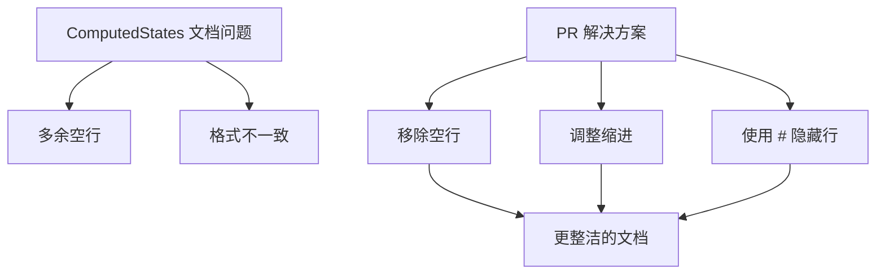

+++
title = "#20578 remove some new lines from ComputedStates docs"
date = "2025-08-15T00:00:00"
draft = false
template = "pull_request_page.html"
in_search_index = false

[extra]
current_language = "zh-cn"
available_languages = {"en" = { name = "English", url = "/pull_request/bevy/2025-08/pr-20578-en-20250815" }, "zh-cn" = { name = "中文", url = "/pull_request/bevy/2025-08/pr-20578-zh-cn-20250815" }}
labels = ["D-Trivial"]
+++

# remove some new lines from ComputedStates docs

## Basic Information
- **Title**: remove some new lines from ComputedStates docs
- **PR Link**: https://github.com/bevyengine/bevy/pull/20578
- **Author**: hymm
- **Status**: MERGED
- **Labels**: D-Trivial, S-Ready-For-Final-Review
- **Created**: 2025-08-14T23:45:31Z
- **Merged**: 2025-08-15T00:33:42Z
- **Merged By**: alice-i-cecile

## Description Translation
# 目标 (Objective)

- 在 ComputedStates 的文档示例中有一些多余的空行。https://dev-docs.bevy.org/bevy_state/state/computed_states/trait.ComputedStates.html

## 解决方案 (Solution)

- 隐藏或移除它们。

## The Story of This Pull Request

在审查 `ComputedStates` trait 的文档示例时，作者注意到代码示例中存在多余的空行。这些空行在渲染后的文档中显示为不必要的空白区域，影响了代码示例的紧凑性和可读性。虽然问题看似微小，但文档质量直接影响开发者体验，因此值得修复。

问题具体出现在两个文档示例中：第一个示例在状态枚举定义和派生状态结构体之间存在多余空行，第二个示例在应用构建器代码前存在不必要的缩进和空行。这些格式问题不会影响代码功能，但会使示例显得不够专业和整洁。

解决方案直接明了：移除多余空行并调整格式。作者没有选择复杂的重构方案，因为这只是文档格式的微调。关键决策点是使用 Rust 文档注释的 `#` 语法来隐藏辅助行，同时保持示例代码的完整性。具体来说：
1. 将单独的空行注释 `///` 改为 `/// #`，利用 Rust 文档系统隐藏这些行
2. 移除完全多余的空行
3. 调整代码缩进使示例更符合实际用法

这些修改完全不影响代码功能，仅优化文档呈现效果。变更后，开发者在阅读 `ComputedStates` 文档时会看到更紧凑、专业的代码示例，更容易聚焦核心模式。这种文档维护体现了对细节的关注，有助于保持代码库的整体质量。

## Visual Representation



## Key Files Changed

### crates/bevy_state/src/state/computed_states.rs
1. **修改说明**：优化 `ComputedStates` trait 文档中的两个代码示例格式，移除多余空行并调整缩进
2. **代码变更**：

```diff
 /// ```
 /// # use bevy_state::prelude::*;
 /// # use bevy_ecs::prelude::*;
-///
+/// #
 /// /// Computed States require some state to derive from
 /// #[derive(States, Clone, PartialEq, Eq, Hash, Debug, Default)]
 /// enum AppState {
@@ -22,7 +22,6 @@ use super::{state_set::StateSet, states::States};
 ///     InGame { paused: bool }
 /// }
 ///
-///
 /// #[derive(Clone, PartialEq, Eq, Hash, Debug)]
 /// struct InGame;
 ///
@@ -52,7 +51,7 @@ use super::{state_set::StateSet, states::States};
 /// ```
 /// # use bevy_state::prelude::*;
 /// # use bevy_ecs::prelude::*;
-///
+/// #
 /// # struct App;
 /// # impl App {
 /// #   fn new() -> Self { App }
@@ -61,10 +60,10 @@ use super::{state_set::StateSet, states::States};
 /// # }
 /// # struct AppState;
 /// # struct InGame;
-///
-///     App::new()
-///         .init_state::<AppState>()
-///         .add_computed_state::<InGame>();
+/// #
+/// App::new()
+///     .init_state::<AppState>()
+///     .add_computed_state::<InGame>();
 /// ```
 pub trait ComputedStates: 'static + Send + Sync + Clone + PartialEq + Eq + Hash + Debug {
     /// The set of states from which the [`Self`] is derived.
```

3. **与 PR 目标的关联**：这些变更直接解决了文档中多余空行的问题，使示例更简洁

## Further Reading
1. [Rust 文档注释指南](https://doc.rust-lang.org/rustdoc/how-to-write-documentation.html)
2. [Bevy States 文档](https://docs.rs/bevy_state/latest/bevy_state/)