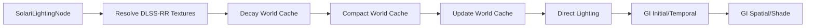

+++
title = "#20580 Improve Solari GI quality"
date = "2025-08-16T00:00:00"
draft = false
template = "pull_request_page.html"
in_search_index = true

[taxonomies]
list_display = ["show"]

[extra]
current_language = "en"
available_languages = {"en" = { name = "English", url = "/pull_request/bevy/2025-08/pr-20580-en-20250816" }, "zh-cn" = { name = "中文", url = "/pull_request/bevy/2025-08/pr-20580-zh-cn-20250816" }}
labels = ["A-Rendering", "D-Modest", "C-Refinement"]
+++

# Analysis of PR #20580: Improve Solari GI quality

## Basic Information
- **Title**: Improve Solari GI quality
- **PR Link**: https://github.com/bevyengine/bevy/pull/20580
- **Author**: JMS55
- **Status**: MERGED
- **Labels**: A-Rendering, S-Ready-For-Final-Review, D-Modest, C-Refinement
- **Created**: 2025-08-15T01:48:43Z
- **Merged**: 2025-08-16T17:38:41Z
- **Merged By**: alice-i-cecile

## Description Translation
**Objective**
- Reduce noise from jacobian
- Reduce temporal artifacts under DLSS-RR
- Improve responsiveness 

**Solution**
- Don't merge samples when the jacobian > 2.0, as it leads to either infs, or exploding variance
- Do permutation sampling (essentially a small ordered spatial pass during the temporal pass). Also try multiple temporal samples in case of disocclusions.
- Reduce max confidence weight

**Showcase**
After


Before


It's a lot more noticeable under motion and with DLSS-RR (not pictured).

## The Story of This Pull Request

### The Problem and Context
The Solari real-time global illumination system was experiencing several visual artifacts that impacted quality. The primary issues were:

1. **Jacobian-related noise**: When the Jacobian (a measure of how much a function stretches space) exceeded 2.0, it caused either infinite values or exploding variance in the GI samples, creating visual noise

2. **Temporal artifacts under DLSS-RR**: The system exhibited flickering and instability when using NVIDIA's DLSS Ray Reconstruction, particularly during camera movement

3. **Responsiveness issues**: The GI system wasn't handling disocclusions (when objects move and reveal previously hidden surfaces) effectively, leading to delayed updates in revealed areas

These issues were critical to address because they directly impacted the visual quality and stability of Bevy's real-time ray traced lighting solution, especially for high-quality rendering scenarios.

### The Solution Approach
The developer implemented three key improvements:

1. **Jacobian threshold**: Added a check to skip sample merging when the Jacobian exceeds 2.0, preventing numerical instability
2. **Permutation sampling**: Implemented a small ordered spatial pass during temporal sampling to handle disocclusions more effectively
3. **Confidence weight reduction**: Lowered the maximum confidence weight from 30.0 to 8.0 to reduce temporal artifacts

The approach balanced visual quality with performance by:
- Using a fixed 4-sample permutation pattern to avoid expensive neighborhood searches
- Maintaining the same workgroup size (8x8) for compute shaders
- Adding DLSS-RR texture preparation only when the feature is enabled

### The Implementation
The solution involved changes across the rendering pipeline:

**1. Jacobian threshold in GI merging**  
Added a guard clause to skip unstable merges:
```wgsl
// Before: No jacobian check
fn merge_reservoirs_spatial(...) { ... }

// After: Skip unstable samples
fn merge_reservoirs(...) {
    if canonical_target_function_other_sample_jacobian > 2.0 {
        return ReservoirMergeResult(canonical_reservoir, canonical_sample_radiance);
    }
    // Continue with merge...
}
```

**2. Permutation sampling for temporal lookup**  
Implemented a deterministic sampling pattern for temporal history:
```wgsl
fn load_temporal_reservoir(...) -> NeighborInfo {
    let temporal_pixel_id_base = ...;
    for (var i = 0u; i < 4u; i++) {
        let temporal_pixel_id = permute_pixel(temporal_pixel_id_base, i);
        // Try this sample...
    }
}

fn permute_pixel(pixel_id: vec2<u32>, i: u32) -> vec2<u32> {
    let r = constants.frame_index + i;
    let offset = vec2(r & 3u, (r >> 2u) & 3u);
    var shifted_pixel_id = pixel_id + offset;
    shifted_pixel_id ^= vec2(3u);
    shifted_pixel_id -= offset;
    return min(shifted_pixel_id, vec2<u32>(view.main_pass_viewport.zw - 1.0));
}
```

**3. Confidence weight reduction**  
Lowered the cap to reduce temporal artifacts:
```wgsl
// Before:
const CONFIDENCE_WEIGHT_CAP = 30.0;

// After:
const CONFIDENCE_WEIGHT_CAP = 8.0;
```

**4. DLSS-RR texture preparation**  
Added conditional texture creation for DLSS Ray Reconstruction:
```rust
#[cfg(all(feature = "dlss", not(feature = "force_disable_dlss"))]
if has_dlss_rr {
    let diffuse_albedo = render_device.create_texture(...);
    let specular_albedo = render_device.create_texture(...);
    // ... other textures
    commands.entity(entity).insert(ViewDlssRayReconstructionTextures { ... });
}
```

**5. DLSS-RR resolve pass**  
Added a new compute pass to prepare DLSS-RR textures:
```rust
#[cfg(all(feature = "dlss", not(feature = "force_disable_dlss"))]
if let Some(bind_group_resolve_dlss_rr_textures) = ... {
    pass.set_bind_group(2, &bind_group_resolve_dlss_rr_textures, &[]);
    pass.set_pipeline(resolve_dlss_rr_textures_pipeline);
    pass.dispatch_workgroups(dx, dy, 1);
}
```

### Technical Insights
Key technical aspects of the implementation:

1. **Permutation sampling**: Uses a deterministic 4-pattern offset based on frame index to search neighboring pixels in a consistent order. This avoids expensive random searches while handling disocclusions

2. **Jacobian threshold**: The 2.0 threshold was empirically determined to prevent numerical instability while maintaining sample reuse where valid

3. **DLSS-RR integration**: The new resolve pass converts G-buffer data into DLSS-specific textures (diffuse albedo, specular albedo, etc.) using storage textures for efficient GPU writes

4. **Conditional compilation**: DLSS features are gated behind feature flags to maintain compatibility with systems without DLSS support

### The Impact
These changes significantly improve Solari's visual quality:
- Reduced noise and variance in GI samples
- Fewer temporal artifacts during camera movement
- Faster convergence in disoccluded areas
- Better compatibility with DLSS Ray Reconstruction

The changes maintain real-time performance by:
- Using fixed iteration counts (4 samples)
- Adding minimal overhead when DLSS is disabled
- Keeping compute shader workgroup sizes unchanged

## Visual Representation



Note: The "Resolve DLSS-RR Textures" step is conditionally added when DLSS is enabled

## Key Files Changed

1. `crates/bevy_solari/src/realtime/restir_gi.wgsl` (+58/-71)
   - Core ReSTIR GI algorithm improvements
   - Key changes: Jacobian threshold, permutation sampling, confidence weight reduction
   ```wgsl
   // Before: Single temporal sample lookup
   fn load_temporal_reservoir(...) -> Reservoir { ... }
   
   // After: 4-sample permutation lookup
   fn load_temporal_reservoir(...) -> NeighborInfo {
     for (var i = 0u; i < 4u; i++) { ... }
   }
   ```

2. `crates/bevy_solari/src/realtime/prepare.rs` (+101/-2)
   - Prepares DLSS-RR textures when enabled
   ```rust
   #[cfg(all(feature = "dlss", not(feature = "force_disable_dlss"))]
   if has_dlss_rr {
       // Create diffuse_albedo, specular_albedo, etc.
   }
   ```

3. `crates/bevy_solari/src/realtime/node.rs` (+79/-1)
   - Adds DLSS-RR resolve pass to rendering pipeline
   ```rust
   #[cfg(all(feature = "dlss", not(feature = "force_disable_dlss"))]
   if let Some(bind_group) = ... {
       pass.set_pipeline(resolve_dlss_rr_textures_pipeline);
       pass.dispatch_workgroups(dx, dy, 1);
   }
   ```

4. `examples/3d/solari.rs` (+30/-1)
   - Adds DLSS-RR support to example
   ```rust
   #[cfg(all(feature = "dlss", not(feature = "force_disable_dlss"))]
   if dlss_rr_supported.is_some() {
       camera.insert(Dlss::<DlssRayReconstructionFeature> { ... });
   }
   ```

5. `crates/bevy_solari/src/realtime/resolve_dlss_rr_textures.wgsl` (+28/-0)
   - New shader for DLSS-RR texture preparation
   ```wgsl
   @compute @workgroup_size(8, 8, 1)
   fn resolve_dlss_rr_textures(...) {
       // Converts G-buffer data to DLSS-specific textures
   }
   ```

## Further Reading
1. [ReSTIR GI Paper](https://research.nvidia.com/publication/2020-07_spatiotemporal-reservoir-resampling-real-time-ray-tracing)
2. [DLSS Ray Reconstruction Overview](https://www.nvidia.com/en-us/geforce/technologies/dlss/ray-reconstruction/)
3. [Jacobian in Computer Graphics](https://en.wikipedia.org/wiki/Jacobian_matrix_and_determinant)
4. [Permutation Sampling Techniques](https://www.stat.cmu.edu/~ryantibs/statcomp/lectures/permutation.html)