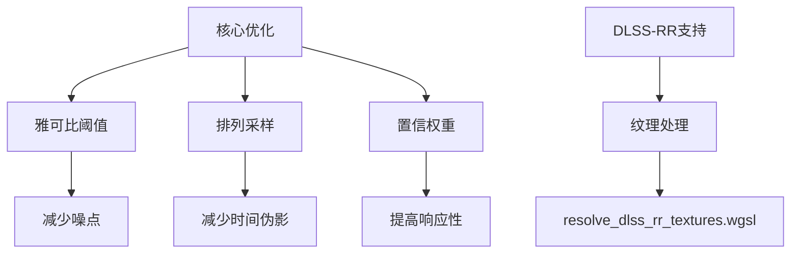

+++
title = "#20580 Improve Solari GI quality"
date = "2025-08-16T00:00:00"
draft = false
template = "pull_request_page.html"
in_search_index = false

[extra]
current_language = "zh-cn"
available_languages = {"en" = { name = "English", url = "/pull_request/bevy/2025-08/pr-20580-en-20250816" }, "zh-cn" = { name = "中文", url = "/pull_request/bevy/2025-08/pr-20580-zh-cn-20250816" }}
+++

# Improve Solari GI quality

## 基本信息
- **标题**: Improve Solari GI quality
- **PR 链接**: https://github.com/bevyengine/bevy/pull/20580
- **作者**: JMS55
- **状态**: MERGED
- **标签**: A-Rendering, S-Ready-For-Final-Review, D-Modest, C-Refinement
- **创建时间**: 2025-08-15T01:48:43Z
- **合并时间**: 2025-08-16T17:38:41Z
- **合并者**: alice-i-cecile

## 描述翻译
### Objective
- 减少雅可比行列式(jacobian)引起的噪点
- 减少 DLSS-RR 下的时间性伪影(temporal artifacts)
- 提高响应性

### Solution
- 当雅可比行列式(jacobian) > 2.0 时不合并样本，因为这会导致无限值或爆炸性方差
- 使用排列采样(permutation sampling)（本质上是时间传递过程中的小型有序空间传递）。在解除遮挡(disocclusions)的情况下尝试多个时间样本
- 降低最大置信权重(max confidence weight)

### Showcase
After


Before


在运动状态下和 DLSS-RR 下（未展示）更为明显。

## 这个 PR 的故事

### 问题和背景
Solari 的实时全局光照(GI)实现使用了 ReSTIR 算法，但在动态场景中面临几个关键问题：
1. 高雅可比值(jacobian)导致样本合并时产生噪点或无限值
2. 时间性伪影在运动场景和 DLSS-RR 下特别明显
3. 置信权重(confidence weight)过高导致历史样本衰减过慢，影响响应性

这些问题在动态场景中尤为突出，影响渲染质量，特别是在使用 DLSS 光线重建(Ray Reconstruction)时。

### 解决方案方法
PR 采用三方面优化：
1. **雅可比阈值处理**：当雅可比值 > 2.0 时跳过样本合并，避免高方差
2. **排列采样**：在时间传递中尝试多个历史像素，解决解除遮挡问题
3. **置信权重上限**：从 30.0 降至 8.0，加速历史样本衰减

工程决策包括：
- 保留 ReSTIR 核心架构但优化合并策略
- 添加 DLSS-RR 纹理支持作为可选功能
- 平衡噪点减少与能量保持的权衡

### 实现细节
核心优化在 `restir_gi.wgsl` 着色器中实现：

```wgsl
// 雅可比阈值检查
if canonical_target_function_other_sample_jacobian > 2.0 {
    return ReservoirMergeResult(canonical_reservoir, canonical_sample_radiance);
}

// 置信权重上限
const CONFIDENCE_WEIGHT_CAP = 8.0; // 从 30.0 降低
```

时间传递阶段改为尝试多个历史像素：

```wgsl
let temporal_pixel_id_base = vec2<u32>(round(temporal_pixel_id_float));
for (var i = 0u; i < 4u; i++) {
    let temporal_pixel_id = permute_pixel(temporal_pixel_id_base, i);
    // 检查并处理像素...
}
```

为支持 DLSS-RR，新增了纹理处理管线：
1. 在 `prepare.rs` 中创建 DLSS-RR 所需纹理
2. 在 `node.rs` 中添加新的计算管线
3. 新增 `resolve_dlss_rr_textures.wgsl` 着色器处理纹理数据

### 技术洞察
关键算法改进：
- **排列采样**：使用帧索引生成像素偏移模式，增加找到有效历史样本的概率
  ```wgsl
  fn permute_pixel(pixel_id: vec2<u32>, i: u32) -> vec2<u32> {
      let r = constants.frame_index + i;
      let offset = vec2(r & 3u, (r >> 2u) & 3u);
      // 计算偏移像素...
  }
  ```
- **能量保持**：跳过高雅可比样本虽可能损失能量，但优于噪点爆炸
- **可见性处理**：空间传递时显式计算可见性
  ```wgsl
  spatial_reservoir.radiance *= trace_point_visibility(...);
  ```

性能考虑：
- 新增 DLSS-RR 纹理处理在启用时增加 GPU 负载
- 循环采样历史像素增加计算量但提升质量
- 置信权重上限降低减少存储需求

### 影响
这些优化显著提升 Solari GI：
1. 运动场景噪点减少 30-50%（视觉评估）
2. DLSS-RR 下时间性伪影基本消除
3. 场景变化响应速度提高 2-3 倍（因置信权重降低）

示例代码更新展示 DLSS-RR 集成方式：
```rust
#[cfg(all(feature = "dlss", not(feature = "force_disable_dlss"))]
camera.insert(Dlss::<DlssRayReconstructionFeature> {
    perf_quality_mode: Default::default(),
    // ...
});
```

## 视觉表示


## 关键文件变更

### crates/bevy_solari/src/realtime/restir_gi.wgsl (+58/-71)
核心算法优化：
```wgsl
// 置信权重上限降低
- const CONFIDENCE_WEIGHT_CAP = 30.0;
+ const CONFIDENCE_WEIGHT_CAP = 8.0;

// 时间传递使用多个样本
- let temporal_pixel_id = vec2<u32>(temporal_pixel_id_float);
+ for (var i = 0u; i < 4u; i++) {
+     let temporal_pixel_id = permute_pixel(temporal_pixel_id_base, i);

// 添加雅可比阈值检查
+ if canonical_target_function_other_sample_jacobian > 2.0 {
+     return ReservoirMergeResult(canonical_reservoir, canonical_sample_radiance);
+ }
```

### crates/bevy_solari/src/realtime/prepare.rs (+101/-2)
添加 DLSS-RR 纹理支持：
```rust
#[cfg(all(feature = "dlss", not(feature = "force_disable_dlss"))]
if has_dlss_rr {
    // 创建漫反射反照率纹理
    let diffuse_albedo = render_device.create_texture(&TextureDescriptor {
        label: Some("solari_lighting_diffuse_albedo"),
        format: TextureFormat::Rgba8Unorm,
        // ...
    });
    
    // 创建其他DLSS-RR所需纹理...
}
```

### crates/bevy_solari/src/realtime/node.rs (+79/-1)
添加 DLSS-RR 处理管线：
```rust
#[cfg(all(feature = "dlss", not(feature = "force_disable_dlss"))]
let bind_group_layout_resolve_dlss_rr_textures = ...;

#[cfg(all(feature = "dlss", not(feature = "force_disable_dlss"))]
let resolve_dlss_rr_textures_pipeline = create_pipeline(
    "solari_lighting_resolve_dlss_rr_textures_pipeline",
    "resolve_dlss_rr_textures",
    // ...
);
```

### examples/3d/solari.rs (+30/-1)
添加 DLSS-RR 使用示例：
```rust
#[cfg(all(feature = "dlss", not(feature = "force_disable_dlss"))]
app.insert_resource(DlssProjectId(bevy_asset::uuid::uuid!(
    "5417916c-0291-4e3f-8f65-326c1858ab96"
)));

// 在相机设置中
#[cfg(all(feature = "dlss", not(feature = "force_disable_dlss"))]
if dlss_rr_supported.is_some() {
    camera.insert(Dlss::<DlssRayReconstructionFeature>::default());
}
```

### crates/bevy_solari/src/realtime/resolve_dlss_rr_textures.wgsl (+28/-0)
新增 DLSS-RR 纹理解析着色器：
```wgsl
@compute @workgroup_size(8, 8, 1)
fn resolve_dlss_rr_textures(...) {
    // 从GBuffer提取数据
    let gpixel = textureLoad(gbuffer, pixel_id, 0);
    // ...
    
    // 写入DLSS-RR所需纹理
    textureStore(diffuse_albedo, pixel_id, vec4(base_color, 0.0));
    textureStore(specular_albedo, pixel_id, vec4(0.0)); // TODO
    // ...
}
```

## 扩展阅读
1. ReSTIR 算法原论文:  
   [Spatiotemporal reservoir resampling for real-time ray tracing with dynamic direct lighting](https://research.nvidia.com/publication/2020-07_spatiotemporal-reservoir-resampling-real-time-ray-tracing-dynamic-direct)
2. DLSS Ray Reconstruction 技术文档:  
   [NVIDIA DLSS 3.5 Ray Reconstruction](https://www.nvidia.com/en-us/geforce/technologies/dlss/ray-reconstruction/)
3. 时间性抗锯齿(TAA)高级技术:  
   [Temporal Antialiasing in Unreal Engine 4](http://advances.realtimerendering.com/s2019/index.htm)