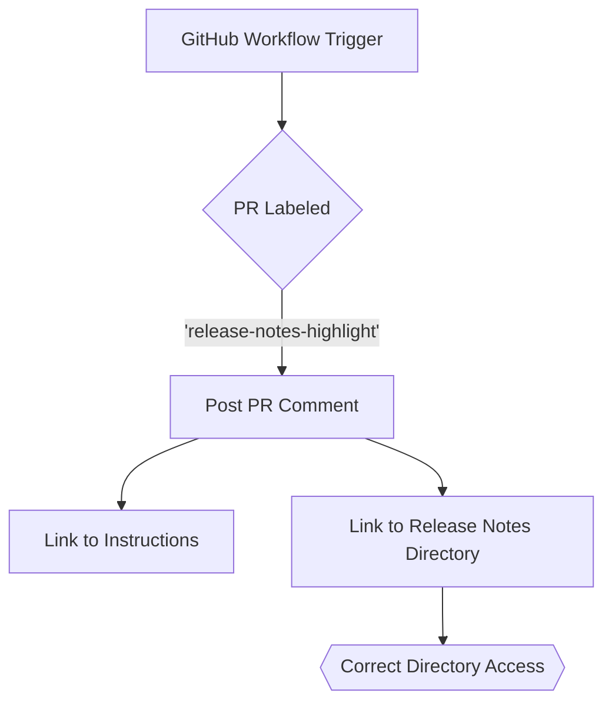

+++
title = "#20581"
date = "2025-08-15T00:00:00"
draft = false
template = "pull_request_page.html"
in_search_index = true

[taxonomies]
list_display = ["show"]

[extra]
current_language = "en"
available_languages = {"en" = { name = "English", url = "/pull_request/bevy/2025-08/pr-20581-en-20250815" }, "zh-cn" = { name = "中文", url = "/pull_request/bevy/2025-08/pr-20581-zh-cn-20250815" }}
+++

## Technical Analysis: Fixing a Broken Link in GitHub Workflows

This pull request addresses a straightforward but important documentation issue in Bevy's GitHub workflow automation. Let me walk through the technical context and solution.

### The Problem and Context
In Bevy's contribution workflow, when a pull request is labeled for inclusion in release notes, an automated GitHub Action posts a comment reminding contributors to write release notes. This comment includes two critical links:
1. Instructions for writing release notes
2. The directory where release notes should be placed

The second link contained a typo - it pointed to `release_notes` (with an underscore) instead of the actual directory name `release-notes` (with a hyphen). This error made the link non-functional, as evidenced in this real-world failure: https://github.com/bevyengine/bevy/pull/19864#issuecomment-3016970396. 

For a project like Bevy that relies on community contributions, having accurate documentation links is essential. Broken links create friction in the contribution process and reduce the effectiveness of automated reminders.

### The Solution Approach
The fix required minimal but precise intervention:
1. Identify the exact location of the broken link in the workflow file
2. Correct the directory name from `release_notes` to `release-notes`
3. Verify the new link works correctly

No alternatives were needed since this was a clear case of correcting a typo. The solution preserves all existing workflow functionality while fixing the documentation reference.

### Implementation Details
The change modifies a single line in GitHub's workflow configuration:

```yaml
# File: .github/workflows/action-on-PR-labeled.yml
# Before:
.../release_notes) to showcase your changes.`

# After:
.../release-notes) to showcase your changes.`
```

The implementation:
1. Changes only the directory name in the URL string
2. Maintains identical Markdown syntax and surrounding text
3. Preserves all other workflow logic and functionality

The solution is technically sound because:
- It addresses the root cause (directory name mismatch)
- Maintains the workflow's intended behavior
- Requires no additional testing beyond link verification

### Technical Insights
This fix demonstrates important maintenance practices:
1. **Automation hygiene**: CI/CD workflows should be maintained with the same rigor as application code
2. **Link validation**: All documentation links should be periodically verified
3. **Precision editing**: Minor configuration changes require careful attention to avoid breaking YAML syntax

The change also highlights how GitHub Actions use JavaScript string interpolation for dynamic content, though in this case the URL is fully static.

### The Impact
This small change has significant practical benefits:
1. Restores functionality to an important contributor workflow
2. Prevents future confusion when contributors receive automated reminders
3. Maintains Bevy's reputation for attention to detail
4. Resolves a concrete issue reported by community members

The fix has no performance implications since it only modifies documentation text in a workflow comment.

## Visual Representation



## Key Files Changed

### `.github/workflows/action-on-PR-labeled.yml`
**Purpose**: GitHub Actions workflow that automates responses to PR labels  
**Change**: Fixed typo in release notes directory link  
**Diff**:
```diff
@@ -70,5 +70,5 @@ jobs:
               repo: context.repo.repo,
               body: `It looks like your PR has been selected for a highlight in the next release blog post, but **you didn't provide a release note**.
 
-              Please review the [instructions for writing release notes](https://github.com/bevyengine/bevy/tree/main/release-content/release_notes.md), then expand or revise the content in the [release notes directory](https://github.com/bevyengine/bevy/tree/main/release-content/release_notes) to showcase your changes.`
+              Please review the [instructions for writing release notes](https://github.com/bevyengine/bevy/tree/main/release-content/release_notes.md), then expand or revise the content in the [release notes directory](https://github.com/bevyengine/bevy/tree/main/release-content/release-notes) to showcase your changes.`
             })
```

## Further Reading
1. [GitHub Actions Workflow Syntax](https://docs.github.com/en/actions/using-workflows/workflow-syntax-for-github-actions)
2. [Bevy's Release Notes Guide](https://github.com/bevyengine/bevy/tree/main/release-content/release_notes.md)
3. [Effective CI/CD Maintenance Practices](https://google.github.io/eng-practices/review/reviewer/looking-for.html#correctness)