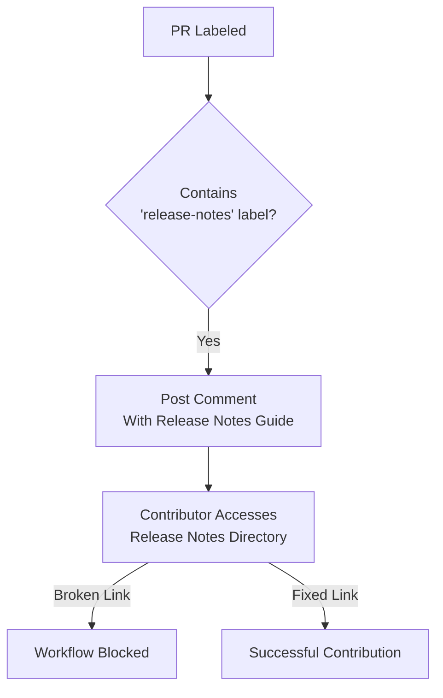

+++
title = "#20581 Fix typo in release-notes directory link in GitHub workflow"
date = "2025-08-15T00:00:00"
draft = false
template = "pull_request_page.html"
in_search_index = false

[extra]
current_language = "zh-cn"
available_languages = {"en" = { name = "English", url = "/pull_request/bevy/2025-08/pr-20581-en-20250815" }, "zh-cn" = { name = "中文", url = "/pull_request/bevy/2025-08/pr-20581-zh-cn-20250815" }}
labels = ["C-Docs", "A-Meta"]
+++

## Fix typo in release-notes directory link in GitHub workflow

### Basic Information
- **Title**: Fix typo in release-notes directory link in GitHub workflow
- **PR Link**: https://github.com/bevyengine/bevy/pull/20581
- **Author**: ariofrio
- **Status**: MERGED
- **Labels**: C-Docs, A-Meta, S-Ready-For-Final-Review
- **Created**: 2025-08-15T03:39:47Z
- **Merged**: 2025-08-15T04:22:01Z
- **Merged By**: alice-i-cecile

### Description Translation
# Objective

例如在：
- https://github.com/bevyengine/bevy/pull/19864#issuecomment-3016970396

指向发布说明目录的链接是损坏的。

## Solution

修复该链接。

## Testing

将新链接复制粘贴到URL地址栏进行测试。

### The Story of This Pull Request

在Bevy引擎的贡献工作流中，当PR被标记为需要发布说明时，系统会自动生成评论引导贡献者完善发布说明。该功能通过`.github/workflows/action-on-PR-labeled.yml`中定义的工作流实现，其中包含指向发布说明目录的关键链接。

问题出现在这个自动评论的链接结构中：
```yaml
[release notes directory](https://github.com/bevyengine/bevy/tree/main/release-content/release_notes)
```
实际仓库目录名称为`release-notes`(带连字符)，但工作流中错误地使用了`release_notes`(带下划线)。这个拼写差异导致链接404错误，这在https://github.com/bevyengine/bevy/pull/19864#issuecomment-3016970396等历史记录中可验证。

这个拼写错误的影响很直接：当贡献者点击链接准备添加发布说明时，会被导向不存在的页面，导致工作流程中断。考虑到发布说明对版本管理的重要性，及时修复这个链接能避免贡献者困惑并减少维护者的人工干预。

解决方案是精确修正目录名称的拼写：
```diff
- [release notes directory](https://github.com/bevyengine/bevy/tree/main/release-content/release_notes)
+ [release notes directory](https://github.com/bevyengine/bevy/tree/main/release-content/release-notes)
```
这个单字符修改(_ → -)恢复了链接功能。作者通过手动复制新URL到浏览器进行了验证，确认修正后的链接正确指向目标目录。

从工程角度看，这个修改展示了配置文件维护的关键细节：
1. 自动化工作流中的静态链接需要与仓库实际结构严格同步
2. 下划线(_)与连字符(-)在URL中是不同字符，会导致完全不同的路径解析
3. 工作流文件的微小错误可能中断贡献者流程，需要及时修复

虽然修改简单，但它维护了项目贡献体验的顺畅性。类似配置文件的链接验证应纳入常规检查清单，尤其是当仓库目录结构调整时。

### Visual Representation


### Key Files Changed
- **.github/workflows/action-on-PR-labeled.yml** (+1/-1)

该文件定义了当PR被标记特定标签时的自动化工作流。关键修改是修复发布说明目录的链接拼写错误：
```yaml
# 修改前:
body: `... [release notes directory](https://github.com/bevyengine/bevy/tree/main/release-content/release_notes)...`

# 修改后:
body: `... [release notes directory](https://github.com/bevyengine/bevy/tree/main/release-content/release-notes)...`
```
这个单行修改将目录名从`release_notes`(带下划线)修正为`release-notes`(带连字符)，使链接指向实际存在的目录。

### Further Reading
1. [GitHub Actions Workflow Syntax](https://docs.github.com/en/actions/using-workflows/workflow-syntax-for-github-actions)
2. [Bevy's Release Notes Guide](https://github.com/bevyengine/bevy/tree/main/release-content/release_notes.md)
3. [URL Path Semantics RFC 3986](https://datatracker.ietf.org/doc/html/rfc3986#section-3.3)

### Full Code Diff
```diff
diff --git a/.github/workflows/action-on-PR-labeled.yml b/.github/workflows/action-on-PR-labeled.yml
index 9e5835c1f79ea..d44a0e52dc7d6 100644
--- a/.github/workflows/action-on-PR-labeled.yml
+++ b/.github/workflows/action-on-PR-labeled.yml
@@ -70,5 +70,5 @@ jobs:
               repo: context.repo.repo,
               body: `It looks like your PR has been selected for a highlight in the next release blog post, but **you didn't provide a release note**.
 
-              Please review the [instructions for writing release notes](https://github.com/bevyengine/bevy/tree/main/release-content/release_notes.md), then expand or revise the content in the [release notes directory](https://github.com/bevyengine/bevy/tree/main/release-content/release_notes) to showcase your changes.`
+              Please review the [instructions for writing release notes](https://github.com/bevyengine/bevy/tree/main/release-content/release_notes.md), then expand or revise the content in the [release notes directory](https://github.com/bevyengine/bevy/tree/main/release-content/release-notes) to showcase your changes.`
             })
```